# Agent Runtime Control Plane + Context Plane Implementation Plan

Date: 2026-05-29

## 1. Goal

补齐当前 Agent 层缺失的底层架构能力：任务意图、执行 profile、上下文组装、工具意图计划、policy/approval/QA gate、模型路由、runtime metrics、checkpoint 和 retry ledger。

本轮不增加前端复杂度。Swift 前端继续只暴露 Skill / Extension，底层 tool、provider、context chunk、policy detail 和 artifact contract 只在 Agent Runtime Host 内部与 wiki/Ops 详情中可追踪。

## 2. Scope

### In Scope

- 新增 `agent-runtime/control-plane/` 模块。
- 新增内部 `agent-runtime/extensions/context-plane/` 包。
- 改造 daemon 执行顺序，但保持 `POST /sessions/{sessionID}/messages` 入参兼容。
- 每次 run 写出完整控制面和上下文面 artifact。
- 同步总 wiki 与 `agent-runtime/wiki/AGENT_RUNTIME_WIKI.md`。

### Out of Scope

- 不做生产级多 worker sandbox。
- 不改变 Swift 主界面公开能力模型。
- 不运行真实微信读取、live wechat-cli、交易、发消息或外部发布。
- 不把 raw tool/provider/module 暴露给前端。

## 3. Runtime Flow

```mermaid
flowchart LR
  A["Swift Agent Workspace"] --> B["Agent Runtime Host"]
  B --> C["Task Intent"]
  C --> D["Execution Profile"]
  D --> E["Context Plane"]
  E --> F["Planner Envelope"]
  F --> G["Tool Intent Plan"]
  G --> H["Policy / Approval Gate"]
  H --> I["Model Route"]
  I --> J["Allowed Tool Execution"]
  J --> K["QA Gate"]
  K --> L["Metrics / Checkpoint"]
  L --> M["Final Output + Run Artifacts"]
```



## 4. Artifact Contract

Run artifacts are written under `runtime/agent/runs/{runID}/`:

- `control-plane-manifest.json`
- `task-intent.json`
- `execution-profile.json`
- `planner-envelope.json`
- `tool-intent-plan.json`
- `context-manifest.json`
- `context-bundle.json`
- `retrieval-plan.json`
- `context-gate.json`
- `policy-decisions.json`
- `approval-decisions.json`
- `model-route.json`
- `qa-gate.json`
- `runtime-metrics.json`
- `checkpoint.json`
- `retry-ledger.json`
- existing artifacts: `tool-calls.json`, `events.ndjson`, `product-mutations.json`, `final-output.md`

All artifacts must include `runID` and avoid API keys, Authorization headers, raw provider request bodies, and full private WeChat transcript dumps.

## 5. Context Plane

The internal Context Plane creates:

- `ContextSource`: prompt, selected refs, attachments, and local runtime artifact summaries.
- `ContextChunk`: bounded, redacted source segments.
- `ContextBundle`: selected chunks and model-ready summary text.
- `RetrievalPlan`: selected/excluded chunk trace and budget.
- `ContextGate`: freshness, privacy, missing-source, and raw-content checks.

The frontend should only show a lightweight summary such as "已带入 N 项上下文"; chunking, budget, retrieval, and gate details stay internal.

## 6. Control Plane

The internal Control Plane creates:

- `AgentTaskIntent`
- `ExecutionProfile`
- `ToolIntentPlan`
- `PolicyDecision`
- `ApprovalDecision`
- `ModelRouteDecision`
- `QAGateResult`
- `RuntimeMetrics`
- `Checkpoint`
- `RetryLedger`

First version is sequential. It records worker/checkpoint/retry decisions but does not launch parallel sandbox workers.

## 7. Safety Boundary

- `GET /capabilities` returns only public Skill / Extension / Template surface.
- Internal tools are never user-selectable from the main UI.
- Live WeChat and live wechat-cli are blocked.
- Computer Use remains `needs_confirmation`; the runtime records a proposal but does not operate the Mac UI.
- API keys are environment-only and never written to wiki, code, logs, or artifacts.

## 8. Verification

Required commands:

```bash
node domains/agent/code/agent-runtime/control-plane/smoke-test.mjs
node domains/agent/code/agent-runtime/bin/wechat-agent-daemon.mjs --smoke-check
swift build --scratch-path /private/tmp/wechat-radar-build
swift test --scratch-path /private/tmp/wechat-radar-test-build
swift run --scratch-path /private/tmp/wechat-radar-build WeChatIntelligenceRadar --ui-smoke-check
```

Acceptance:

- Control Plane smoke passes.
- Daemon smoke creates all required artifacts.
- `/capabilities` keeps `internalToolsExposed=false`.
- Swift build/test/UI smoke pass.
- `assignment-agent-raw` and `wechat-cli_raw` remain read-only.

