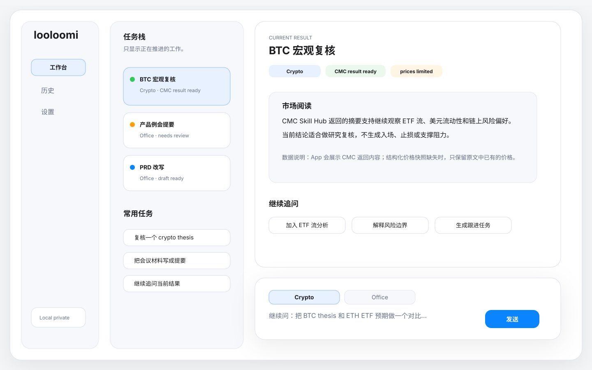
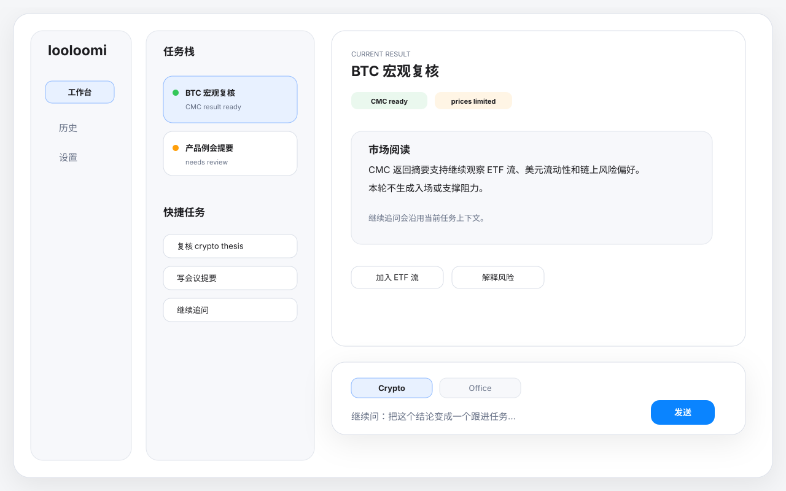
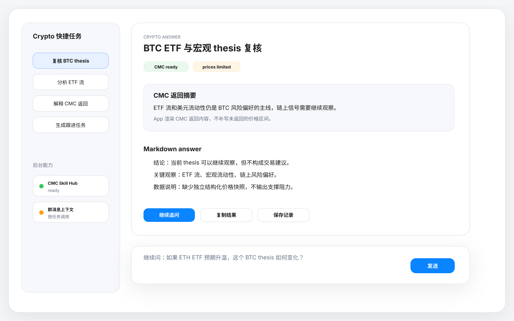
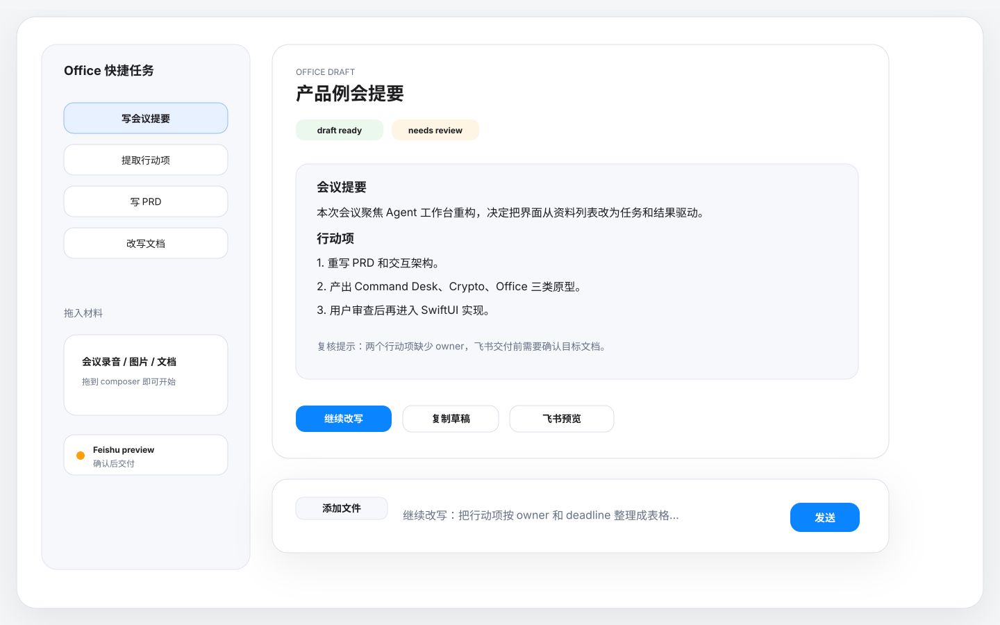

# Agent 综合工作台原型说明 v2

- 日期：2026-06-11
- 状态：历史原型基线，已被 Blocks Workbench 和 LoopOps v2 取代
- 当前实现方向：历史 `Command Desk`
- 对应 PRD：`wiki/prd/2026-06-11-agent-workbench-product-redesign-prd.md`
- 对应架构：`wiki/architecture/2026-06-11-agent-workbench-interaction-redesign.md`
- 取代者：`domains/frontend/documents/design/2026-06-22-loopops-v2-prototype-spec.md`

## 0. 历史状态

本文档记录 Command Desk v2 原型，不再是当前 active 原型方向。当前 active 原型方向是 LoopOps v2 + Chat Control Layer。

## 1. 本轮修正

上一版 `Unified Workstream Desk` 仍然过度强调资料源、queue 和 evidence drawer。用户真实工作流更简单：

- Crypto：问问题，调用 CMC Skill Hub，读结果，继续追问。
- Office：拖文件或给指令，生成会议提要或文档草稿，改写，准备飞书交付。

所以 active 原型目录只保留本轮三类原型。旧原型已归档到 `wiki/history/design/prototypes/`。

## 2. Active 原型

### 2.1 Command Desk（推荐）

文件：

- `domains/frontend/documents/design/prototypes/2026-06-11-command-desk.svg`
- `domains/frontend/documents/design/prototypes/2026-06-11-command-desk-1280.svg`

定位：

默认工作台。左侧只保留轻量任务栈，中心是当前结果，底部是强 composer。用户打开 App 后可以直接做 crypto 或 office 任务。

设计重点：

- 不展示资料源面板。
- 不展示 Inspector。
- Crypto 与 Office 是 composer 的任务意图。
- 当前结果可以继续追问。

### 2.2 Crypto Answer Loop

文件：

- `domains/frontend/documents/design/prototypes/2026-06-11-crypto-answer-loop.svg`

定位：

展示 CMC Skill Hub 返回结果如何在 App 内被阅读和追问。

设计重点：

- CMC returned summary 是正文的一部分。
- Markdown answer 和轻量 market component 同屏。
- price limitation 作为数据说明，而不是阻断主阅读。
- 操作是追问、复制、保存、创建跟进。

### 2.3 Office Writing Loop

文件：

- `domains/frontend/documents/design/prototypes/2026-06-11-office-writing-loop.svg`

定位：

展示会议提要、文档草稿和飞书交付预览。

设计重点：

- 拖入文件和图片是 composer 行为，不是资料库行为。
- 草稿正文是主对象。
- Feishu 是交付动作，需要 preview 和确认。
- 复核在任务内完成，不进入运维面板。

## 3. 原型预览

### Command Desk

### Command Desk 1280

### Crypto Answer Loop

### Office Writing Loop

## 4. 设计验收与实现同步

- 首屏能直接开始任务。
- 能直接追问当前结果。
- 没有常驻资料源面板。
- 没有常驻 Inspector。
- Crypto 结果以 CMC returned result 和 answer rendering 为中心。
- Office 结果以草稿和交付为中心。
- WeChatCLI 只作为后台群消息读取能力出现。
- Feishu 写入前必须有 preview / confirmation。
- SwiftUI 当前实现使用任务栈、结果画布、Crypto / Office composer 和历史入口承接这些原型，不再实现旧 Today Desk / Queue Canvas / Split Focus / source-heavy 原型。
