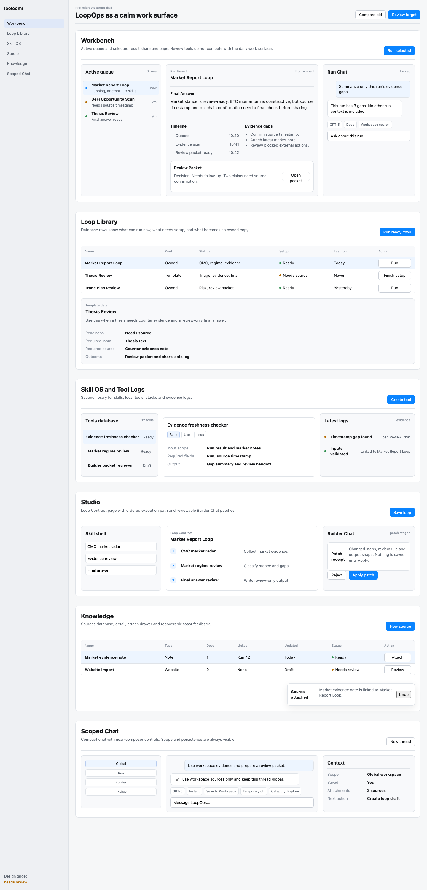

# LoopOps Redesign V3

Status: `superseded-reference`
Date: 2026-06-27
Updated: 2026-06-29

This folder is an older reference package. It is useful for seeing the previous LoopOps target mockups, but it is not the current design source of truth.

Current research and design reset:

- [2026-06-29 RelevanceAI authenticated product research](../../2026-06-29-relevanceai-authenticated-product-research/README.md)

## Reference Entry

- Static target: [target-mockups/index.html](target-mockups/index.html)
- Review board reference: [review-board.html](review-board.html)
- Full overview screenshot: [target-mockups/target-overview-1440-full.png](target-mockups/target-overview-1440-full.png)
- Mobile overview screenshot: [target-mockups/target-overview-mobile-390.png](target-mockups/target-overview-mobile-390.png)
- Per-module screenshots: [target-mockups/modules/](target-mockups/modules/)

Single-module reference URLs:

```text
target-mockups/index.html?module=workbench
target-mockups/index.html?module=library
target-mockups/index.html?module=skillos
target-mockups/index.html?module=studio
target-mockups/index.html?module=knowledge
target-mockups/index.html?module=chat
```



## Files

- [visual-system.md](visual-system.md)
- [implementation-handoff.md](implementation-handoff.md)
- [modules/](modules/)
- [before-after.md](before-after.md)
- [review-status.md](review-status.md)
- [human-review-form.md](human-review-form.md)
- [review-board.html](review-board.html)
- [target-mockups/index.html](target-mockups/index.html)

