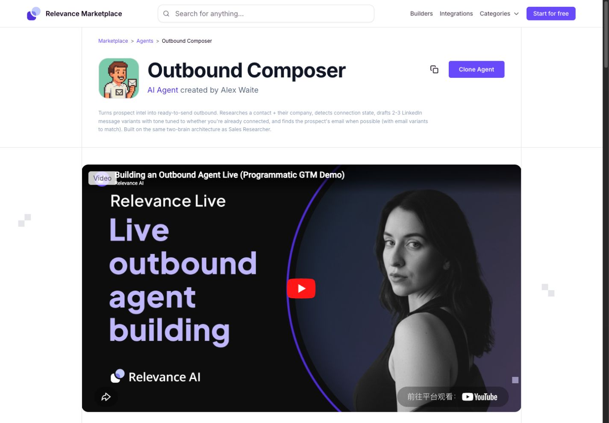
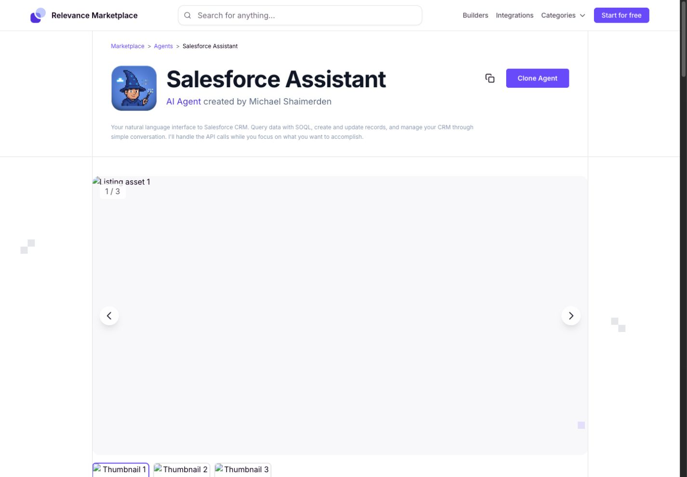
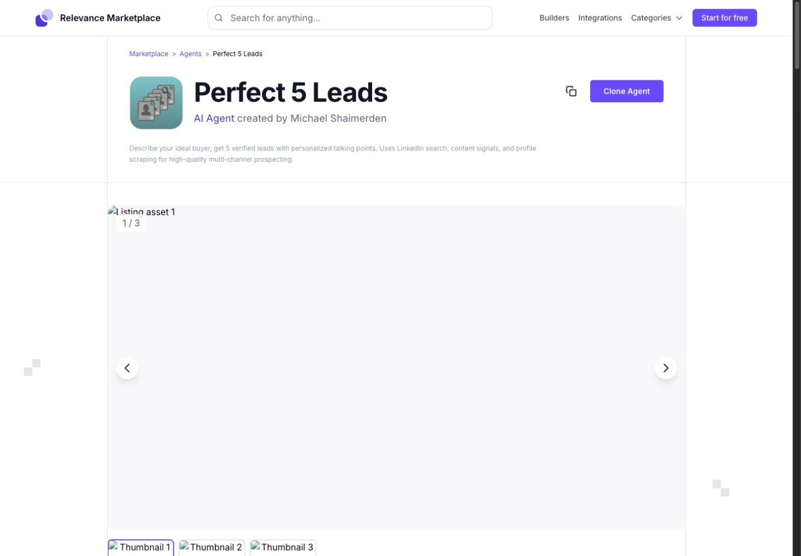
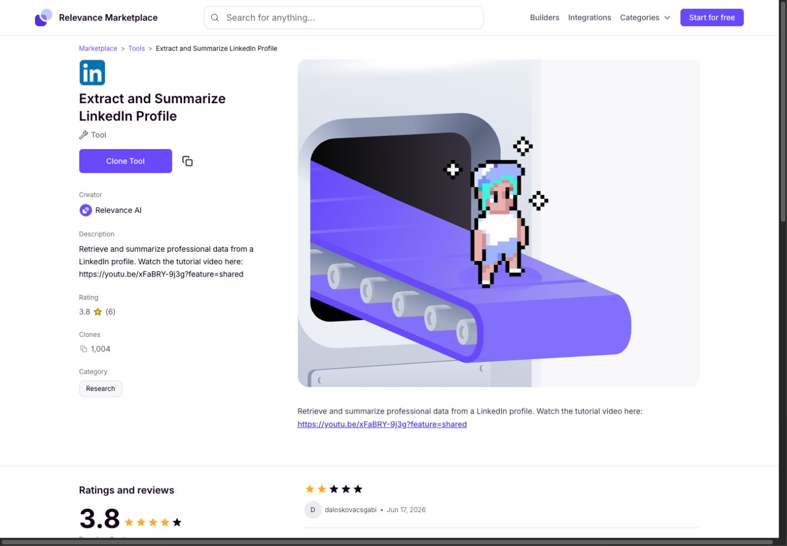

# RelevanceAI Authenticated UI Research

Date: 2026-06-29
Source URL: `https://app.relevanceai.com/marketplace/f1db6c/38acb714-abf3-4e5f-b898-d5718c6a4d5b`

## Scope

This pass studies the logged-in RelevanceAI product shape, not the public marketing site. The goal is to extract UI/UX patterns that should inform the LoopOps redesign: marketplace, skill/tool library, loop templates, app shell, help/toast patterns, object detail pages and clone/install flows.

No clone, install, run, send, publish, delete or account-changing action was executed.

## Authenticated App Shell

Observed through Computer Use on the logged-in Chrome tab.

### Workspace Shell

- Top-left workspace switcher: `Loomi`, with compact identity and workspace switching affordance.
- Sidebar is narrow, utilitarian and grouped:
  - Primary: Home, Marketplace, Tasks, Chat.
  - Build: Agents, per-agent nested rows, Tools, Workforce, Knowledge, More.
  - Account: Analytics, Integrations & API Keys.
  - Support/account utility: Settings, Relevance builders, Community, Ask for help.
  - Usage card at bottom: Free plan, actions remaining, credits remaining, manage plan, reset timing.
- Selected navigation uses a quiet filled row, not a big card.
- Existing agents are nested directly under Agents, making owned objects visible without opening a separate library.

### Marketplace Surface

- The app shell title says `Marketplace`, with `My Purchases` as a clear secondary action.
- Marketplace itself is embedded as a product surface:
  - Hero: `Discover the world's top AI agents with Relevance AI`.
  - Primary search: `Search for integration or use-case`.
  - Featured agent cards: title, rating, clone count, short description, avatar and integration icons.
  - Category sections: Sales, Marketing, Content Creation, Operations.
  - Each category shows integration icons first, then use-case links such as Enrichment, Lead Gen, Outreach, CRM Sync, Reporting.
  - Lower page sections include Popular agents, Top tools, Top workforces, Ready to build your own, Browse Integrations, Compare Alternatives and Top Builders.
- A `What's New` toast/card appears in the lower-right corner.
- Help widget is present as a Pylon support surface with `Start new chat`, offline state and bookmarks.

### Interaction Model

- The shell makes product geography clear: Marketplace is one workspace surface, not a modal.
- Marketplace rows/cards are mostly deep links to listing pages.
- Browse behavior is safe and reversible. The potentially mutating action is the detail CTA: `Clone Agent` or `Clone Tool`.
- Search is positioned as the main entry point for intent, not just keyword lookup.
- `My Purchases` separates owned/cloned objects from the public marketplace.

## Listing Detail Pattern

File-backed screenshots:

- 
- 
- 
- 

### Shared Structure

- Persistent marketplace top bar:
  - Marketplace logo.
  - Large search field.
  - Builders, Integrations, Categories.
  - `Start for free` CTA.
- Breadcrumb:
  - Marketplace > Agents or Tools > current listing.
- Object header:
  - Large avatar or icon.
  - Large object title.
  - Type and creator, e.g. `AI Agent created by Alex Waite`.
  - Short description.
  - Copy link icon.
  - Primary CTA: `Clone Agent` or `Clone Tool`.
- Metadata:
  - Category tags.
  - Tool count or tool list.
  - Integration count.
  - Clone count.
  - Rating and review count.
- Body:
  - Rich media preview or carousel.
  - Long-form description sections.
  - Example conversation for agents.
  - How it works / Getting started.
  - More by creator.
  - Similar agents/tools.
  - Ratings and reviews.

### Agent Detail Examples

Outbound Composer:

- Emphasizes an example conversation and generated variants.
- Shows many tools and integrations as capabilities.
- Body demonstrates expected output, not just a feature list.

Salesforce Assistant:

- Explicitly frames safety: smart write guardrails and confirmation before creating, updating or deleting CRM records.
- Has image carousel controls, but one captured state showed broken/empty media. This is a concrete quality risk.
- The object header still remains understandable even when media fails.

Perfect 5 Leads:

- Clear promise: describe ideal buyer, get verified leads and talking points.
- Categories and tool count summarize setup complexity quickly.

Tool detail:

- The Tool variant is more compact and more database-like:
  - Creator.
  - Description.
  - Rating.
  - Clones.
  - Category.
  - Reviews.
  - You might also like.
- `Clone Tool` replaces `Clone Agent`.

## UI/UX Strengths To Borrow

1. **Workspace shell grouping**

   RelevanceAI separates Work, Build and Account areas in the left nav. This gives users a durable map of where objects live.

2. **Marketplace as a database plus detail system**

   The list/discover page is broad and visual; the detail page is object-specific and durable. LoopOps should use the same split: browse/search first, then a stable object page.

3. **Owned versus public objects**

   `My Purchases` is a strong pattern. LoopOps needs equivalent separation:
   - Public/source templates.
   - Installed or owned loops.
   - Skill packages available to use.
   - Skill stacks owned by the user.

4. **Object header tells the whole story quickly**

   Avatar, title, type, creator, description, metadata and one primary CTA make the listing immediately understandable.

5. **Capability metadata is compact**

   Categories, tool counts, integration counts, clones and ratings are easy to scan. LoopOps can adapt these into domain, skill count, required inputs, last run, review boundary, reliability and installed state.

6. **Example conversation is part of the product detail**

   Agent listings explain behavior through sample conversation/output. Loop templates should show an example run, expected final answer, evidence gaps and review packet shape.

7. **Support surfaces are separate from logs**

   Help widget, What's New and Marketplace content are separate. LoopOps should keep product help/toasts separate from run logs and tool evidence.

## UI/UX Risks To Avoid

1. **Two visual systems can collide**

   The authenticated app shell is dense and utilitarian; the marketplace listing pages are more public/marketing-like. LoopOps should avoid this split. Marketplace, Loop Library and Skill OS should feel like one product.

2. **Primary clone CTA is too easy to treat as harmless**

   `Clone Agent` is visually dominant. For LoopOps, install/clone/use actions should show what will be added, required permissions, required inputs and whether external actions remain disabled.

3. **Media can dominate or fail**

   Listing media is useful but can overpower the object header. One detail page captured a broken/empty carousel area. LoopOps should prefer durable structured previews over large media-first layouts.

4. **Long detail pages bury setup requirements**

   Tool counts and integrations are visible, but actual setup requirements can be buried. LoopOps should surface required bindings, missing credentials and review-only boundaries near the primary action.

5. **Search intent is strong, but filters are shallow**

   The marketplace search field is central, but the first screen does not expose advanced faceting. LoopOps should offer visible filters: domain, installed/source, ready/needs setup, skill type, external-action risk, review-required.

## Accessibility And Interaction Risks

- Some controls rely heavily on icon plus label but not all labels are equally visible in the visual screenshot.
- Large media/video regions may create keyboard and screen-reader noise.
- Broken listing media leaves large blank regions.
- The public detail pages have strong visual hierarchy but long pages may make keyboard traversal heavy.
- The app shell's side nav is readable, but nested owned agents under Agents can become long if the workspace has many objects.

## Evidence Limits

- Logged-in app shell observations came from Computer Use screenshot/accessibility tree. Persistent local screenshot capture of that Chrome shell was unreliable in this environment.
- Listing detail screenshots are file-backed and saved in `screenshots/`.
- No account-changing or mutating action was tested.
- Search and filter interactions were not fully captured after the Computer Use state tree stopped returning detailed nodes.

