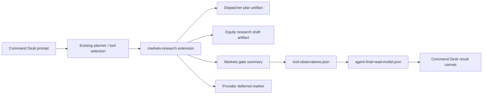

# Markets Research Capability Package Integration

- Date: 2026-06-12
- Status: implemented in this iteration
- Scope: Agent Runtime Host, Command Desk, public Skill/Extension surface, QA gates
- References:
  - `https://github.com/yennanliu/InvestSkill`
  - `https://github.com/prof-little-bear/cc-equity-research`

## 1. Decision

`InvestSkill` and `cc-equity-research` should be integrated as a single `Markets Research 能力包`, not as two copied runtimes and not as Claude Code CLI / slash-command surfaces.

The product model becomes:

```text
Command Desk
├── Crypto       -> CMC Skill Hub / WeChat evidence / market loops
├── Markets      -> Equity Research / Macro / Cross-asset drafts
└── Office       -> Meeting notes / document drafts / Feishu preview
```

`Markets` is a task lane inside the composer. It is not a new top-level product area and it does not expose raw skills, providers, slash commands, prompt filenames, or repository names.

## 2. Source Assessment

### 2.1 InvestSkill

`InvestSkill` is useful as prompt-methodology taxonomy. Its important contribution is not a runtime, but structured research frames such as company evaluation, fundamental analysis, valuation, earnings, sector analysis, research bundle, and result validation.

Integration boundary:

- Adopt framework taxonomy and output structure ideas.
- Do not copy its Claude Code plugin install flow.
- Do not expose its slash-command style usage.
- Do not make its generated `BUY / HOLD / SELL` labels a product action.
- Treat all output as research draft until evidence and price gates pass.

### 2.2 cc-equity-research

`cc-equity-research` is useful as dispatcher taxonomy and workflow coverage. Its four-user-command shape maps cleanly to a product-level dispatcher:

- `Discover`
- `Analyze`
- `Monitor`
- `Macro`

Integration boundary:

- Adopt dispatcher and workflow taxonomy.
- Do not expose raw slash commands.
- Do not connect live `drillr` MCP in this pass.
- Do not copy a second orchestrator or project-local Claude memory files.
- Add a deferred provider marker so future work must pass adapter/auth/normalizer/gate/QA before live data is enabled.

## 3. Runtime Architecture

The current Agent Runtime Host remains the only orchestrator.



New internal artifacts:

- `markets-dispatcher-plan.json`
- `equity-evidence-pack.json`
- `equity-research-draft.json`
- `markets-provider-deferred.json`
- `markets-capability-summary.json`

These artifacts are internal read models. They support QA, review, and task-local diagnostics. They do not replace `agent-final-read-model.json`.

## 4. Gate Contract

Markets Research uses the same safety pattern already proven in CMC gates:

| Gate | Current status | Product meaning |
| --- | --- | --- |
| Prompt framework | `usable` | local research methodology can structure a draft |
| Dispatcher | `planned` | task was routed into Discover / Analyze / Monitor / Macro |
| Provider transport | `provider_deferred` | no live equity MCP/provider was called |
| Research evidence | `user_context` or `empty_provider_evidence` | only user-supplied context can support conclusions |
| Price snapshot | `provider_deferred` | no independent price snapshot exists |
| Concrete prices | `false` | App/LLM must not invent price levels, entry/exit, stop loss, take profit, or ranges |
| Action advice | `false` | no `BUY / HOLD / SELL`, position sizing, or execution instructions |
| Product mutations | `review_required` or `discarded` | empty provider evidence stays strict |

This avoids the CMC-era bug where transport success was confused with evidence usability.

## 5. Public Surface

User-visible extension:

- `Markets Research 能力包`

User-visible skills:

- `Company deep dive`
- `Earnings review`
- `Thesis tracker`
- `Sector scan`
- `Macro / Cross-asset`

Forbidden user-visible surfaces:

- raw provider names
- `markets.*` internal tools
- repo names as product UI
- Claude Code slash commands
- prompt filenames
- `BUY / HOLD / SELL` as action buttons

## 6. Command Desk Integration

Command Desk keeps three top-level navigation items only:

- Workbench
- History
- Settings

Inside Workbench, the composer adds a third task intent:

- `Crypto`
- `Markets`
- `Office`

Markets quick actions are compact and task-oriented:

- Company deep dive
- Earnings review
- Thesis tracker
- Sector scan

The result canvas continues to show one authoritative final answer. Markets artifacts may support a task-local review sheet, but Swift must not rebuild final output from artifacts, session messages, SSE text, or provider payloads.

## 7. Future Live Provider Path

The live equity provider remains deferred. Before enabling it, the project needs:

1. Provider adapter with auth and redaction.
2. Normalized evidence contract.
3. Normalized price snapshot contract.
4. Gate split for transport, evidence, price, number quoting, and product mutations.
5. Business QA fixture for empty provider, partial evidence, usable evidence, price snapshot usable, and output guard rewrite.
6. UI copy that distinguishes provider-backed evidence from methodology-only draft.

Until then, Markets Research is a methodology-backed research draft lane.

## 8. Acceptance

- Backend writes all Markets artifacts for an equity draft run.
- `tool-observations.json` includes `marketsResearch.gate`.
- `agent-final-read-model.json` includes `marketsGateSummary`.
- Final output does not expose raw internal tools, provider names, repo names, slash command language, or `BUY / HOLD / SELL`.
- Product mutations are discarded when provider evidence and price snapshot are empty.
- Command Desk shows Markets as a composer lane and ability palette group.
- UI smoke verifies `ui_smoke_markets_research_visible=true`.
