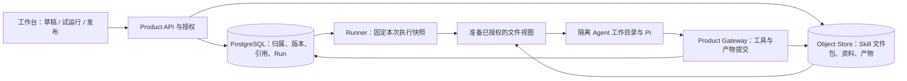

# Skill、Workflow 与 Agent Workspace 存储调研

调研日期：2026-09-21。性质：补充调研与开发建议，不是已完成实现或上线验收，也不替代 Master PRD / CURRENT_SYSTEM_ARCHITECTURE。

用户要求在继续 Skill / Workflow 引用接线前，研究市场项目的存储方式。本轮暂停了这部分实现，只做官方文档、源码对照和本地解析实验；没有重启预览、执行数据库迁移或安装新的运行时。

## 结论

Turnsu 应继续采用 **PostgreSQL 管理产品事实与引用关系，Object Store 保存文件内容，隔离执行目录向 Agent 提供文件视图**。当前问题不足以支持整体改用 SQLite、Git 或某个 Agent workspace 框架。

需要调整的是对象边界和生命周期：

1. Skill 是可移植的指令与文件包；它与 Turnsu 的输入输出契约、执行授权、测试和发布记录分开。
2. Workflow 是可编辑定义与发布版本；保存草稿、检查能否运行、正式发布是不同动作。
3. Agent workspace 是一次任务工作的文件环境；团队 workspace 是成员与权限边界，两者不能共用一个含混概念。
4. 会话记录、运行恢复数据、用户交付文件各有自己的保存与可见性规则。同步一个目录不足以同时实现这些能力。

这保留了现有 Product / Pi 分工，但会改变刚才准备接入的引用校验：不能把“当前可以执行”当作“可以保存草稿”的前提。

## 对照项目与证据

下表的“采用判断”是对 Turnsu 场景的工程判断，不是来源项目对 Turnsu 的背书。网页及 main/master 源码为当日可访问版本；未执行这些项目的端到端部署或性能比较。LinkCode 对照本地固定提交，Pi 同时检查了项目实际安装版本。

| 对象 / 项目 | 官方实现或文档可确认的事实 | Turnsu 采用判断 |
| --- | --- | --- |
| Agent Skills 标准 | 一个目录含 `SKILL.md`，可带 scripts、references、assets；必填 name、description，允许 license、compatibility、metadata、实验性的 allowed-tools；按需加载正文和附属资料。[规范](https://agentskills.io/specification) | 接受标准包的内容结构；输入输出类型、版本审批和实际工具授权由 Product 补充，不要求作者把所有平台设置写进正文。 |
| Pi | Skill 从目录 / 包发现，先加载名称描述，再按需读取；SessionManager 使用带 id / parentId 的会话条目，支持 JSONL 持久化和内存模式。[Skills](https://github.com/earendil-works/pi/blob/main/packages/coding-agent/docs/skills.md)、[SessionManager](https://github.com/earendil-works/pi/blob/main/packages/coding-agent/src/core/session-manager.ts)。本项目安装版本为 0.85.1。 | 保留原生 Skill 文件和 Pi 执行；Pi 的日志格式不承担团队发布、授权或业务成功判定。 |
| LinkCode | 固定提交 `da9c0673f102a6cc6e1410b45044bb8e03e9afb8` 中，SQLite 存 sessions、session_runs、resources、schedules、workspaces、worktrees；workspace 行登记 cwd；SessionStore 注明 transcript 留在 provider 本地 history。[数据库定义](https://github.com/arcboxlabs/linkcode/blob/da9c0673f102a6cc6e1410b45044bb8e03e9afb8/apps/daemon/src/db/schema.ts)、[SessionStore](https://github.com/arcboxlabs/linkcode/blob/da9c0673f102a6cc6e1410b45044bb8e03e9afb8/packages/host/engine/src/session/session-store.ts) | 借鉴工作目录、会话、输入 / 产物的分离及资源状态；不把本地 daemon.db 提升为 Turnsu 团队业务数据库。 |
| n8n | 工作流当前编辑版本与 activeVersionId 分开；历史保存 nodes / connections，执行数据另存 workflowData / workflowVersionId。保存变化后还需发布才进入生产执行。[实体](https://github.com/n8n-io/n8n/blob/master/packages/%40n8n/db/src/entities/workflow-entity.ts)、[历史](https://github.com/n8n-io/n8n/blob/master/packages/%40n8n/db/src/entities/workflow-history.ts)、[执行数据](https://github.com/n8n-io/n8n/blob/master/packages/%40n8n/db/src/entities/execution-data.ts)、[发布文档](https://docs.n8n.io/build/understand-workflows/save-and-publish-workflows) | 保留可编辑草稿与固定发布版本；用户能继续保存未完成配置。自动化运行固定版本，而不是跟随正在编辑的内容。 |
| Dify | Workflow 数据模型包含 tenant、app、version、graph；draft 与发布版本并存，WorkflowRun 独立保存版本、图、输入和结果。[模型源码](https://github.com/langgenius/dify/blob/main/api/models/workflow.py) | 工作流定义适合结构化数据库；运行需要捕获本次执行所用内容，不能靠事后读取最新编辑器状态解释历史结果。 |
| Deep Agents / LangGraph | StateBackend、StoreBackend、FilesystemBackend 按不同持久化范围使用，CompositeBackend 可按路径路由；checkpointer 保存线程状态，store 保存跨线程数据；技能可设只读或可编辑目录。[Backends](https://docs.langchain.com/oss/python/deepagents/backends)、[Persistence](https://docs.langchain.com/oss/python/langgraph/persistence)、[Skills](https://docs.langchain.com/oss/python/deepagents/skills) | 借鉴“同一文件视图、不同保存范围”与只读发布包 / 可写草稿的区别；不为此再引入 LangGraph 控制 Turnsu Runner。 |
| Mastra Workspace | filesystem 可独立于 sandbox，持久文件可以跨临时 sandbox 保存；可按 user / thread 解析存储前缀与 sandbox；文件工具授权与 shell 写入约束彼此独立。[Sandbox](https://mastra.ai/docs/sandbox/overview)、[Filesystem](https://mastra.ai/docs/sandbox/filesystem) | 明确谁拥有目录、何时持久化、重启如何恢复；只读约束须落实在执行环境，不能只在文件工具按钮上检查。 |
| OpenClaw | Agent workspace 存工作文件与上下文，与配置、凭据及 sessions 分开；文档明确 cwd 不是安全沙箱。[Workspace 文档源码](https://github.com/openclaw/openclaw/blob/main/docs/concepts/agent-workspace.md) | 借鉴可理解的目录布局与私有上下文；普通路径前缀不能替代租户授权、只读挂载或进程隔离。 |
| AgentFS | 提供 SQLite 格式的文件系统、KV 与工具调用记录；CLI overlay 与 sandbox 组合提供执行环境。项目 README 标为 Beta。[规范](https://github.com/tursodatabase/agentfs/blob/main/SPEC.md)、[README](https://github.com/tursodatabase/agentfs/blob/main/README.md)、[overlay 说明](https://turso.tech/blog/agentfs-overlay) | 是任务文件快照、携带与恢复的候选实现。它不能自动提供 Turnsu 的成员权限、发布语义或外部写入幂等性；当前先不增加这项依赖。 |
| Cloudflare Agents Workspace | 实验性虚拟文件系统用命名空间 SQLite 存目录与小文件，大文件可放 R2；文档仍列出文件锁 / 冲突处理等演进项。[设计源码](https://github.com/cloudflare/agents/blob/main/design/workspace.md) | 证明数据库元数据与对象内容组合有现实用途；具体阈值与 DO 部署限制不适合直接复制到现有 PostgreSQL 服务。 |
| `conorbronsdon/agent-workspace` | 这是通过 Skill 维护 Markdown 状态、决策和会话记录的工作区维护项目，不是通用持久化引擎。[README](https://github.com/conorbronsdon/agent-workspace)、[状态模型](https://github.com/conorbronsdon/agent-workspace/blob/main/docs/state-model.md) | 可借鉴上下文陈旧检测和可读记录，但不再为 Turnsu 建一套由 Agent 维护的权威 Goal / Plan / State 文件。用户未指定具体同名仓库，此项仅为搜索所得样本。 |

## 当前代码实际是什么

本节来自当前工作树，不依赖旧文档自报状态。

| 现有对象 | 当前责任与代码 | 判断 |
| --- | --- | --- |
| Skill 包字节 | `skill-package-format.mjs` 以规范化文件记录形成内部传输包；`FilesystemObjectStore` 按 workspace / object 存内容并核对 hash | 已经有文件层，无须把所有内容再次塞入 PostgreSQL。内部封装可以保留，不能被当成行业通用 Skill 格式。 |
| Skill 草稿 / 发布 | `postgres-skill-draft-lifecycle.mjs` 将草稿快照、包引用、验证、execution binding、发布版本关联；数据库要求发布 definition 与对应草稿快照一致 | 这种分离有价值；发布后不能为了运行方便而篡改原始 definition。 |
| 发布读取 | `postgres-skill-read-model.mjs` 已组合 version / validation / binding；Runner resolver 却要求 `row.definition.executionRef` | 实际接线缺口是两个消费者读取契约不同，不能据此判定 PostgreSQL 存储方向错误。 |
| Workflow | `workflow_revisions`、`compile_results`、`execution_plans`、`loop_versions` 与 pin 表已经存在 | 复用现有对象，补全读取与固定依赖，避免另建工作流数据库。 |
| Agent 执行 | `container-pi-worker.mjs` 使用 `SessionManager.inMemory(cwd)`，Product 通过私有 transcript 和事件链提供上下文 | 不能宣称复制本地 Pi JSONL 就能恢复当前 Product Run；恢复仍必须走已存在的 Product 快照与权限检查。 |
| 上传一致性 | `postgres-skill-upload-service.mjs` 调用对象存储后提交 DB 记录，promotion 也跨越这两个存储 | 这是两步协议，不是跨文件系统 / PostgreSQL 的单一原子事务；执行读取须同时验证 DB 可用状态与对象 hash，失败允许安全重试。 |

对应本地文件：

- [Skill 格式](../../domains/backend/code/workbench-server/src/skills/skill-package-format.mjs)
- [对象存储](../../domains/backend/code/workbench-server/src/storage/filesystem-object-store.mjs)
- [上传服务](../../domains/backend/code/workbench-server/src/skills/postgres-skill-upload-service.mjs)
- [Skill 草稿与发布](../../domains/backend/code/workbench-server/src/skills/postgres-skill-draft-lifecycle.mjs)
- [Skill 读模型](../../domains/backend/code/workbench-server/src/skills/postgres-skill-read-model.mjs)
- [Workflow 执行 resolver](../../domains/backend/code/workbench-server/src/runner/postgres-workflow-execution-resolver.mjs)
- [PG 基线与约束](../../domains/backend/code/workbench-server/src/store/postgres/migrations/001_pg_baseline.sql)
- [Pi Worker](../../domains/agent/code/agent-runtime/worker/container-pi-worker.mjs)

### 已复现的格式差异

用合成的无副作用 SKILL.md 调用当前 `inspectSkillPackage` 和项目实际安装的 Pi 0.85.1 `loadPiSkillsFromDir`，未执行 Skill、模型或脚本。

| 输入 | Turnsu 检查 | Pi 发现 |
| --- | --- | --- |
| 仅 name、description、正文 | passed | 成功，无诊断 |
| 同样内容，加 `license: MIT` | failed：skill_frontmatter_invalid | 成功，无诊断 |
| 同样内容，加 `allowed-tools: Read` | failed：skill_frontmatter_invalid | 成功，无诊断 |

实验原始输出在 `/private/tmp/turnsu-storage-research-VY4z3B/result.json`；临时目录可能被系统清理，上表保留了可复现输入和结果。源码白名单未包括上述两项。

纯指令 Skill 已经可以通过检查，不能把问题描述成“所有普通 Skill 都要求运行时清单”。现有检查在包含可执行文件时才强制 `skill.runtime.json`。这进一步说明应把**允许存入 / 阅读包**与**允许执行其中脚本**分开设计。导入 `allowed-tools` 只能保留作者声明，不能自动生成 Product 授权。

## 适合 Turnsu 的存储分工

这是拟采用的实现方向，以下目录为概念示意，不是新增公开 API，也不表示已落地。

| 数据 | 保存位置 / 身份 | 写入规则 |
| --- | --- | --- |
| Skill 源文件 | Object Store；包内容 hash 与文件清单 | 保留原始内容；已发布包不可原地修改，编辑产生新草稿 / 新包。 |
| Skill 元信息与可执行配置 | PostgreSQL；asset、version、binding 等现有对象 | 区分源内容、平台配置和验证事实；多个消费者读取同一权威组合。 |
| Workflow 草稿 | PostgreSQL 的 revision 与当前草稿指针 | 可保存未完成配置，带并发版本检查；跨权限引用、伪造 hash、非法结构仍拒绝。 |
| 发布 Workflow / 定时任务 | 已有发布版本、plan、依赖 pin / automation revision | 固定实际引用的 Skill 版本与内容、资料版本、模型配置版本和连接要求；配置变化不会悄悄改旧任务。 |
| 本次输入、过程与输出 | Run 快照 / 事件在 PG，文件内容在 Object Store | 每次运行可追溯实际输入；通过 Product 接收产物后才对用户宣称已保存。 |
| Agent 文件工作区 | 按任务 / 执行尝试隔离的目录，必要内容由受控快照恢复 | 授权 Skill 与输入只读；scratch / output 可写。恢复同任务也需重新检查权限，不能挂载整个团队对象库。 |
| 凭据与私有上下文 | 现有 secret / private transcript 路径 | 不随共享文件包、Workflow 导出或团队产物发布；目录名和哈希不是授权。 |

当前个人 / 小团队 MVP 继续使用现有本地 Object Store adapter。需要多机 Worker 时，先验证共享对象后端与恢复路径，再决定 S3 等部署方式；不因调研直接增加云账户、费用或 FUSE 服务。

AgentFS 的适用触发条件应是：用户确实需要整目录跨设备携带、分叉试验或大规模文件回滚，而且现有按产物保存无法满足。届时只替换执行文件层，仍不让它拥有团队业务状态。数据库文件快照也不代表外部 API 副作用能撤销，或模型重跑会得到相同结果。

## 对正在开发代码的具体修正

1. **拆分保存检查与执行检查。** 新写的 `requireWorkflowReferences` 目前把访问控制、版本存在、废弃状态、资料 readiness 混在一起，并用于保存草稿。应在保存时验证身份、结构与允许引用范围；对已授权但暂不可运行的配置给出明确诊断。编译 / 发布 / 执行继续严格检查完整性，不能把越权对象以“未完成草稿”为由接入。
2. **统一已发布 Skill 的读取。** 已有 read model、刚写的 helper、Runner 各自拼接会漂移。优先抽取 Skill 域内的窄读取接口，让执行 resolver 取得原始快照加已验证 binding 的投影；不向已发布 definition 补写 executionRef，不另存一份权威执行定义。
3. **完整固定依赖后再发布。** `publishLoop` 尚未接上真实 Skill / Resource pin；闭包和不支持的组合要明确校验。保留测试与发布对应同一内容的约束。一个 Skill 多版本同图目前受现有 pin 键限制，这个限制应明确显示，不能隐式选一个版本。
4. **发布、共享、弃用、撤销分别处理。** Skill asset 的 visibility 与 workspace release 的可见性存在不同字段，引用资格应与 Library / Grant 的实际授权路径一致，不能仅凭名字或一个 visibility 字段推断。普通弃用影响新采用；安全撤销应使执行停止或要求修复；草稿编辑不改既有版本。
5. **保持已有恢复机制，验证其边界。** Runner 已从不可变 Run 快照恢复，而不是每次重新读取最新草稿；不要重建 checkpoint 框架。补验入队时的 plan / pin 一致性、对象缺失和授权被撤销后的恢复行为。精确版本可追溯不等于 LLM 结果确定性。
6. **兼容标准包，额外能力按需配置。** 先修 license / allowed-tools 等已复现的兼容问题，保留声明但不授予工具权限。普通 Skill 的导入、阅读、试用与脚本执行准备应有不同状态；不要求用户先手写平台运行时文件才能管理知识型 Skill。

这些改动应复用现有数据模型和服务，不增加新数据库、通用 VFS、第二个 scheduler 或第二套审批系统。暂存中的 Workflow helper / compile 改动尚未验证，不能原样接入后就宣布链路完成。

## 用户应看到的行为与后续验收

Skill 入口优先展示说明、文件、试用、版本与使用位置。可执行配置仅在确实需要脚本、工具或结构化 Workflow 节点时展开。内部 hash、binding、pin 不应成为所有用户的必填项。

Workflow 中，保存成功只表示草稿已保留；试运行显示缺什么以及如何补齐；发布展示此次使用的版本；定时任务使用该发布版本。任务文件区区分“输入资料”和“已保存产物”，重开任务能看到自己的文件与上下文；共享结果只共享明确选择的内容。

下一次实现的黄金路径仍是已有真实 Skill：保存引用它的 Workflow → 配置可恢复 → 真实模型运行 → 发布固定版本 → 定时执行 → 刷新 / 重启读取结果。受影响验证至少覆盖：

- 带标准可选元数据的 Skill 可导入；工具声明不能扩大执行权限。
- 未完成草稿可保存；越权引用和伪造对象 hash 不能保存为有效引用。
- 已发布 Skill 编辑新草稿后，旧 Workflow 仍解析同一版本与内容。
- 试运行、发布和定时执行的 Skill / Resource / Model pin 一致。
- 中断后恢复可保留已接受的文件与结果；重复执行不会伪称外部副作用已撤销。
- 第二用户无法读取私有 Skill、未共享输入、私有 transcript 或凭据。

本轮证据仅支持上述架构取舍、源码差异与解析兼容问题。AgentFS / Mastra / Cloudflare 的性能和部署质量、S3、跨设备文件迁移、真实 LinkCode daemon 集成均未在本轮验证。

## 2026-09-22 补充：用户自己的 Agent 与原生 workspace

用户进一步明确工作台要接入自己的 Claude Code、Codex、Pi。由此需要区分两种执行上下文：Turnsu 托管任务继续使用 Product Session 和受治理 Worker；原生 Agent 的本地 session、workspace、登录和工具配置仍由它自己持有。不能把两者都压成一个模型配置，也不能把原生 workspace 同步成第二份 Product 权威数据库。

| 原生入口 | 已核对的一手证据 | 接入判断 |
|---|---|---|
| Codex | [App Server](https://developers.openai.com/codex/app-server) 提供 stdio JSON-RPC、thread start/resume/fork、turn events、interrupt 和审批；已安装 CLI 路径存在 | 用 App Server 建会话适配器；初始化确认与 turn 完成事件分别处理。会话恢复保留原生权限，不把旧 MCP server 当运行接口。 |
| Pi | [RPC](https://pi.dev/docs/latest/rpc) 提供 JSONL 命令、session 状态、prompt/abort 与 agent events | 本地 Pi 可用 RPC；prompt 的接收回执不能当完成，原生配置与资料目录归该用户。 |
| Claude | [Agent SDK](https://platform.claude.com/docs/en/agent-sdk/overview) 提供会话恢复、工具、权限处理；LinkCode 的固定版本使用该 SDK | 需要单独保留原生会话与审批语义。SDK/API 认证与用户 Claude Code 订阅不能默认视为同一种授权；不能承诺代管用户订阅额度。 |
| LinkCode | 本地固定 `v0.30.0` / `da9c0673f102a6cc6e1410b45044bb8e03e9afb8`，`packages/host/agent-adapter/src/adapter.ts` 与 native adapters | 借鉴 host 持有 provider adapter、原生 history capability、统一事件与 start/resume/stop 的职责划分。当前项目 bridge 仍只完成 Pi 的 Product Work Item 操作适配，未完成多 Agent UI 接入。 |

存储建议：Product 保存用户私有的设备/Agent/原生会话引用、明确接受的共享结果以及版本化工作方法；本地保留原生会话和工作目录。内容仅在用户明确执行上传、共享或交接时进入 Product Object Store。依赖本地目录的任务必须显示设备是否在线；排程不自动把本地任务转给云端或换 Agent。

新主流程应是选择项目与原生 Agent → 完成任务 → 查看结果和证据 → 将有价值的做法整理为可复用工作方法。工作流编辑展示目标、输入、结果、真实步骤依赖和复核条件，节点画布退为高级入口。工作流包固定技能版本和允许的数据引用，不封装登录凭据、整个个人工作目录或完整私有聊天记录。

本次核对属于接口/源码证据；检测到可执行文件不表示已经登录或连接成功。完整原生会话的接入、审批、断线恢复和跨设备验收仍需实现。LinkCode daemon 的实际启动此前被自动审批拦截，涉及 Keychain 与本地配置写入，等待该次明确授权；没有用其他启动方式绕过。
