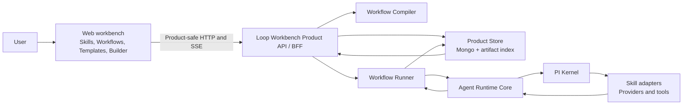
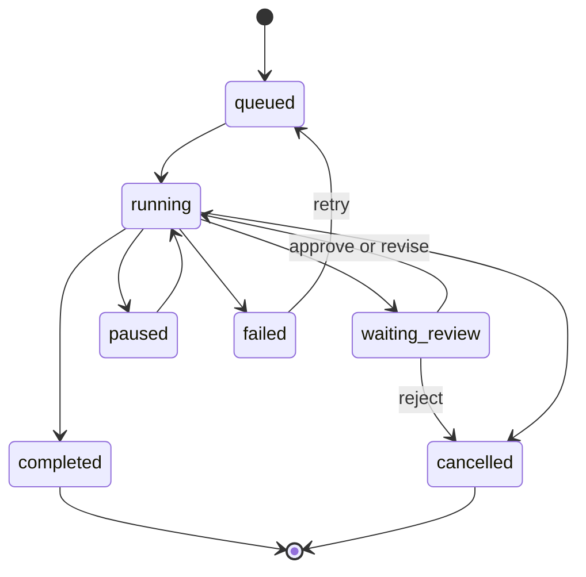
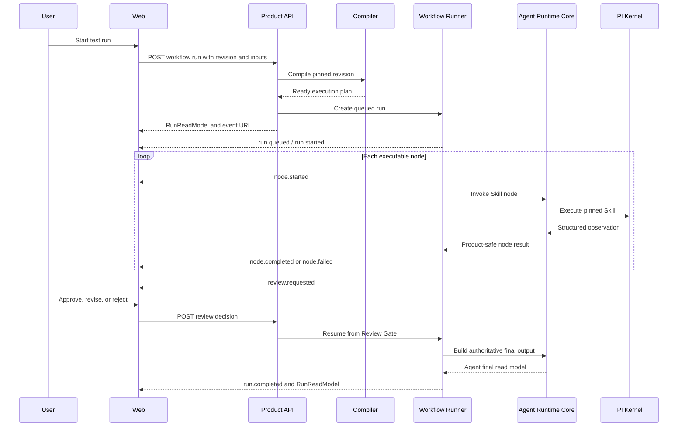

# Skill / Workflow / Loop Workbench Current System Architecture

- Date: 2026-07-18
- Status: current cross-domain architecture
- Current deployment scope: local-first, workspace-scoped Skill / Workflow / Loop Web workbench
- Target product scope: Skill & Loop cloud workbench with workspace-scoped team sharing; see the target PRDs
- Implementation status: Backend and Agent Slice 0–4, the product model-routing layer, and the single-machine operating unit are implemented. The original R0 code blockers are closed, but the current release decision remains NO-GO because authenticated candidate Mongo, external supply-chain, real Provider, repeatable cold-capacity, and full upgrade/rollback gates are not complete. The capability-filtered model picker is frozen at frontend tree `c928dda4e262bff84186333068317413d8debce6`; later backend/Agent work must not change it.

> **Production status override (2026-07-17):** the blockers found by the independent code review
> have been implemented and exercised through Product, Mongo and Docker paths. This closes the
> Slice 0–4 code-completeness finding; it does not authorize a production release. The current
> gate-by-gate evidence and remaining blockers are recorded in
> [the single-machine production readiness report](../qa/2026-07-17-backend-agent-slices-0-4-single-machine-production-readiness.md).
> Until every fail-closed release gate passes, the authoritative release status is `NO-GO`.

## 1. Document Authority

This document is the current cross-domain architecture source for the Web workbench.
It describes both the implemented system and the target boundaries needed to turn the
prototype into a real Skill / Workflow / Loop product.

The target product requirements have been expanded in the
[Skill & Loop Cloud Workbench Master PRD](../prd/2026-07-10-skill-loop-cloud-workbench-master-prd.md)
and its linked PRDs. This architecture document remains authoritative for what is implemented
today. Bounded workspace upload quarantine/promotion, immutable Skill publication, isolated
uploaded-code execution, product-safe package replacement, repository/resumable ingestion,
same-workspace Loop release/install, workspace Connections and portable Loop transfer are
implemented foundations. Cross-organization federation and public distribution remain non-goals;
the live aggregate Builder proposal has passed through the configured PI provider without exposing
provider or credential details.

Use sources in this order:

1. [PRODUCT.md](../../PRODUCT.md) for product scope and non-goals.
2. [DESIGN.md](../../DESIGN.md) for current Web information architecture and interaction rules.
3. This document for Web, Backend, Agent Runtime, storage, API, and execution boundaries.
4. [Current Frontend Truth](../../domains/frontend/documents/current-skill-workflow-loop-workbench.md) for prototype-specific behavior.
5. Historical architecture documents only as implementation background.

This document supersedes the architecture authority of:

- [2026-07-09 Frontend Backend Handoff](../../domains/frontend/documents/2026-07-09-frontend-backend-handoff.xml)
- [2026-06-12 Current Architecture Cleanup Sync](../../domains/backend/documents/architecture/2026-06-12-current-architecture-cleanup-sync.md)
- [2026-06-12 Agent Runtime Core and Pi Kernel Redesign](../../domains/agent/documents/architecture/2026-06-12-agent-runtime-core-pi-kernel-redesign.md)
- [Agent Runtime Wiki](../../domains/agent/code/agent-runtime/wiki/AGENT_RUNTIME_WIKI.md)

The internal Agent Runtime Core and Pi Kernel decisions in those documents remain useful
background where they do not conflict with this document.

## 2. Executive Decision

looloomi is one product: a Web workbench for managing callable Skills, managing owned
Workflows / Loops, using templates and a canvas to compose Skills, running the resulting
Workflow, reviewing the result, and reusing it.

The Web workbench is connected to a same-origin Product API. The Product API owns
versioned product contracts, Mongo repositories, immutable Workflow revisions, the DAG
compiler, the persisted Workflow Runner, review continuation, resumable product events,
and product-safe Run read models. Skill nodes execute through an explicit Agent Runtime
Core and PI Kernel boundary; browser code does not call the legacy Agent daemon.

The accepted P0 path uses a test-only deterministic conformance Skill loaded through the
real PI loader and production Workflow executor path. The default non-test catalog now exposes
the bounded `meeting-action-extractor` business Skill through a separate PI extension and an
explicit production executor registry binding. It processes supplied text only and has no network,
filesystem, connection, or external-action permission. Uploaded Skill packages can now enter
workspace-isolated quarantine, receive static inspection, and be promoted to immutable object
storage. Persisted uploaded packages can pass validation, publish an immutable `SkillVersion`, and
execute through Agent Runtime Core, a generic PI tool and a Docker-isolated executor. Workspace,
version and package hash are revalidated before execution; package code is not imported into the host process.

The target dependency direction is:

```text
Web UI
  -> Loop Workbench Product API / BFF
      -> Product Store
      -> Workflow Compiler and Runner
          -> Agent Runtime Core
              -> Pi Kernel
                  -> Skill and Tool Adapters
```

The browser must not call the Agent daemon directly. The Product API is the only public
Web boundary. Agent sessions, internal tool names, provider payloads, artifact paths,
policy implementation details, and runtime secrets remain internal.

## 3. Current System Reality

### 3.1 Capability Matrix

| Area | Implemented now | Missing for a real product |
|---|---|---|
| Skill management | Server catalog, schemas, readiness probes, real PI/Core execution, bounded production and isolated uploaded Skills, session-bound repository/resumable upload with quarantine/promotion, product-safe Instructions/Files and runtime settings, strong-ETag immutable versions, version history/diff/usage and retirement | General archive/binary ingestion and operational metrics |
| Workflow management | Server list/detail, generic goal-first create, immutable revisions, duplicate/from-Run/Team-release Fork, portable upload/import/export with exact dependency mapping, ETag save, stable provenance, local dirty-draft recovery, readable object overview and addressable Builder/preflight/Run/publish routes | Archive, richer revision comparison and rollback |
| Templates | Immutable server catalog and idempotent transactional create-from-template | Business template catalog and compatibility management |
| Canvas | Canonical revision graph, add/drag/move/delete/connect, ports, zoom, fit, minimap | Heavy-canvas replacement only if future scale requires it |
| Builder assistant | PI model-backed typed proposal generation, temporary-graph validation, revision-bound apply/dismiss, audit, explicit Web confirmation and live-provider aggregate proof; no local fallback | Two-phase idempotency reservation, operational telemetry and richer proposal diagnostics |
| Compile | Server DAG/port/schema/reachability validation, deterministic topology, derived readiness, server-derived text/Markdown Resource readiness | Controlled parallel plans and richer resource extraction diagnostics |
| Run | Persisted sequential node runner through Agent Core and PI, internal immutable SkillVersion/package-hash snapshots, SSE, Review Gate, authoritative final result, session-authorized cancel/retry commands, durable jobs/leases/fencing/checkpoints, startup recovery, terminal reconciliation and process-kill proof | Generic exactly-once external side-effect proof, pause/resume and richer replay controls |
| Run history | Durable list/detail, timeline, final answer, evidence gaps, review packet and decision history, rerun | Replay tooling and richer evidence lineage |
| Resources | Workspace-isolated text/Markdown/JSON Resource storage, immutable `1.0.0` references, Builder create/select/attach, transactional embedded Loop materialization, compiler readiness, and Runner Material resolution | PDF/OCR/binary extraction, detach/version management, and richer context controls |
| Connections | Product-safe workspace records, validation state, strong ETag, role enforcement and explicit binding to installations, starting points, Forks, updates and imported Workflow revisions | Real provider-specific credential onboarding and enterprise secret operations |
| Product API | Same-origin session/CSRF, Host validation, strict contracts, idempotency, ETag, static Web, repository/resumable upload, portable Loop transfer, current-revision tested Loop publication, Team install/Fork/explicit update, Connection, proposal and Run-command endpoints | Deployment/scale hardening and production provider operations |
| PI SDK | Valid Skill frontmatter, discovery diagnostics, explicit executor registry, Core invocation, bounded meeting-action binding, Docker-isolated uploaded-package tool, bounded Agent and in-node AgwaB orchestration | Production egress/secret policy for future external tool families |

### 3.2 Web Implementation

The active Web application is [web-prototype](../../domains/frontend/web/code/web-prototype/).
It uses React, Vite, Astryx wrappers, a local canvas adapter, TanStack Query, and the
same-origin Product API.

The Web behavior and data boundary are implemented, but the current rendered UI is not accepted as
the visual target. The previous capture proved routes, interactions, responsive overflow and
accessibility; it did not prove fidelity to the selected design. The obsolete 46-shot approval
record was removed. Current visual work is governed by [DESIGN.md](../../DESIGN.md) and the
[selected design handoff](../design/skill-loop-cloud-workbench-v1/HANDOFF.md).

Evidence:

- [App.jsx](../../domains/frontend/web/code/web-prototype/src/App.jsx) composes the backend-backed
  Skills, Loops, Team library, Loop overview, Builder, Run preflight and Run detail surfaces.
- [workbenchRoutes.js](../../domains/frontend/web/code/web-prototype/src/routing/workbenchRoutes.js)
  owns addressable product paths and browser-history mapping. Object identities remain URL state;
  Product records still load through TanStack Query rather than being copied into the router.
- [client.js](../../domains/frontend/web/code/web-prototype/src/api/client.js) owns the product-safe HTTP/SSE boundary, same-origin credentials, session renewal, ETag, and idempotency headers.
- [useWorkbenchServerState.js](../../domains/frontend/web/code/web-prototype/src/state/server/useWorkbenchServerState.js) owns cached server read models.
- [useWorkflowEditor.js](../../domains/frontend/web/code/web-prototype/src/state/editor/useWorkflowEditor.js) owns one unsaved revision draft and one-time legacy dirty-draft recovery.
- [useRunStream.js](../../domains/frontend/web/code/web-prototype/src/state/run-stream/useRunStream.js) reduces monotonic Run events and refreshes the authoritative Run detail.
- [LoopCanvas.jsx](../../domains/frontend/web/code/web-prototype/src/components/canvas/LoopCanvas.jsx) is the actual graph renderer.
- [flowgramAdapter.js](../../domains/frontend/web/code/web-prototype/src/components/canvas/flowgramAdapter.js) maps document data and detects the FlowGram package, but does not make FlowGram the execution model.

Retired fixture catalogs, the old all-in-one workspace hook, browser compile/run actions,
legacy snapshot writer, and unused scoped chat component were physically removed. Web
smoke alone remains insufficient proof; the accepted DOM and fresh HTTP tests execute the
real Product path.

### 3.3 Backend Implementation

The Product backend is implemented in two explicit packages:

- [workbench-contracts](../../domains/backend/code/workbench-contracts/) owns strict TypeBox v1 product schemas, examples, headers, and endpoint metadata.
- [workbench-server](../../domains/backend/code/workbench-server/) owns HTTP/security,
  application services, Product Mongo repositories, compiler, Runner, Agent bridge, and
  same-origin static Web delivery.

Product data uses `looloomi_workbench`; tests use only `looloomi_workbench_test`. Product
collections are separate from the legacy AgentMongoStore. Templates and revisions are
immutable, Workflow saves require `If-Match`, writes are idempotent, and Run events have
durable per-Run sequence numbers. Product API routes were not added to
`wechat-agent-daemon.mjs`.

The Product backend now also owns the execution fabric, personal Agent sessions, governed
long-term Memory, and isolation adapters. These are product modules in the same deployable
service, not a second public Agent control plane.

Model execution is owned by one in-process `ModelService` behind the Product Tool Gateway. A
revisioned `ModelCatalog` in Mongo is the runtime truth: `model_profiles` stores product identity
and scope, immutable `model_profile_revisions` store provider/protocol/capability/parameter/limit
configuration, and versioned `model_routing_policies` store per-workspace capability defaults.
The single-machine V3 config is a secret-free, idempotent operator import into that catalog; it is
not a second runtime truth source. Session preference selects a profile, while each Agent Turn and
compiled Workflow pins a concrete revision before execution. The public API returns product-safe
profile/readiness/selection fields and never returns credential references, endpoint internals or
raw provider payloads.

DeepSeek and OpenAI use `openai_compatible_chat`; Anthropic uses native Messages; Gemini uses
native `generateContent`; Stability image generation uses its own binary-response adapter and
writes the result through the governed Product Artifact service. Stability is a typed
`model_task`, not a PI chat turn. The first release intentionally exposes only
`stable-image-core`, with its official seed/aspect-ratio bounds and a versioned 3-credit
(estimated USD 0.03) single-image policy; runtime authentication probing is non-generative and
non-billable. Image fallback is forbidden. Chat fallback is attempted only for
compiler-pinned compatible revisions when workspace and Workflow policy explicitly allow it; a
Session Turn does not invent a fallback route. Every attempt records requested and actual revision,
capability, protocol, bounded usage/status and fallback state without recording prompt, image or
Provider payload. In single-machine production, credentials are lazy-resolved from macOS Keychain
account `model-credential:<credentialRef>` on the host. Missing credentials make the profile
unavailable and required routes fail closed; credentials never enter the catalog import, Agent
sandbox, environment JSON, Artifact metadata or log.

### 3.4 Agent Runtime and PI SDK

The Agent Runtime already has reusable foundations:

- [AgentRuntimeCore](../../domains/agent/code/agent-runtime/core/run-loop/agent-runtime-core.mjs)
- [Pi Kernel adapter](../../domains/agent/code/agent-runtime/kernels/pi/pi-kernel-adapter.mjs)
- [tool router](../../domains/agent/code/agent-runtime/core/router/tool-router.mjs)
- [context plane](../../domains/agent/code/agent-runtime/control-plane/context-plane.mjs)
- [gate engine](../../domains/agent/code/agent-runtime/core/gates/gate-engine.mjs)
- [final output writer](../../domains/agent/code/agent-runtime/core/artifacts/artifact-writer.mjs)
- [Mongo store](../../domains/agent/code/agent-runtime/lib/mongo-store.mjs)

Current limitations:

- the legacy daemon still accepts prompt/capability inputs and remains separate from the Product Workflow path;
- P0 executes Workflow nodes sequentially with `maxParallelism=1`;
- a test-only conformance Skill and one bounded business Skill have explicit bindings; persisted
  uploaded versions use a generic workspace-scoped PI tool and Docker-isolated executor;
- `revise` requires a Review Gate to declare a direct Skill text-input target, persists the
  reviewer feedback, and creates a new upstream Skill attempt with that feedback appended to the
  declared input; Review Gates without that mapping explicitly disable change requests in the Web;
- queued and expired claimed work is recovered from the Run-owned immutable snapshot at Product
  server startup; checkpoints, cancel and retry are implemented foundations.
- BuilderProposal generation now uses an isolated PI model session through Agent Runtime Core, with
  no tools, extensions, Skills, context files or persistent session. Product contracts revalidate
  the result before a user can apply it. Process-kill boundary reconciliation is implemented;
  generic exactly-once external side-effect policy remains deployment hardening for future
  external-action Skills. Text/Markdown/JSON Resources are server-owned and executable through
  Material nodes; PDF/OCR extraction and provider credential onboarding are outside this V1.

### 3.5 Agent Execution Platform, Memory, and Isolation

The implemented control chain is:

```text
Product API / AgentTurnRunner / WorkflowRunner
  -> Product-owned Execution Broker
  -> deterministic_skill | bounded_agent | agent_orchestrator
  -> process | container | remote adapter
```

Ownership is deliberately split:

- `WorkflowRunner` owns the outer Loop Run, immutable plan, review, retry, lease/fence,
  checkpoint, Run state, and final result.
- `AgentTurnRunner` owns FIFO turns for one personal Session. One Turn may start multiple
  bounded Workers concurrently; it does not create concurrent Turns in the same Session.
- `ExecutionBroker` owns Worker invocation, attempt, event, checkpoint, capability lease,
  cancellation transport, and late-result fencing.
- `ProductMemoryService` is the only long-term Memory authority. PI compaction remains
  Session-context compression and is not durable Memory.

`deterministic_skill` calls a fixed Skill/script without creating a PI Session.
`bounded_agent` creates one budgeted Worker. `agent_orchestrator` may create a dynamic child
graph only inside the current immutable outer node. Default Product composition supplies a
`ProductAgentExecutor` and registers the bounded container and AgwaB orchestrator paths through
the Product-owned Broker. AgwaB children are opened while the parent is running, receive separate
product invocation/attempt/event/checkpoint records, inherit only a permission subset, and are
cancelled and fenced with the parent. The outer pinned Loop graph remains unchanged.

The built-in Agent definitions are `main`, `skill_creator`, and `loop_creator`. Main Sessions
are scoped by `user × workspace`; Module Sessions are scoped by
`user × workspace × object × branch`. Collaborators therefore never share transcript, PI
Session, permission lease, or temporary branch. Module Agents produce structured proposals.
Non-overlapping proposal changes are rebased and recompiled; same-path changes persist a
`MergeConflict` and leave the canonical Draft unchanged.

PI compatibility is pinned to Node `22.22.3`, Pi `0.80.7`, `pi-subagent` `0.4.8`, and
`pi-workflow` `0.8.1`. The backend uses its own YAML dependency and the Agent domain's public
Skill loader adapter rather than PI internal files or transitive dependencies.

Mongo is the sole durable Memory truth. Agent, Worker and public submissions always create a
`MemoryCandidate`; automatic promotion is available only to the internal canonical ingestion path,
which rereads the Product object, revision, validation and evidence hash before applying policy.
Retrieval first applies workspace, subject, scope, and permission filters, then
text/tag/confidence/recency ranking; Context Capsules contain only bounded summaries and evidence
references. Embedding is an uncalled adapter boundary in this version. Physical deletion removes
content and retains only a content-free hash tombstone.

The shared Container Sandbox preserves the existing uploaded-script contract and applies
digest-pinned images, no network, read-only roots, non-root UID, dropped capabilities,
`no-new-privileges`, and CPU/memory/PID/file/output bounds. The repository contains a buildable
Agent image and Worker/Supervisor protocol pinned to Node 22.22.3, Pi 0.80.7, pi-subagent 0.4.8 and
pi-workflow 0.8.1. Host-to-container communication uses framed stdio RPC; Provider, Mongo,
Connection and user secrets never enter the container. The Gateway revalidates invocation,
attempt, fence, lease, allowlist, permissions and budget for every request. Docker unavailability
produces `sandbox_unavailable`; there is no host-process success fallback.

`RemoteWorkerTransport` defines `probe`, `dispatch`, `streamEvents`, `checkpoint`, `cancel`,
`resume`, and `dispose`. The adapter reorders and deduplicates bounded product events, resumes
after disconnect from the last committed sequence, cascades cancellation, and constructs event,
artifact, evidence and result payloads from explicit product allowlists. Unknown transport,
Provider, tool, host-path, image, socket and credential fields are dropped. Only a loopback/fake
transport exists. There is no real device registration, mTLS, relay, NAT traversal, fleet
scheduler, or public user-selectable Remote backend.

### 3.6 Current Acceptance Boundary And Post-V1 Limits

The R0 implementation findings in the
[independent code review](../qa/2026-07-16-backend-agent-slices-0-4-independent-code-review.md)
and [production readiness review](../qa/2026-07-16-backend-agent-slices-0-4-production-readiness-review.md)
are closed by the default Product Agent/AgwaB chain, server-verified Memory promotion, buildable
credential-free Agent sandbox, atomic terminal state, and Remote allowlists. Migration
`006-model-routing` adds the revisioned catalog, routing policy, attempt indexes and Product
Artifact metadata. The single-machine backup unit now binds two AES-256-GCM archives—Mongo and the
complete Object Store—to one manifest and verifies restored Artifact metadata against restored
content hashes. Normal readiness verifies required capability routes without creating billable
image work.

The integrated local acceptance for model routing is recorded in the
[2026-07-18 model-routing acceptance addendum](../qa/2026-07-18-model-routing-production-acceptance.md).
It includes Contracts 44/44, Backend 431 pass / 14 gated skip / 0 fail, full Agent runtime integrity,
and real digest-pinned bounded PI plus `pi-workflow` container execution. These are code and local
runtime proofs, not substitutes for the release gates below.

Production release is still blocked. A new Product-path release gate starts the staged candidate
in a separate process with its bundled Node and requires separate real chat and Stability smoke
evidence bound to the exact source commit, candidate digest and selected model
revision. The Stability gate requires an explicit billable confirmation and verifies the resulting
Artifact hash, authorized retrieval, cross-workspace denial and absence of a PI Session. The
release manager also requires source/candidate-bound license evidence in addition to dependency,
SBOM, secret and exact-image CVE evidence. It verifies all evidence before writing a manifest,
before reading runtime secrets, and before backup or activation. Missing, stale, handwritten or
candidate-mismatched evidence produces `release_gates_not_passed`, not degraded success. These live
and external gates have not been executed for the integrated candidate in this document, so the
authoritative verdict remains `NO-GO`. See the
[2026-07-17 readiness report](../qa/2026-07-17-backend-agent-slices-0-4-single-machine-production-readiness.md)
and the model-routing acceptance addendum in `wiki/qa/`.

The earlier live provider-backed aggregate proof remains evidence for its narrow Builder boundary
only; it is not Slice 0–4 production proof.
The Web visual result
was explicitly rejected on 2026-07-15 because the implementation did not match the selected
lifecycle board and key-frame hierarchy. This is active implementation work, not a pending approval
checkbox. The three visual baseline screens must be rebuilt and approved before broader Web visual
acceptance resumes.

After that visual baseline is accepted, the remaining deployment or expansion items are:

| Priority | Limit | Evidence and impact |
|---|---|---|
| P3 / deployment | External-action reliability | Durable claim/fence/checkpoint/recovery, terminal reconciliation and process-kill proof are implemented. Future Skills that perform non-idempotent external actions need provider-specific effect receipts and reconciliation policy. |
| P3 / scale | Builder throughput | Generation currently holds the idempotency transaction during the bounded model call. A two-phase reservation is required before high-throughput deployment. |
| P3 / product expansion | Rich Resources and replay | PDF/OCR/binary extraction, provider credential onboarding, richer evidence lineage, pause/resume controls and cross-organization federation remain outside this V1. |
| P1 / release proof | External security and Provider gates | Exact-candidate chat and explicitly confirmed Stability Product-path smoke, authoritative dependency/license evidence, exact-digest image CVE reports and repeatable cold-capacity/release rehearsal are required before GO. |
| P2 / remote execution | Real device transport | The transport contract and loopback fault suite are implemented; device identity, mTLS, relay/NAT, upgrade, quota, and fleet scheduling require a separate design and acceptance cycle. |

Historical artifacts remain invalid as current health proof. The dated 2026-07-17 readiness report
and the 2026-07-18 model-routing addendum together describe current evidence; both preserve a
NO-GO verdict until a later exact-candidate report records every release gate as passed.

## 4. Implemented P0 Architecture and Target Evolution

### 4.1 System Context



### 4.2 Physical Deployment

Phase 1 uses one local Node process to minimize operational cost:

- serve or proxy the Web application;
- mount the Product API under `/api/workbench/v1`;
- keep existing Agent compatibility routes internal;
- inject the daemon credential server-side;
- reuse Mongo and the current artifact root after path correction.

This is one process, not one module. Product routes, repositories, compilers, read-model
adapters, and Agent Runtime code must remain separate. New product behavior must not be
added directly to `wechat-agent-daemon.mjs`.

Development:

- Vite proxies `/api/workbench/v1` to the local Product API.
- The proxy or backend injects local authentication.
- The browser never reads `runtime/agent/auth-token.json` and never stores a daemon token.

Production/local review:

- the Product API serves the built Web files from the same origin;
- same-origin session/bootstrap handling stays inside the Backend boundary;
- Host and Origin protection remains enabled.

### 4.3 Responsibility Boundaries

| Layer | Owns | Must not own |
|---|---|---|
| Web presentation | navigation, accessible controls, canvas rendering, Inspector, product copy, i18n | server truth, readiness decisions, tool routing, artifact parsing |
| Web editor state | unsaved graph draft, selection, viewport, dirty state, compile diagnostics | durable Workflow revision, template mutation, run authority |
| Product API / BFF | public API, auth bridge, product-safe errors, read models, idempotency | agent reasoning, provider-specific UI, canvas rendering |
| Product Store | Skills, Templates, Workflows, revisions, Resources, Runs, event cursor, audit | prompt design, provider routing |
| Workflow Compiler | graph validation, ports, mappings, topology, readiness, execution plan | UI position decisions, model reasoning |
| Workflow Runner | persisted state machine, node scheduling, checkpoint, review pause, cancellation | changing user graph semantics |
| Agent Runtime Core | context, capability resolution, policy, evidence, review contract, final authority | product navigation, browser state |
| PI Kernel | Skill session/tool execution, agentic node execution, normalized observations | Workflow ownership, public product types, final UI read model |
| Skill adapter | provider transport, normalizer, Skill-specific schemas and artifacts | global routing, template/product lifecycle |

## 5. Canonical Product Model

Every durable object includes:

- `schemaVersion`;
- stable ID;
- `createdAt` and `updatedAt`;
- object revision or immutable version;
- product-safe status;
- no raw provider secret or internal tool identifier.

### 5.1 SkillDefinition

`SkillDefinition` is the user-visible and executable Skill contract.

Required fields:

- `skillId` and `version`;
- `name`, `description`, `category`, and localized display metadata;
- `status`: `draft | validating | ready | blocked | retired`;
- typed `inputSchema` and `outputSchema`;
- risk and external-action summary;
- dependencies and setup checks;
- `executionRef`: `capabilityId`, `taskIntent`, adapter version, and execution mode;
- usage count derived from Workflow revisions;
- readiness diagnostics.

A user-created Skill starts as `draft`. It cannot become `ready` merely because a form
was submitted. Activation requires schema validation, an execution adapter, readiness
checks, and a test invocation.

Internal tool names do not appear in `SkillDefinition`.

### 5.2 WorkflowTemplate

`WorkflowTemplate` is immutable:

- `templateId`;
- fixed `templateVersion`;
- display metadata;
- input form definition;
- immutable graph;
- included Skill versions;
- expected outputs and review policy;
- availability and compatibility diagnostics.

Using a template creates a new owned Workflow and its first revision. Templates cannot
be saved, run, or patched in place.

### 5.3 Workflow and WorkflowRevision

`Workflow` contains stable identity and ownership:

- `workflowId`;
- name, description, status, and archive state;
- current revision ID;
- optional source template reference;
- latest compile summary and latest run summary.

`WorkflowRevision` is an immutable saved version:

- `revisionId` and monotonically increasing `revisionNumber`;
- `baseRevisionId`;
- graph, input form, output definition, resources, and run settings;
- content hash;
- author and save reason;
- compile status and diagnostics.

The editable browser graph is a draft derived from one saved revision. Saving creates a
new revision rather than overwriting historical run inputs.

### 5.4 WorkflowNode and WorkflowEdge

Supported v1 node kinds:

| Kind | Meaning |
|---|---|
| `Input` | Collect and validate run input. No Agent call. |
| `Skill` | Invoke one pinned `SkillDefinition` version through Agent Runtime. |
| `Material` | Resolve attached Resource references into bounded context. |
| `Transform` | Apply a declared deterministic mapping or a bounded agent transformation. |
| `ReviewGate` | Pause the run and wait for an explicit decision. |
| `Output` | Assemble the user-facing result from reviewed upstream values. |

`WorkflowNode` includes:

- `nodeId`, kind, title, description, and canvas position;
- Skill reference where applicable;
- typed input ports and output ports;
- input bindings;
- node configuration;
- review and retry policy;
- timeout and optional condition;
- display metadata separate from executable data.

`WorkflowEdge` includes:

- `edgeId`;
- `sourceNodeId` and `sourcePort`;
- `targetNodeId` and `targetPort`;
- optional mapping expression;
- no visual-only routing data.

Canvas curve points and viewport position stay in editor metadata. They do not change
execution semantics.

### 5.5 BuilderProposal

The Builder assistant returns a `BuilderProposal`:

- `proposalId`;
- `workflowId` and `baseRevisionId`;
- user prompt;
- human-readable summary;
- typed operations;
- compile diagnostics after applying operations in a temporary graph;
- status: `proposed | applied | dismissed | conflicted | invalid`;
- created and decided timestamps.

Allowed operations:

- `addNode`;
- `removeNode`;
- `updateNode`;
- `connectNodes`;
- `disconnectNodes`;
- `updateWorkflowSettings`;
- `attachResource`;
- `detachResource`.

The assistant cannot set readiness, persist a revision, or start a run. Applying a
proposal is a separate transaction that checks `baseRevisionId`.

### 5.6 CompileResult

`CompileResult` is the only source of Workflow readiness.

It contains:

- `status`: `ready | blocked | invalid`;
- Workflow and revision identity;
- topologically ordered steps;
- required run inputs;
- missing bindings and Resources;
- unavailable or incompatible Skills;
- orphan and unreachable nodes;
- invalid cycles;
- port and schema mismatches;
- review gates;
- output nodes;
- warnings and recovery actions;
- a versioned execution plan when ready.

For v1, the graph must be acyclic. “Loop” means a reusable Workflow that can be run
again, not a graph cycle.

### 5.7 WorkflowRun and RunReadModel

`WorkflowRun` pins:

- `runId`;
- Workflow ID and immutable revision ID;
- input values and Resource references;
- execution-plan version;
- status;
- current node;
- timestamps;
- idempotency key;
- node attempts;
- review decisions;
- authoritative final read-model reference.

Run states:



`RunReadModel` is product-safe and includes:

- Workflow and revision identity;
- current and terminal status;
- node timeline;
- final answer copied from the authoritative Agent final read model;
- evidence gaps;
- review packet and decision history;
- failure summary and recovery action;
- follow-up prompts;
- Resource and evidence references safe for UI display.

Backend adapters must not reconstruct a different final answer from raw events,
provider output, or artifact files.

## 6. Product API

All public Web routes use:

```text
/api/workbench/v1
```

### 6.1 Conventions

- JSON request and response bodies.
- `schemaVersion` on durable read models.
- `ETag` and `If-Match` for Workflow revision mutations.
- `Idempotency-Key` on every write, run start, command, and review decision.
- cursor pagination for lists.
- stable request ID in every response.
- UTC ISO-8601 timestamps.
- no raw internal tool, provider, schema path, artifact path, or secret.

Error envelope:

```json
{
  "code": "workflow_revision_conflict",
  "message": "This workflow changed after you opened it.",
  "details": {
    "workflowId": "workflow-123",
    "expectedRevision": 4,
    "currentRevision": 5
  },
  "retryable": false,
  "requestId": "request-123"
}
```

The Web maps `code` to localized product copy. The server message is diagnostic fallback,
not the primary visible UI label.

### 6.2 Endpoints

The table below is the full target surface. The implemented contract covers workspace, Skill
lifecycle, Template use, Workflow lifecycle/revisions, compile, text Resources, Builder proposal
generate/apply/dismiss, Run start/history/detail/events, Review decisions and cancel/retry commands.
Repository import, binary extraction, generic uploaded-code execution and pause/resume remain target
work and must not be inferred as implemented from this table.

| Capability | Endpoint |
|---|---|
| Workspace bootstrap | `GET /workspace` |
| List Skills | `GET /skills` |
| Create Skill draft | `POST /skills` |
| Skill detail/update | `GET/PATCH /skills/{skillId}` |
| Validate/activate Skill | `POST /skills/{skillId}/validate`, `POST /skills/{skillId}/activate` |
| Skill usage | `GET /skills/{skillId}/usage` |
| List/detail Templates | `GET /templates`, `GET /templates/{templateId}` |
| Use Template | `POST /templates/{templateId}/workflows` |
| List/create Workflows | `GET/POST /workflows` |
| Workflow detail/update/archive | `GET/PATCH/DELETE /workflows/{workflowId}` |
| Duplicate Workflow | `POST /workflows/{workflowId}/duplicate` |
| Save revision | `POST /workflows/{workflowId}/revisions` |
| Get revision | `GET /workflows/{workflowId}/revisions/{revisionId}` |
| Compile draft/revision | `POST /workflows/{workflowId}/compile` |
| Generate proposal | `POST /workflows/{workflowId}/proposals` |
| Apply/dismiss proposal | `POST /loops/{workflowId}/proposals/{proposalId}/apply`, `POST /loops/{workflowId}/proposals/{proposalId}/dismiss` |
| Start run | `POST /workflows/{workflowId}/runs` |
| Workflow run history | `GET /workflows/{workflowId}/runs` |
| Run detail | `GET /runs/{runId}` |
| Product event stream | `GET /runs/{runId}/events?after={sequence}` |
| Run command | `POST /runs/{runId}/commands` |
| Review decision | `POST /runs/{runId}/review-decisions` |
| Create/upload Resource | `POST /resources` |
| Resource detail/status | `GET /resources/{resourceId}` |
| Attach/detach Resource | `POST/DELETE /workflows/{workflowId}/resources/{resourceId}` |

`POST /runs/{runId}/commands` accepts only versioned product commands:

- `pause`;
- `resume`;
- `cancel`;
- `retryRun`;
- `retryNode` where the execution plan allows it.

### 6.3 Browser Security Boundary

The Product API is a BFF, not a CORS pass-through to the Agent daemon.

- Browser requests use the Product API origin.
- Backend code attaches internal daemon credentials.
- The daemon token never reaches JavaScript or `localStorage`.
- The BFF accepts only product-safe request bodies.
- The BFF maps internal Agent events to product Run events.
- Raw Agent compatibility routes remain unavailable to normal Web code.

## 7. Compile and Execution

### 7.1 Compile Rules

A revision is runnable only when:

- the graph is a DAG;
- every node kind is supported;
- at least one Input or bound starting value exists;
- at least one Output node is reachable;
- every required input port is bound;
- every edge references real nodes and compatible ports;
- every Skill reference resolves to an active version;
- required Resource extraction is ready;
- Review Gate configuration is valid;
- no node depends on an unreachable predecessor.

Warnings do not imply readiness. Each diagnostic has:

- code;
- severity;
- node or edge target;
- human-safe message key;
- recovery action.

### 7.2 Run Sequence



### 7.3 PI Kernel Role

The Workflow Runner controls graph order. PI executes Skill nodes.

Two execution modes are allowed:

- deterministic Skill adapter: one validated input produces one structured output;
- agentic Skill session: PI may plan and call tools inside the node boundary until the Skill contract completes.

An agentic Skill may not add Workflow nodes, bypass a Review Gate, execute a successor
early, or rewrite the saved graph. Any proposed graph change returns as a
`BuilderProposal` for later user confirmation.

### 7.4 Review Gate

When a `ReviewGate` is reached:

- the Run status becomes `waiting_review`;
- downstream nodes do not start;
- a `review.requested` event contains a product-safe packet;
- the decision is persisted with actor, timestamp, note, and idempotency key;
- `approve` resumes;
- `revise` records requested changes and returns the Run to the configured node;
- `reject` cancels the remaining plan.

This replaces the current approval artifact that records `approved: false` without an
execution continuation.

## 8. Product Event Contract

SSE event types:

- `run.queued`;
- `run.started`;
- `node.started`;
- `node.progress`;
- `node.completed`;
- `node.failed`;
- `review.requested`;
- `run.paused`;
- `run.completed`;
- `run.failed`;
- `run.cancelled`.

Envelope:

```json
{
  "schemaVersion": "workbench-run-event-v1",
  "sequence": 42,
  "eventId": "event-42",
  "type": "node.completed",
  "runId": "run-123",
  "workflowId": "workflow-123",
  "workflowRevisionId": "revision-4",
  "nodeId": "node-review",
  "status": "completed",
  "summary": "Evidence review completed.",
  "occurredAt": "2026-07-10T10:00:00.000Z"
}
```

Requirements:

- `sequence` increases monotonically per Run;
- the event log is durable before delivery;
- reconnect accepts `after` or `Last-Event-ID`;
- duplicate delivery is allowed and client reducers are idempotent;
- terminal events are followed by an authoritative `GET /runs/{runId}` refresh;
- raw tool streams and provider deltas are not product events.

## 9. Frontend State Architecture

The Web state is split into four concerns.

### 9.1 Server State

Owns cached Product API read models:

- Skills;
- Templates;
- Workflows and revisions;
- Runs;
- Resources;
- Builder proposals.

Server state handles loading, stale data, retry, mutation errors, ETag conflicts, and
cache invalidation.

### 9.2 Editor State

Owns the unsaved Builder session:

- base revision;
- draft graph;
- selected node;
- viewport;
- local dirty flag;
- pending local operations;
- latest compile diagnostics;
- pending Builder proposal.

`localStorage` may cache this draft for crash recovery. It is not durable product truth.

### 9.3 Run Stream State

Owns:

- event cursor;
- node statuses;
- current Review Gate;
- connection state;
- terminal refresh state.

The reducer is idempotent by `sequence` and `eventId`.

### 9.4 UI State

Owns:

- active page;
- drawer and assistant visibility;
- toast queue;
- theme;
- locale;
- ephemeral focus and menu state.

UI state does not contain Skill availability, Workflow readiness, or Run authority.

### 9.5 UX Invariants

- “Save this workflow” saves one Workflow revision.
- Template controls are read-only except “Use template”.
- Readiness and blocked reasons come from `CompileResult`.
- Every disabled run action shows one product-safe reason and recovery action.
- Run detail always exposes node timeline, final answer, evidence gaps, and review packet.
- Product copy never exposes provider IDs, internal tools, schema filenames, artifact paths, or secrets.
- EN and ZH labels are frontend concerns; backend returns stable codes and structured values.

## 10. Capability Status

### P0: Implemented for the First Real Vertical Slice

1. Correct the runtime root and use one auth/artifact/PID location.
2. Make PI Skill loading valid and expose actual readiness diagnostics.
3. Add the same-origin Product API/BFF.
4. Add canonical versioned product contracts and boundary validation.
5. Persist Skill definitions, immutable Templates, Workflows, and Workflow revisions.
6. Implement the DAG compiler and derive readiness from it.
7. Implement a persisted node-level runner.
8. Map a real Skill node to Agent Runtime Core and PI Kernel.
9. Emit product-safe, resumable node events.
10. Implement Review Gate decisions and continuation.
11. Build `RunReadModel` from the authoritative Agent final read model.
12. Connect one Web path end to end and remove its mock fallback.

Fresh acceptance evidence for all twelve items is recorded in
`wiki/qa/2026-07-10-skill-workflow-loop-first-slice-acceptance.md`.

### P1: Required for Reliable Daily Use

- generic exactly-once effect policy for future externally mutating Skills, building on the completed
  terminal reconciliation and process-kill fault matrix;
- bounded node replay and pause/resume beyond the implemented Run retry/cancel path;
- PDF/OCR/binary Resource extraction beyond the implemented bounded text/Markdown path;
- two-phase Builder proposal idempotency reservation and production provider telemetry;
- richer ETag conflict merge UI beyond the current visible reload/retry recovery;
- timeout, cancellation propagation, per-run filesystem boundary;
- provider-specific secret and network egress allowlists for future external Skills;
- product event cursor retention;
- completed Run detail and rerun exist in P0; P1 adds replay controls and unfinished-job recovery.

### P2: Product Hardening

- general archive ingestion, cross-organization lifecycle and richer package authoring;
- node-level replay where side effects allow it;
- evidence lineage and checksums;
- artifact index and retention;
- cost, latency, and failure metrics;
- controlled execution of independent DAG branches;
- workflow revision comparison and rollback.

### P3: Deferred From the Current P0 Implementation

- cross-organization federation and public marketplace distribution;
- scheduled Loops;
- long-term memory;
- subagent orchestration;
- external channel execution;
- automatic Workflow optimization.

CMC, Markets, Meeting, WeChat, Office, and Crypto code may remain as sample Skill
adapters and templates. They must not create new top-level products or new branches in
the core daemon.

## 11. Migration Plan

### Phase 0: Restore Runtime Integrity (complete)

- fix root resolution;
- align scripts, token, PID, Mongo, and artifact paths;
- add valid PI Skill metadata;
- add a clean-start runtime smoke that does not rely on historical artifacts;
- publish current capability readiness honestly.

Exit condition: one registered Skill can be invoked through Agent Runtime Core from a
clean runtime directory.

### Phase 1: Product Data Plane (P0 complete)

- implement Product API/BFF modules;
- add canonical schemas and validation;
- add repositories for Skills, Templates, Workflows, revisions, Runs, and events;
- serve Web and API through the same-origin boundary;
- keep existing Agent routes internal.

Exit condition: Web lists backend Skills/Templates, creates a Workflow from a Template,
and saves a revision with conflict detection.

### Phase 2: Compiler and Runner (P0 complete)

- compile graph ports and bindings;
- create an immutable execution plan;
- run Input, Skill, ReviewGate, and Output nodes;
- emit node events;
- persist Run and node attempts;
- map the final result to `RunReadModel`.

Exit condition: one real Workflow runs end to end and appears in durable history.

### Phase 3: Review, Builder Assistant and text Resources implemented

- Review Gate decision and resume are implemented;
- typed Builder proposals are generated through Agent Runtime Core and PI;
- Product validation applies operations to a temporary graph;
- apply/dismiss check the base revision and persist audit events;
- text/Markdown Resource attach/resolve behavior is implemented.

Exit condition: user can modify a Workflow through natural language, confirm the
proposal, run it, review it, and rerun the same revision.

### Phase 4: Reliability (P1/P2 pending)

- durable queue;
- restart recovery;
- terminal-state reconciliation after a mid-commit process crash;
- retry and cancellation propagation;
- event replay;
- sandbox and egress controls;
- retention, metrics, and operational QA.

## 12. First Real Vertical Slice

The first integration proved exactly this path on 2026-07-10:

```text
Load a real Skill
  -> Use a Template
  -> Add the Skill to the Workflow
  -> Save an immutable revision
  -> Compile on the server
  -> Start the Run
  -> Receive node events
  -> Decide a Review Gate
  -> Display the final result
  -> Rerun from history
```

The slice was accepted only after verifying that:

- readiness comes from a real PI/Core probe rather than a browser fixture;
- graph edges determine execution independently of node-array and canvas order;
- the final result is copied from the internally persisted Agent final read model;
- Review decisions persist and continue or terminate execution;
- completed Runs survive Product server restart and can rerun the same revision;
- the proof starts from an empty test database and temporary runtime, not a historical artifact.

## 13. Verification Contract

### 13.1 Current Audit Evidence

Current evidence through 2026-07-13:

- contracts passed 22/22 tests;
- Workbench server passed 177 unit/contract/compiler/HTTP/Runner/runtime/store/proposal tests, with three
  Mongo integrations intentionally excluded from the unit command;
- the current Mongo HTTP proof covers trusted package upload/promotion, immutable Skill publication
  with strong draft ETag and idempotent replay, a Loop revision pinned to that version, server
  compile, asynchronous Run and authoritative final read model, Loop release, Team install and
  starting-point creation;
- `meeting-action-extractor` separately passed real PI loader, PI extension, Agent Core and
  explicit registry execution. A separate fresh uploaded-package proof exercises the Product Store,
  immutable binding, Agent Core, generic PI tool and Docker executor without using the production
  runtime directory or importing package code into the host process;
- runtime-integrity passed without changing repository runtime files;
- Agent unit tests include the isolated no-tool PI proposal generator and runtime Core delegation.
- Web build/static/action/state and live DOM/focus evidence is current in the execution ledger.
  The current lifecycle audit has sixteen captures: twelve primary surfaces at 1280 plus
  representative Loops and Builder states at 1440 and 390, including Skill
  overview/Instructions/Files/version history, Team Loop detail and publish review, with light/dark
  and EN/ZH coverage and no page-level horizontal overflow.

The machine-readable IDs and screenshot paths are in
`wiki/qa/2026-07-10-skill-workflow-loop-first-slice-acceptance.md`.

### 13.2 Contract Tests (implemented for P0)

- every schema example validates;
- server rejects unknown fields where mutation safety requires it;
- ETag conflict returns `workflow_revision_conflict`;
- duplicate `Idempotency-Key` returns the original mutation result;
- Template mutation returns a stable read-only error;
- internal tool/provider fields never appear in product responses.

### 13.3 Compiler Tests (implemented for P0)

- valid linear graph;
- valid branched DAG;
- cycle rejected;
- missing node and missing port rejected;
- incompatible schemas rejected;
- unreachable Output rejected;
- unavailable Skill blocks readiness;
- missing Resource blocks readiness;
- Review Gate appears in the execution plan;
- changing canvas position does not change execution order.

### 13.4 Run Tests

- queued to running to completed;
- node failure and safe recovery;
- cancel, retry, Review continuation, expired-lease startup recovery and the process-crash terminal
  reconciliation matrix are implemented; generic pause/resume remains P1;
- Review Gate approve, revise, and reject;
- generic external side-effect reconciliation remains a later deployment requirement even though
  Run retry idempotency, completed/waiting-review readback, restart rerun, queued/expired-lease
  recovery, final-answer authority, evidence gaps, review packets and SSE cursor recovery are
  implemented.

### 13.5 Web End-to-End Tests

The P0 suite now covers backend-backed scenarios:

- list real Skills and readiness;
- use a Template;
- edit and save one Workflow revision;
- show compile diagnostics on the correct node;
- start a Run and consume node events;
- submit a Review decision;
- render Run detail;
- reload and reopen the same Run;
- show localized disconnected, blocked, service failure, and retry states;
- upload/import/export a canonical portable Loop through the same-origin Product API;
- preserve executable Skill environment settings across revision-bound Web edits;
- resolve package conflicts side by side without silently discarding local edits.

## 14. Historical and Retained Surfaces

| Surface | Status |
|---|---|
| Current Web Skills / Loops / Team library | active product |
| Loop Workbench Product API/BFF | active V1 local backend; live Builder provider proof accepted |
| Agent Runtime Core and Pi Kernel | retained execution foundation |
| Native SwiftUI workbench | retained legacy reference |
| Old Blocks Workbench and Command Desk | historical |
| CMC, Markets, Meeting, WeChat vertical products | sample Skills/Templates only |
| Old frontend/backend handoff XML | superseded handoff |
| Historical Agent architecture documents | implementation background |
| Historical runtime artifacts | evidence only, never health proof |

Do not physically delete history merely to make the active architecture look clean.
Keep historical files discoverable through history indexes, but remove all “current”
authority labels that conflict with this document.

## 15. Key Code Evidence

- Web product client: [client.js](../../domains/frontend/web/code/web-prototype/src/api/client.js)
- Web server state: [useWorkbenchServerState.js](../../domains/frontend/web/code/web-prototype/src/state/server/useWorkbenchServerState.js)
- Web editor state: [useWorkflowEditor.js](../../domains/frontend/web/code/web-prototype/src/state/editor/useWorkflowEditor.js)
- Web Run stream: [useRunStream.js](../../domains/frontend/web/code/web-prototype/src/state/run-stream/useRunStream.js)
- Canvas: [LoopCanvas.jsx](../../domains/frontend/web/code/web-prototype/src/components/canvas/LoopCanvas.jsx)
- FlowGram mapping: [flowgramAdapter.js](../../domains/frontend/web/code/web-prototype/src/components/canvas/flowgramAdapter.js)
- Product contracts: [workbench-contracts](../../domains/backend/code/workbench-contracts/)
- Product server composition: [server.mjs](../../domains/backend/code/workbench-server/src/server.mjs)
- Product application services: [workbench-application.mjs](../../domains/backend/code/workbench-server/src/application/workbench-application.mjs)
- Product Store: [product-mongo-store.mjs](../../domains/backend/code/workbench-server/src/store/product-mongo-store.mjs)
- Workflow compiler: [compiler](../../domains/backend/code/workbench-server/src/compiler/)
- Workflow Runner: [workflow-runner.mjs](../../domains/backend/code/workbench-server/src/runner/workflow-runner.mjs)
- Agent bridge: [in-process-agent-adapter.mjs](../../domains/backend/code/workbench-server/src/runtime/in-process-agent-adapter.mjs)
- Agent daemon: [wechat-agent-daemon.mjs](../../domains/agent/code/agent-runtime/bin/wechat-agent-daemon.mjs)
- Agent Core: [agent-runtime-core.mjs](../../domains/agent/code/agent-runtime/core/run-loop/agent-runtime-core.mjs)
- Workflow Skill registry: [workflow-skill-executor-registry.mjs](../../domains/agent/code/agent-runtime/core/workflow/workflow-skill-executor-registry.mjs)
- PI adapter: [pi-kernel-adapter.mjs](../../domains/agent/code/agent-runtime/kernels/pi/pi-kernel-adapter.mjs)
- Final read model: [final-read-model.mjs](../../domains/agent/code/agent-runtime/core/final-output/final-read-model.mjs)
- Fresh proof: [proof-first-slice.mjs](../../domains/backend/code/workbench-server/scripts/proof-first-slice.mjs)
- Acceptance evidence: [first-slice acceptance](../qa/2026-07-10-skill-workflow-loop-first-slice-acceptance.md)
