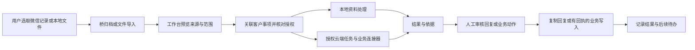

# 客服与微信桥接入

**状态：开发中，客服闭环尚未验收。** 本页维护材料导入、客服闭环和跨仓库边界；实施顺序与完整发布标准见 [迭代计划](roadmap.md)。

工作台现已接入 macOS 微信桥 v1 交接的**主动选择与本机导入**：可看实际解析数量、逐项原档哈希及未解析项；导入时逐文件校验并保存项目私有快照，记录按页预览和引用。单份 manifest 最多 40 MB、32 个原档项、100,000 条解析记录；工作台本次导入还限制单文件 32 MiB、原档合计 128 MiB，超限会保留桥原档并明确报错。导入 ID 去重，同一交接不能归入另一个本地项目。预览文本每条只传 600 字，引用完整文字仍受单次 64 KiB / 合计 128 KiB 限制。

这只完成材料入口，没有完成客户身份核对、订单或工单查询、云端客服处理、人工回复确认及真实微信分享至工作台的可见路径验收。团队事项不能直接引用本机私有导入，必须另走显式授权的共享流程；“导入成功”不得显示为“客服事项已处理”。

## 已存在的微信桥能力

2026-09-28 核对 `turnsu/wechat-bridge` 的提交 `4b4b4c8b20b540aa4ed9229049478cdb493fe98e`。它提供 Swift 原生桥和可选应答组件；工作台通过交接协议读取用户选定的材料。

| 当前事实 | 对接影响 |
| --- | --- |
| 用户在微信选择记录、合并转发并分享到目标应用；桥保存微信实际导出的原档 | 接入主动分享，不读取微信全库；导出之外的消息不能推定已经收到 |
| 原生桥有外部 Agent、Obsidian、剪贴板与自定义目标；可从记录主动交给应答 | 保持直接转发独立，不强制先摘要、调用模型或登录工作台 |
| 外层桥为 SwiftUI / AppKit，应答是包内独立辅助组件 | 工作台复用资料和交接协议，不搬入应答的 Tauri UI、模型配置或凭据库 |
| `WeChatHandoff` v1 有交接 / 批次 ID、文件相对路径、大小、SHA-256、解析记录与未解析项 | 可复用完整性和来源模型；不等于有客户身份、业务授权或上云同意 |
| 现有接收方要求 `schemaVersion=1`、`action=analyze`、`selection=all` | `all` 是交接引用范围，不是已理解全部媒体；`analyze` 不能解释为自动云端执行 |
| 现有应答读取器只在 macOS 实现；限制交接 JSON 为 40,000,000 字节、32 个文件项、100,000 条解析记录 | 这些是现有读取器边界，不是微信消息选择上限；工作台不能静默改变 v1 合同或把它当无限容量 |

代码依据：[交接写入](https://github.com/turnsu/wechat-bridge/blob/4b4b4c8b20b540aa4ed9229049478cdb493fe98e/bridge/Sources/WeChatBridgeCore/WeChatHandoff.swift)、[交接读取与检查](https://github.com/turnsu/wechat-bridge/blob/4b4b4c8b20b540aa4ed9229049478cdb493fe98e/companion/desktop/src-tauri/src/wechat_handoff.rs)、[现有集成说明](https://github.com/turnsu/wechat-bridge/blob/4b4b4c8b20b540aa4ed9229049478cdb493fe98e/docs/wiki/technical-integration.md)。

桥库[自己的验收记录](https://github.com/turnsu/wechat-bridge/blob/4b4b4c8b20b540aa4ed9229049478cdb493fe98e/docs/wiki/delivery-and-acceptance.md)记录了旧 0.2.0 包的真实微信两条测试消息归档与应答预览，以及原 ZIP 到临时 Obsidian 的路径；没有完成 Agent 输入送达或模型分析。当前 0.2.1 包只补验了部分构建、签名与登记，更新后 UI 未全量复验。**本轮只读源代码和记录，没有重测这些行为，也没有读取客户私人聊天。**

## 职责划分

| 所有者 | 持有内容 | 不承担的责任 |
| --- | --- | --- |
| 微信桥 | 原始批次、原始文件、分享与交接动作记录 | 企业成员、业务工单、客户资金权限、工作台模型 Key |
| 工作台 Host | 用户所选材料的本地索引 / 必要快照、导入回执、私有草稿和会话关联 | 根据昵称推断客户、用导入动作自动授权上云 |
| 企业 Product API | Work Item、身份与权限、共享版本、委派、审批和结果回执 | 接管用户全部原生 Agent 历史 |
| 业务连接器 / 云端系统 | 订单、CRM、工单等权威记录和业务动作回执 | 把模型推断当作权威金额、库存、客户身份或处理成功 |
| 客服 Skill | 提取事实、识别缺口、建议下一步和起草回复 | 修改授权、自行承诺赔偿、发送或审批自己的方案 |

业务系统继续拥有原订单 / 工单状态。工作台显示其版本化引用与回执；已有外部工单可关联一个 Work Item，不新建互相冲突的工单真相源。

## 一条可日常使用的客服路径

1. **选择材料。** 员工在微信主动分享，或在工作台选择已导出的 TXT / ZIP 和附件。先落盘校验，再显示原文及实际覆盖，不先调用模型。
2. **关联事项。** 选择企业、客户及订单 / 工单；可新建工作事项或追加到已有事项。未识别身份就标记待确认，不能仅凭群名、昵称或电话号码片段自动合并。
3. **核对范围。** 列出收到的批次、消息、附件、日期及未解析内容；选择参与处理的记录。明确区分“接收了 100 条”“解析了 80 条”“本次选用了 20 条”。
4. **整理事实。** 客服 Skill 给出问题、已有承诺、缺失信息和处理建议，逐条关联来源；冲突并列呈现。规则要求的金额、订单状态来自连接器查询，不让语言模型计算权限。
5. **本地处理或上云。** 用可见的企业授权确定模型、数据范围、业务工具和费用归属。云端收到固定版本的材料、问题、限制和期望产物，不收到整段隐藏推理或默认完整会话。
6. **补充与交接。** 云端可以返回待补充信息；员工追加一批材料或换负责人，仍在同一事项。交接给同事时仅分享被授权的证据、结论和未决问题。
7. **审核结果。** 展示查询依据、回复草稿和业务动作差异；需要主管批准的补发 / 退款按业务规则进入批准卡。修改对象、金额、内容或权限后必须重新批准。
8. **完成工作。** 微信个人聊天以复制回复、人工发送为基线；具备可验证目标时才可提供辅助填入。业务系统写入独立记录回执。客服确认处理结果和后续待办，而不是 Agent 输出一段话就关闭事项。

用户可直接导入并整理资料，不必为每批记录立即创建云端任务。自动跟进仅针对已授权事项，在期限和预算内进行，不默认为所有聊天开启持续监控。

## 工作台导入合同

下面是新增适配器必须实现的语义，不宣称当前桥 v1 已含这些字段。实现时扩展现有 contracts，避免另外建立通用消息总线。

| 语义 | 要求 |
| --- | --- |
| 来源与交接 | 来源类型、协议版本、交接 ID、批次 ID、接收方和用户本次选择；同一交接只登记一次 |
| 文件证据 | 文件 ID、允许根目录内的相对路径、大小、内容哈希及真实类型；记录到原件的映射可追溯 |
| 消息证据 | 原始顺序、发送者原文、原始时间及可解释的时区、归档内位置；无法确定时间或身份就保留未知 |
| 解析覆盖 | 收到 / 解析 / 选用数量、未解析媒体及原因、解析器版本；记录正文不能继承应答默认末尾 30 条的窗口限制 |
| 业务归属 | 企业、工作空间、事项和客户引用由当前授权用户及服务端校验；不信任外部 JSON 自报的租户和权限 |
| 导入回执 | 已接收、部分可用、失败及原因，映射到本地材料和事项；回执不代表已分析、已上传或已回复 |
| 数据生命周期 | 用户选择的原件快照、保留期限、共享范围、云端版本及删除状态；只持久化被选材料 |

现有 v1 路径为 `~/Library/Application Support/Turnsu/WeChatBridge/Handoffs/<UUID>.json`，原档位于对应的 `Inbox/Ready/<batchId>`；App Group 模式位于 `group.local.turnsu.wechatbridge.shared` 容器。工作台仅在用户主动选择桥归档后读选定批次，不在启动时枚举并解析全部正文。

直接“交给工作台”采用独立接收方、导入动作和版本化交接入口，与现有 v1 应答交接隔离目录 / 通知，保持旧消费者语义不变。兼容现有 v1 时，必须由用户在工作台主动选择导入；不得监听一次 `analyze` 就顺带创建云端任务。URL / IPC 只传受约束标识，不带正文、密钥或任意文件路径；不增加公共 HTTP 监听端口。

归档 ID / 交接 ID 用于投递去重；消息正文相同不等于同一条消息。跨批重复片段可提示用户，但在缺少可靠消息 ID 时不能自动删除重复文字。用户确认多批归入一事项后保留每批来源与原始顺序；原件和派生结果分别保存。

Hash 只能证明内容一致，不能证明发送者可信或获得授权。解析前检查文件类型、canonical path、符号链接、压缩成员路径、文件数、解压体积和资源预算；隔离解析失败，禁止执行文档宏或归档内脚本。经校验的来源仍是待处理数据，包含“忽略规则”“转账”等文字也不能改变权限。

导入前预览必要本地副本的范围。接受材料后工作台保留足以恢复该事项的已选快照，不能长期依赖可能被桥清理的临时路径；未复制成功就显示待恢复，不宣称完整接收。清理桥批次不会偷偷删除已授权的工作台业务证据；用户能看见副本与保留期限，删除分别落实到原档、派生文本、检索索引、云端副本和后续引用。

## 云端处理与结果状态

本地资料接收、云端执行和外部交付分开记录，复用现有事项 / outbox / 结果审核。以下是产品语义，具体 API 枚举先适配已有合同，不额外创建状态引擎。

| 层次 | 必须区分的状态 | 不允许的推断 |
| --- | --- | --- |
| 导入 | 接收中、已接收、部分可用、失败 | 文件已落盘 ≠ 媒体全部理解 |
| 云端 | 待提交、已接收、处理中、待补资料、结果可审、失败、取消中 / 已取消 | HTTP 返回 ≠ 业务处理完成；客户端退出 ≠ 云任务取消 |
| 业务动作 | 待批准、执行中、已提交、已确认、结果未知、失败 | 超时 ≠ 未发生；结果未知不能自动重放 |
| 回复 | 草稿、已审核、已复制、已填入、用户确认已发送 / 渠道确认送达 | 复制 ≠ 填入 ≠ 发送；人工标记与渠道回执分开显示 |

上云交接沿用同一事项标识及本地关联，固定输入版本、允许动作、模型 / 工具来源、预算与截止时间。先持久化请求，再发出；回执有请求 ID、事件序号和输出版本。重连从游标补读，重新检查权限；云端不从聊天文本或回调参数获取任意本机路径读取权。

下发业务写入时校验客户、对象、版本、内容和批准范围。连接器支持幂等 / 查询则使用其原生能力；不支持时保留不确定状态，人工核对后继续。停止任务不撤销已提交的退款或已发消息。复杂处理留在已有云端系统，工作台不重复实现业务规则。

回复默认不自动发送。归档没有可靠的当前窗口或气泡坐标，不能伪造实时采集来源。辅助填入需要重新确认当前目标、唯一编辑框和已有草稿，并回读核对；失败回到复制，不按发送键。将来接入有正式接口的客服渠道时，发送作为独立连接器能力，单独授权、幂等并获取回执，不能把私人微信填入伪装成该能力。

## 跨平台与交付边界

| 平台 / 安装情况 | 目标交付路径 | 当前边界 |
| --- | --- | --- |
| macOS，已有 Turnsu 微信桥 | 用户在工作台主动选择并导入桥交接；已有转发和应答路径保留 | 交接消费者已开发，真实微信分享到工作台的可见路径未验收；桥与工作台各自更新，不复制凭据 |
| macOS，未安装桥 | 企业按需配置兼容桥，或让用户主动选择已合法取得的导出文件 | 当前未完成独立 TXT / ZIP 导入；桥是可选组件，不应成为全部员工常驻依赖 |
| Windows 11 x64 | 用户主动粘贴记录，或导入合法取得的 TXT / ZIP / 附件，后续进入相同事项路径 | 当前尚未开发和实机验收文件导入；不声称存在原生微信分享入口或可读取加密聊天库 |

采用跨仓库协议集成，当前不做双项目合仓或重新打包微信桥。企业交付可提供一个统一的安装说明与依赖检查，但不能把两个安装项宣称为一个安装包；每个组件有唯一更新所有者。若后续要将 Swift 分享接收组件合入工作台安装包，需另行验证 App Group、签名、扩展发现与已有桥共存，不作为本轮已决定的打包方式。

不同平台入口可以不同，材料进入工作台后的业务完成能力一致。Windows 导出格式不可用时提供明确的人工文件 / 文本导入，不许以自动抓屏或解密绕过限制；该路径需要在 M2 真实验收。原生微信分享的两平台完全一致不属于已承诺能力。

## 验收用例

| 检查路径 | 看见的证据 |
| --- | --- |
| 真实授权微信记录 → 工作台 | 原档哈希、时间、顺序与内容一致，所有遗漏 / 未解析附件可见；不能只用手写 TXT 证明微信分享 |
| 多批导入、重复打开、重名客户 | 不重复计费或建单；合法重复消息保留；客户归属需要可信关联 |
| 原档清理、畸形 ZIP、超限、解析中退出 | 已接受快照仍可恢复；未接受的保留错误与重新选择入口；不崩溃、不丢原件 |
| 客服 → 云端 → 业务结果 | 真实验收服务有可核对请求与回执，缺资料可继续，人工修改方案后重新检查批准 |
| 网络断开、重复回调、撤权、取消 | 原事项可找回，无重复业务写入；旧权限不产生新动作；未知结果明确交人工 |
| 回复复制 / 填入 | 记录实际完成步骤；不覆盖草稿、不混目标、不自动发送；无发送证据不显示已送达 |
| 客户切换、知识 / 日志 / 诊断 | 另一个客户不可检索旧客户材料；诊断默认无聊天正文与 Key |
| 长时间导入与切换 | 归档索引、正文和附件按需读取；任务完成后资源回收，原档和结果仍可打开 |

上述用例与 M1–M6 的发行验收一起完成，不用桥库以前通过的单条路径替代当前工作台闭环。
