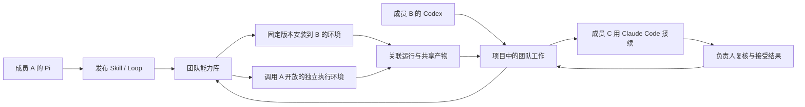

# Turnsu 团队协作与多 Agent 能力复用调研

> 最新方向见 [§14](#14-local-desktop-and-cloud-project-correction-v06)：用户已明确停止 Web/mobile 优先迭代，确认参考 LinkCode + Tutti。§1–13 是当天较早的 v0.5 研究，不能覆盖这次纠正；其中“本轮”指较早调查时点，不能当作当前服务状态。

日期：2026-09-22。对象：约八人的混合团队，成员使用 Codex、Claude Code、Pi，也包含只使用 Web 的同事。范围：现有产品如何从个人任务工具发展为团队日常工作场所，以及 Skill、Loop 和执行能力如何跨成员复用。

这是产品决策的研究依据；正式要求已并入 [Master PRD](../prd/2026-08-04-looloomi-team-intelligence-workspace-master-prd.md) 的同日团队协作修订。实现状态由 [Current System Architecture](../architecture/CURRENT_SYSTEM_ARCHITECTURE.md) 记录。本文的目标流程、示例和验收条件均不表示已经接通。

## 1. 结论：让个人能力成为团队能持续使用的工作方法

Turnsu 的价值时刻应是：**我用自己熟悉的 Agent，在团队项目中完成工作；需要同事擅长的能力时可以直接使用，结果和下一步留在项目里，别人不用重新解释背景就能接着做。**

现有产品有任务、项目、资产版本和执行链路，但这些对象还没有连成这条路径。继续增加配置页面，不能解决“同事的能力在哪里、我能怎样用、执行卡住找谁、结果交给谁”的问题。

这次确定五个产品判断：

1. **团队项目是共同工作的场所。** 从项目内发起的工作，任务说明、允许共享的输入、执行状态、交付物和讨论默认对该项目成员可见；发起前显示范围。个人任务继续私密，存量私有内容不迁移权限。
2. **成员保留自己的 Agent。** Agent、模型、执行设备、能力维护者、工作负责人是不同概念。团队可以统一工作结果，不必统一每个人的客户端、模型与习惯。
3. **能力有两种使用方式。** “在我的 Agent 使用”分发固定版本的方法包；“交给提供方执行”调用维护者主动开放的能力。两者可属于同一个 Skill/Loop 的不同使用入口，不创建另一个资产市场。
4. **共享运行成为项目里的正常活动。** 团队看到执行步骤、等待事项、版本、证据和结果；不必逐次手工转发全部成果。原生私人会话、账户和任意本地文件不因此公开。
5. **复用来自真实工作。** 先完成一次有价值的任务，再把稳定方法发布成 Skill/Loop。重复工作进入 Automation；复杂流程继续在画布调整，普通使用者从能力入口运行即可。

“大多执行可以共享”的产品落点是项目范围内的共享运行记录和产物，以及成员可以调用的能力。不能把它缩减成分享链接，也不能把每个人的整个 Agent 账户开放给全员。

## 2. 调研方法与证据强度

检查了官方产品文档、协议规范与当前项目调用链。LinkCode 的已有内部适配固定在 `v0.30.0 / da9c0673`，公共文档按本次访问内容核对，二者不能混用版本能力。其他 `latest` 文档是当日材料，不代表项目当前安装版本具有全部特性。

内部证据包括团队 Work/Project、Team Library、Loop 发布、Device Gateway、LinkCode/Pi bridge 及对应前端消费者。当前 `127.0.0.1:8798/work` 返回连接拒绝，因此本轮没有新的运行中界面或多用户操作证据。之前截图用于理解用户反馈，不当作本轮验收。

尚未做八人访谈、真实跨设备联合试用或竞品付费团队环境操作。下面的痛点优先级来自用户连续纠正和代码阻塞；**发生频率、采用率、节省时间均未测量**。不以厂商功能介绍推导实际效果。

## 3. 哪些参考解决了哪一部分

| 参考 | 本次核对到的机制 | Turnsu 采用判断与边界 |
|---|---|---|
| LinkCode | 本地 host 统一多种 native agent 的界面、交互和会话；README 的远程云隧道仍标为即将发布。[官方仓库](https://github.com/arcboxlabs/linkcode) | 借鉴 Agent 宿主与工作区交互。多客户端连接一个 host 不足以证明跨成员授权、隔离和团队调度；这些由 Turnsu 补齐。 |
| Linear Agents | issue 保留人类 assignee，Agent 使用 delegate 身份；被提及/委派后建立可观察的 Agent Session。[集成文档](https://linear.app/developers/agents) | 把 Agent 放进已有工作，保留人的责任。团队任务详情应成为协作中心，不额外建立 Agent 群聊产品。 |
| n8n | workflow 在项目内共享，执行可按项目查看；编辑者能运行其中使用的凭据，即使凭据未单独共享，相关节点编辑受到限制。[共享](https://docs.n8n.io/workflows/sharing/)、[执行记录](https://docs.n8n.io/workflows/executions/all-executions/) | 借鉴项目归属与共享运行。进一步分开使用、编辑、开放执行的权限，避免把“可以查看/编辑方法”直接变成“可调用提供方全部连接”。 |
| Dify | 区分可构建应用的角色和仅使用发布应用的成员；移除成员后，其应用和知识库留在工作区。[成员管理](https://docs.dify.ai/en/cloud/use-dify/workspace/team-members-management) | 使用能力与建设能力分层；组织资产要有持续维护人。现有原生 Agent 身份和环境仍需单独处理。 |
| Relevance AI | Workforce 边区分按条件委派与必经下一步，并区分新建任务、继续任务以及调用次数/审批设置。[Edge Settings](https://relevanceai.com/docs/build/workforces/build-an-ai-workforce/edge-settings) | 画布表达必要交接和并行任务。不能把所有工作预先拆成僵硬步骤，也不能用 Agent 的自信替代执行授权。 |
| Claude Code plugins | marketplace 分发 Skills、agents、hooks 和 MCP 等组合，并有版本与来源管理。[分发文档](https://code.claude.com/docs/en/plugin-marketplaces) | 团队方法可以分发给成员自己的客户端；发布前需要明确依赖和升级影响。安装包本身不建立团队运行记录。 |
| Agent Skills / Pi | `SKILL.md` 及资源目录形成可携带方法；规范允许声明兼容环境，工具字段仍有实现差异。Pi 文档支持加载其他 harness 的技能目录。[规范](https://agentskills.io/specification)、[Pi Skills](https://pi.dev/docs/latest/skills) | 可共享文件格式是起点。必须区分“能读取”“依赖齐全”“在此 Agent 版本验证过”，不能统一标记为跨 Agent 可运行。 |

重要反例：Claude Code 的 Agent Teams 协调多个 Claude 会话，权限与主会话关联；它不等于不同员工各带自己账户的跨产品协作系统。[Agent Teams](https://code.claude.com/docs/en/agent-teams)。同样，Claude Remote Control 主要让本人从别的设备继续本地会话，自动连接不会授权给其他人。[Remote Control](https://code.claude.com/docs/en/remote-control)。

LinkCode 的当前许可证是 BUSL-1.1。附加授权区分组织内部使用和面向第三方的竞争性托管/嵌入，且“嵌入”的定义还涉及运行所必需的下载；品牌另有许可。[许可证原文](https://github.com/arcboxlabs/linkcode/blob/master/LICENSE)。本方案采用宿主模式与交互思想，以官方 Agent 接口独立实现；不能用“改名”或“让用户另行下载”假定解决商业采用条件。

## 4. 当前产品的主要断点

| 优先级与信心 | 用户想做什么 | 当前证据与影响 | 对应产品动作 |
|---|---|---|---|
| 最高，高 | 同事使用我已做好的方法 | Library 安装写入 `asset_installations`；不是 CC/Codex/Pi 的文件安装，更不是向我的 Agent 派单 | 在能力详情分别提供“在我的 Agent 使用”和“交给提供方执行”，各有真实可用状态 |
| 最高，高 | 把试运行过的 Skill 流程交给团队反复用 | `publishLoop` 仍拒绝含 Skill 或 Resource 的 revision | 补齐发布依赖闭包、版本固定、授权与消费方绑定，先让已有方法能完整发布 |
| 最高，高 | 在同一个项目看见大家正在做什么 | Work/Project 和个人 continuation 已有代码；完整 Work Activity 投影与多用户 UI 验收缺失 | 项目内创建共享工作，执行与结果自动汇入同一工作记录，个人分支单独保留 |
| 最高，高 | 用自己的 Codex/CC/Pi 参与 | 目前 LinkCode bridge 仅 Pi，公开能力仅项目/工作读取与有限修改提案；没有多 Agent 原生宿主 | 同时提供原生客户端接入和 Turnsu 内嵌宿主；两者调用同一 Product 命令 |
| 高，高 | 同事离线时仍能完成工作 | Device 控制链已有基础，缺真实 native host 与能力服务绑定 | 明确个人在线执行与团队常驻执行；任务显示等待设备、可用替代和维护者 |
| 高，中 | 理解谁在负责、哪里卡住、结果是否可靠 | 当前 UI 更偏个人结果晋升与资产管理；用户多次否定创建交互 | 团队工作成为核心场景，详情首先回答结果、执行方、下一步和需要谁处理 |

代码定位：

- [Project / Work 生命周期](../../domains/backend/code/workbench-server/src/work-items/postgres-team-work-lifecycle.mjs)：已有原子创建团队工作、continuation 和首次 Turn 的入口，应该复用。
- [Work 分享与交接](../../domains/backend/code/workbench-server/src/work-items/postgres-work-item-promotion-lifecycle.mjs)：既有私有任务晋升与可撤销共享边界。
- [Library 读模型](../../domains/backend/code/workbench-server/src/store/postgres/postgres-team-library-read-model.mjs)、[安装生命周期](../../domains/backend/code/workbench-server/src/store/postgres/postgres-team-library-lifecycle.mjs)：当前工作区级发布/安装，含 Connection requirement 的 Loop 安装仍明确阻塞。
- [Loop 发布](../../domains/backend/code/workbench-server/src/loops/postgres-loop-draft-lifecycle.mjs)：存在 `workflow_reference_lifecycle_unavailable`，不能把草稿引用修复当作发布链路完成。
- [设备网关](../../domains/backend/code/workbench-server/src/devices/device-worker-gateway.mjs)：有 desktop bearer 与注册设备校验，不代表已实现原生 Agent host。
- [LinkCode bridge](../../domains/agent/code/agent-runtime/integrations/linkcode/README.md)：固定 Pi 版本，非空 MCP 配置拒绝，待应用提案保存在进程内。
- [团队工作 UI](../../domains/frontend/web/code/web-prototype/src/components/work/WorkView.jsx)、[资料库 UI](../../domains/frontend/web/code/web-prototype/src/components/library/TeamLibraryView.jsx)：现有页面与数据链路应被演进，不新建平行产品。

## 5. 团队一天怎样使用

以已有“每周试用反馈整理”为黄金路径。下面 A/B/C 是产品情景角色，不是真实试用结果。

1. **A（产品，Pi）准备方法。** A 在自己熟悉的环境整理反馈，确认分类准则和输出有效。将“反馈归类”保存为 Skill，说明需要什么、产出什么，并发布一个团队版本。
2. **A 选择开放方式。** 通用分类规则可让同事安装；依赖 A 维护的专有资料/工具的能力，可另行开放执行。开放时只选择项目、允许的输入/输出、执行环境和调用额度；从现有配置推导其他字段。
3. **B（分析，Codex）发起共享工作。** 在“产品试用”项目输入“整理本周反馈，给出前三项改进建议”，附项目可用资料。提交处清楚显示“项目成员可见 · 使用我的 Codex”。
4. **B 使用 A 的能力。** 输入 `@反馈归类` 或从当前任务的能力选择器选取。可携带版本由 B 的 Agent 执行；提供方版本创建关联调用，由 A 开放的独立环境执行。B 不必切换 Agent 或索要 A 的密钥。
5. **团队看见工作正在推进。** 任务详情显示“B 发起；A 提供的反馈归类 v1.2 正在运行”，完成后出现分类表、证据和未解决项。团队看不到 A 的私人历史，也不会把“开始运行”当作“已完成”。
6. **C（研发，Claude Code）接着审阅。** C 从同一工作取得已共享输入与结果，用自己的原生客户端评估实现工作量，并回交补充产物。是否更换工作负责人是单独动作。
7. **负责人接受结果。** B 汇总为改进清单，工作负责人确认最终交付；执行失败、证据缺失或冲突保留为待处理事项。
8. **沉淀成 Loop。** 将稳定的“归类 → 分析 → 人工复核 → 交付”保存为工作流，在画布调整依赖与执行方式。发布固定版本后，项目成员可重复运行；需要离线定时执行时绑定已验证的常驻环境。

另一条同等重要的路径：一个没有本地 Agent 的同事，从项目里的已发布能力开始，直接使用团队常驻执行环境。接入个人 Agent 不能成为使用团队成果的前置条件。



## 6. 共享到底共享什么

| 对象 | 项目工作默认行为 | 私人任务默认行为 |
|---|---|---|
| 目标、负责人、进度、阻塞、决策 | 项目成员按角色可见 | 仅本人 |
| 输入 | 只包含发起者明确加入该工作的项目资料/文件；私有文件需选择共享后才能加入 | 不自动进入团队资料 |
| 运行摘要、步骤状态、公开进度、版本与执行方 | 自动进入工作记录；使用固定投影字段，不转发原始工具流 | 仅本人，可发布选定结果 |
| 产物 | 写入该次运行的声明输出区并确认可发布后，按提交时的项目范围自动归档；敏感/非声明输出进入复核 | 留在私人任务，显式分享 |
| 原生会话、个人记忆、账户、环境变量、任意本地路径 | 不作为团队工作内容；维护者可按权限发布诊断摘录 | 保留原生所有者 |
| Skill / Loop | 发布的定义、版本、测试证据及使用方式按对象权限开放 | 草稿继续私有 |

项目内“自动共享”的授权来自用户提交时可见的工作范围与声明输出，不来自模型对敏感性的猜测。成员只能向自己有权写入的工作发布结果；跨项目传递输入和产物需要分别检查源读取权与目标发布权。

共享有五种操作权限：查看结果、使用版本、派单执行、维护定义、管理开放范围。界面优先使用“可使用 / 可维护 / 管理者”的简洁角色，底层按操作校验。可见不等于可调用，能调用不等于能读取提供方的连接或修改方法。

## 7. 两种复用方式及第三种接续动作

| 用户动作 | 实际获得什么 | 谁运行 / 谁付费 | 必须显示的限制 |
|---|---|---|---|
| 在我的 Agent 使用 | 固定版本的 Skill 包；Loop 的安装定义与需要补齐的环境绑定 | 调用者选择的个人或团队环境 | 兼容验证、工具/依赖缺口、连接绑定；不带作者凭据 |
| 交给提供方执行 | 一个限定任务的调用权；取得声明的结果与状态 | 提供方明确开放的环境；费用承担者在运行前确定 | 开放项目、可用时段、排队、限额、输入将发给谁、维护者能看到哪些诊断 |
| 用我的 Agent 接着做 | 当前工作明确共享的背景、决定和产物 | 接续成员自己的新会话/分支 | 接续不是恢复他人的原生会话；不自动转移责任 |

“能力卡”围绕用途展示：能完成什么、提供者/维护者、示例输出、版本、最近验证环境、两种可用方式。运行入口回答“你需要提供什么”和“现在是否能用”。详细权限与依赖在展开区，不能要求普通使用者先填写编排配置。

提供方可以开放一个 Skill 或一个 Loop，也可以提供一个有输入/输出约束的专家任务入口。**开放专家入口仍需限定任务范围，不能默认暴露通用 shell、整个工作目录或个人活动会话。** 首版沿用 Skill/Loop 作为发布载体，避免第三种重复资产生命周期。

撤销共享立即阻止新派单和后续授权访问，并处理正在运行的任务；已经合法下载的包或结果不能承诺远程抹除。普通弃用允许已有固定版本按政策继续使用；安全撤销需阻止新运行并通知受影响工作。

## 8. 多 Agent 接入要保留差异

**同时支持两条入口：** 用户可以在 Turnsu 内使用接入的 Agent，也可以继续在自己的原生客户端工作，通过 Turnsu 提供的工具发现能力、取项目上下文、发起调用和回交结果。只做内嵌聊天，会迫使团队迁移习惯；只做连接器，又无法给非技术同事完整体验。

| Agent / 协议 | 有来源支持的接入点 | Turnsu 产品处理 |
|---|---|---|
| Codex | App Server 提供 thread/turn、恢复、流式事件和审批；协议可由安装版本生成。当前文档对远程 WebSocket 有实验性限制。[官方 App Server](https://developers.openai.com/codex/app-server) | 宿主侧优先本地 stdio；公网传输复用 Turnsu 设备连接。记录真实 native thread，不伪造续接。按固定版本检验支持项。 |
| Claude Code | 官方 Agent SDK 支持产品集成；官方明确第三方产品提供 claude.ai 登录/额度需事先获准。[Agent SDK](https://code.claude.com/docs/en/agent-sdk/overview) | 原生客户端可通过受授权的 Turnsu 工具参与；SDK 代执行使用受支持的 API 认证。个人订阅不能承诺为共享执行池，第三方内嵌登录需另行确认支持条件。 |
| Pi | RPC 通过 stdin/stdout 接收命令、返回接受确认和后续事件；扩展可注册模型可调用工具。[RPC](https://github.com/earendil-works/pi/blob/main/packages/coding-agent/docs/rpc.md)、[Extensions](https://pi.dev/docs/latest/extensions) | 可接用户现有 Pi；区分 prompt 接受和最终完成。现有 Product/Pi bridge 继续演进，不能把其 MCP 禁用状态描述为已通用支持。 |
| ACP | 规范客户端与 Agent 的初始化、session、进度、权限请求与取消。[协议](https://agentclientprotocol.com/protocol/v1/overview) | 未来兼容入口；不为统一协议牺牲当前三种 Agent 的成熟原生接口。 |
| MCP | 可承载面向原生 Agent 的团队能力工具；授权规范要求资源受众校验，禁止简单透传不适用的 token。[授权规范](https://modelcontextprotocol.io/specification/2025-11-25/basic/authorization) | 工具背后调用同一个 Product API；MCP 本身不替代项目权限、调用账本或异步任务生命周期。Pi 可用扩展实现同等工具。 |
| A2A | Task/Context/Artifact 能表达长期工作、后续任务与产物；终态任务不直接重启。[任务生命周期](https://a2a-protocol.org/latest/topics/life-of-a-task/) | 为将来外部服务互操作保留映射。当前八人团队先完成已有 Product Run，不额外部署一套 A2A 控制面。 |

每个接入实例的 readiness 需区分：已发现、需登录、需授权、可用、忙碌、离线、版本不兼容。能力清单至少说明会话恢复、取消、审批、文件输入、结构化结果和隔离支持；不支持时给出实际恢复动作。

Skill 兼容状态按“资产版本 × Agent/适配器版本 × 环境依赖”记录：已验证、待验证、缺依赖、不支持。正文能读取并不等于 scripts、hooks、MCP 或产物格式都可用；发布时不能自动改写方法并宣称等价。

Loop 的契约与执行环境分开：发布固定节点、依赖版本、输入输出、复核规则和允许的执行方式；安装/运行时绑定获准的设备、连接和 Agent。实际绑定记入每次 Run，禁止随 `latest` 漂移；变更重要执行方式需要新修订或明确授权。

## 9. “使用别人的 Agent”如何真正成立

跨成员调用需要一条可核对的业务链：

```text
发起人 + 项目工作 + 输入资料 + Skill/Loop 固定版本
  -> Product 检查可见性、调用权、预算、输入传递范围
  -> 选择提供方已开放的执行环境与授权修订
  -> 在独立的任务上下文执行
  -> 返回关联 Run、状态、声明产物与必要证据
  -> 发布到原项目工作，负责人接受或继续处理
```

调用者不冒充提供者。记录请求人、执行环境所有者、能力维护者、结果负责人及费用承担者，允许这些身份由同一人担任。对托管能力，调用者取得的是某项任务的使用权；提供者连接只能在这项授权限定的操作中使用。

跨成员输入不能直接注入维护者正在使用的私人原生会话。新建独立上下文，限定资料、工具与输出区；仅指定 `cwd` 不是隔离。宿主若不能限制全局插件、环境凭据和文件访问，该能力只能由提供者人工接单，不能标记为可无人值守派单。模型遵循提示词不算隔离证据。

一次调用只产生一份 Product 运行事实。原生 session ID 是私有外部引用，公共事件是可重建的授权投影；产品不复制一份原生上下文并假装能任意跨 Agent 恢复。需要换 Agent 时，基于共享结果创建新的尝试/接续记录，保留原执行来源。

### 日常失败的产品表现

| 情况 | 用户看到什么 | 系统该怎样做 |
|---|---|---|
| 提供方离线 | 等待 A 的设备；最后在线时间；取消、等候或选择获准替代 | 保留任务和输入，设等待期限；不自动切换云端或借别人的账户 |
| 提供方忙碌 | 排队、维护者、可取消 | 按已有容量/租约调度，不展示没有依据的精确预计时间 |
| 等待权限 | 本次具体操作、谁能批准、批准后会发生什么 | 绑定本次调用与有效授权；项目经理不能替设备所有者批准任意本地操作 |
| 中途掉线 | 执行状态暂未确认 | 从同一 native attempt 对账；外部效果未知时先核对，不能盲目重跑 |
| 部分步骤成功 | 可用产物与未完成部分分开展示 | Loop 失败不覆盖已完成证据；重试固定失败范围，复核已有副作用 |
| 版本/依赖改变 | 本次仍用固定版本，或清晰说明被撤销 | 普通升级创建新版本；安全撤销使新执行失效 |
| 两人同时修改 | 当前更新、对方变更与重试/重基操作 | 复用 ETag/修订冲突；首版不增加多人实时画布引擎 |
| 成员离开 | 项目成果和组织发布版本保留，能力可能显示需接管 | 撤销成员/设备/执行授权，暂停依赖个人环境的排程；团队环境与维护权显式转移 |

## 10. 页面如何围绕团队工作组织

首页保留快捷发起任务，但始终可见“私人 / 当前项目”和实际执行 Agent。加入团队后优先恢复上次工作位置；不强制所有工作先走私人任务再分享。

| 页面 | 最重要的问题 | 主操作和信息层级 |
|---|---|---|
| 团队工作 / 项目 | 现在推进什么、谁需要我、产出了什么 | 进行中、需要处理、已交付；按项目/负责人筛选。展示真实工作与阻塞，不填充 Agent 数量等装饰指标 |
| 工作详情 | 目标是否完成、谁在执行、我怎样接续 | 目标与负责人 → 最新结果/阻塞 → 运行和协作时间线 → 资料；“用我的 Agent 接着做”“使用团队能力”“提交结果”在上下文出现 |
| 团队能力库 | 谁提供了能解决当前问题的方法 | 按用途发现；我的 Agent 可用/可派单/需配置。Skill 与 Loop 是类型筛选，来源与维护者可见 |
| 能力详情 | 这项能力能做什么、怎样用、结果是否可信 | 示例产物、输入、版本与验证 → 两种使用入口 → 近期共享运行；维护设置后置 |
| 我的 Agent / 执行环境 | 接进来的是什么、为什么不可用 | 本人 Agent 与团队常驻环境分组；原生类型、设备、登录/在线状态、开放能力。个人历史另行进入 |
| 工作流画布 | 步骤怎样交接、在哪里执行、卡在哪里 | 保留画布与上下文侧栏；节点引用已发布能力，显示执行方式；连线仍表示真实输入输出，试运行与历史并排 |
| 自动化 | 哪项固定工作何时运行、失败找谁 | 延续简洁定时任务列表与编辑弹窗；显示项目、负责人、执行环境、下次/上次结果。高级授权按需要展开 |

共享工作时间线同时容纳成员留言、委派、运行摘要、结果版本和确认决定；调试信息按权限展开。订阅默认只通知被指派、需要批准、失败影响工作及最终交付，避免每个 token 和子步骤刷屏。

## 11. 存储与工作区职责

沿用此前研究的单一 Product 权威，不增加团队共享目录作为第二套业务状态。

| 内容 | 存放位置与真相来源 | 共享方法 |
|---|---|---|
| 成员、项目、工作、版本、发布、开放执行规则、调用与接受决定 | PostgreSQL；复用现有域与命令 | 基于当前成员资格与对象授权读取 |
| Skill 文件包、固定资料快照、声明产物 | 现有 Object Store；内容哈希/不可变版本 | 经授权传输，不能用哈希或路径代替权限 |
| 用户原生会话、个人配置、native credential | 用户原生宿主 | Product 只保留需要的私有引用；原生供应商自身同步政策单独适用 |
| 临时执行文件、分支、缓存 | 每次执行的受约束工作区 | 导出声明产物；清理遵循完成/恢复状态与保留策略 |
| 已安装 Skill | 指定 Agent 的受管理安装目录 + 本地安装回执 | 不覆盖用户原文件；固定 digest、报告冲突，可卸载；Product 记录引用与校验状态 |
| 团队项目文件 | 资料版本或 Git commit / branch / worktree | 成员各自工作区，结果通过产物或变更提案汇合；不让多人 Agent 无隔离地写同一目录 |

本地文件 Object Store 可继续支撑单机试点。跨设备传输需经已有受授权下载/上传路径；多实例部署再验证共享对象后端。版本哈希证明文件一致，不证明结果相同或权限成立。

新增概念应尽量挂在现有对象上：Agent 接入实例关联 Device/native reference；能力开放配置关联 Skill/Loop release；调用使用 Command/Invocation/Run 与 Work Item 的关联。具体数据迁移在实现前依据已有 schema 决定，不能先另建泛化“Agent OS”。

## 12. 交付顺序与完成证据

这里是主 PRD 的研究依据，不是独立状态台账。以用户可见的闭环排序：

| 顺序 | 交付内容 | 真正的完成证据 |
|---|---|---|
| 1. 同事真的能复用现有方法 | Skill/Resource 依赖发布闭包；团队成员从能力库在项目中启动固定 Loop；运行和结果关联工作 | A 发布，B 在独立登录会话调用，C 查看共享产物；重启后版本/状态保留；未授权成员读不到私有内容 |
| 2. 三种 Agent 参与同一工作 | 原生客户端 Product 工具接入 + 宿主 adapter；发现/安装固定 Skill；团队工作上下文与回交结果 | Codex、CC、Pi 各用真实客户端取同一共享工作并回交，保留各自 session；记录实际版本和认证方式，不能用三种标签配同一 backend |
| 3. 调用另一成员的能力 | 发布可派单版本、提供方独立执行环境、调用授权/费用/容量、取消与结果投影 | B 的 Codex 调用 A 的 Pi 能力；A 离线可恢复/取消；撤权阻止后续调用；重复请求不重复派单；未知效果不会盲重试 |
| 4. 团队常驻与稳定复用 | 发布 Loop 绑定可验证的团队环境；Automation、维护权接管、依赖升级评估 | 成员电脑关闭后常驻运行完成；个人设备依赖则明确等待；成员退出不会泄露授权或悄悄丢掉负责人 |

第 2 步不能被拖到所有托管功能之后，避免做成只能使用自带 Agent 的平台；第 3 步不能以“装了同一个 Skill”代替验收。每步复用现有 Product、Runner、Device 与存储路径，不同时重写执行核心。

### 首轮试点如何判断是否值得使用

使用同一类真实工作与团队原先的做法比较，记录人工操作和结果质量，而非仅统计调用数：

- 第一位普通成员能否从项目发现同事能力并取得可用结果，记录配置耗时与求助次数。
- 第二人能否在不复制整段历史、不索要密钥的情况下接续；缺失背景导致的返工单独计入。
- 至少覆盖两条不同 Agent 的跨成员调用方向，以及一次可携带 Skill 的本地使用；随后补全三种 Agent 的真实接入矩阵。
- 同一固定版本被另一人成功复用后，再安排重复工作发布/自动化；结果质量由负责人按工作验收标准判断。
- 记录等待设备、等待人、配置失败、执行失败各自耗时，区分接入问题与方法质量问题。
- 对离线、撤权、超额、取消、升级冲突和成员退出做针对性验证；失败应可理解、可恢复，不发生静默权限扩张。

现有 PRD 的八人试点指标仍保留，但新增指标必须以真实基线计算。“跨成员复用成功率”以已接受的首次结果为分子，以所有获准发起的调用为分母，同时列出前置拒绝/配置未完成；成本未知显示未知，不能按零计费。这里没有声称已完成试点。

## 13. 有意收敛的范围与剩余未知

首版面向一个组织、约八人、少量共同项目。先提供一个完整项目工作路径、Skill/Loop 两种复用方式和三类 Agent 的真实接入。公共交易市场、跨组织联邦、实时多人画布、自动选择“最佳 Agent”的竞价/排名、全员共享记忆和复杂部门层级都不能改善当前首个价值时刻，暂不建设。

仍需通过实现与真实试用回答：各 Agent 固定版本的审批/恢复差异，个人宿主能达到的隔离级别，跨设备文件传输与大产物可靠性，第三方内嵌认证支持条件，以及团队是否真的愿意维护常驻执行环境。公开文档不能回答这些实际采用问题。首轮以现有反馈整理工作试用，依据真实卡点调整，而不是继续扩大功能清单。

## 14. Local desktop and cloud project correction (v0.6)

### 核心判断

用户确认参考是 [Tutti 中文官网](https://tutti.sh/zh)，要求先做好本地与云端共同工作的产品，暂停网页和移动端方向。
本次面向同一支约八人的团队，研究当前可采用的桌面工作路径、Agent 宿主、共享上下文和同步边界。
之前的问题是把团队管理与连接器做成了产品入口，用户仍然无法直接打开自己的项目、使用自己的 Agent 并得到真实文件成果。
LinkCode 值得借鉴的是本机工作目录、原生 Agent、会话与审批连成的日常工作路径。
Tutti 值得借鉴的是项目里的文件、讨论、工作过程和成果可直接被另一个人及其 Agent 使用，减少人工转述。
因此新主线是“桌面开始工作 → 项目共享 → 同事接着工作 → 方法复用”，已有版本、授权和执行能力支撑这条路径。

### 参考核对：事实、声明与未知

| 对象 | 核对到的事实 | 不能据此声称的能力 |
|---|---|---|
| LinkCode 官方介绍与架构 | 本机 daemon 管 Agent、目录、终端和交互；SQLite 保存宿主会话与原生历史的关联。README 仍标远程/移动控制未完成。[仓库](https://github.com/arcboxlabs/linkcode)、[架构](https://github.com/arcboxlabs/linkcode/blob/master/docs/ARCHITECTURE.md) | 隧道访问同一台电脑，不等于共享文件同步、跨成员权限或关机后云端继续运行。此次没有完成原生应用操作验收。 |
| LinkCode 已有固定源码 | 检查 `v0.30.0 / da9c0673f102a6cc6e1410b45044bb8e03e9afb8` 的 `apps/daemon/src/db/schema.ts`、SessionStore 和 Codex/Pi/Claude adapters：有原生会话恢复、审批及工作目录，不只是 HTTP 工具连接器。[固定源码](https://github.com/arcboxlabs/linkcode/tree/da9c0673f102a6cc6e1410b45044bb8e03e9afb8) | 这些是源码证据，不是本项目已经接入，也不是最新 master 的实测。 |
| Tutti · VM 产品 | 官网呈现项目 Room、共享工作现场、Agent 借用和跨设备接续；明确 Agent 在成员本机受管 VM 中运行。[官网](https://tutti.sh/zh)、[跨设备](https://tutti.sh/zh/resources/usecases/cross-device)、[借用](https://tutti.sh/zh/resources/usecases/borrow-agents) | “0 秒延迟”“自动解决冲突”是厂商描述。本次未取得 VM Room 进行双人试用，不能给出延迟、冲突正确性和离线恢复实测结论。 |
| Tutti 开源版 | 固定检查提交 `8821cf4788f6a8fe5886942b2ab2890900c14997`。Go Agent Host 负责会话/Turn/审批/恢复，桌面通过适配器调用；本地 workspace catalog 存 SQLite。[Host](https://github.com/tutti-os/tutti/blob/8821cf4788f6a8fe5886942b2ab2890900c14997/packages/agent/host/README.md)、[Workspace](https://github.com/tutti-os/tutti/blob/8821cf4788f6a8fe5886942b2ab2890900c14997/docs/conventions/workspace-domain.md) | 开源本地版与 VM 协作版不能混为一谈；仓库存在 VM 适配接口不证明完整云服务可部署。 |
| Tutti 同步契约 | `activity-replication` 明确是向 cloud projection 复制规范化 Agent 活动快照；规定重复确认、旧版本 no-op、重建 epoch，并明确不拥有 Room 授权和传输。[契约](https://github.com/tutti-os/tutti/blob/8821cf4788f6a8fe5886942b2ab2890900c14997/packages/agent/activity-replication/README.md) | 活动投影不等于文件内容同步、运行进程迁移或多人共享文件系统。不能把这一个包包装成完整云协作实现。 |
| Tutti 上下文入口 | 文件、应用产物、工作附件、项目以统一引用来源进入输入框，选择后由实际来源解析。[引用来源](https://github.com/tutti-os/tutti/blob/8821cf4788f6a8fe5886942b2ab2890900c14997/docs/architecture/agent-reference-sources.md) | “能选中”不等于 Agent 真正收到文件；需验证权限、实际内容和后续结果。 |

源码采用选择：LinkCode 当前为 BUSL-1.1，竞争性付费托管/嵌入受附加授权限制；Tutti 仓库为 Apache-2.0，第三方 NOTICE 仍需保留。[LinkCode LICENSE](https://github.com/arcboxlabs/linkcode/blob/master/LICENSE)、[Tutti LICENSE](https://github.com/tutti-os/tutti/blob/8821cf4788f6a8fe5886942b2ab2890900c14997/LICENSE)。本轮仅做公开源码研究，未复制任一产品代码进入 Turnsu，未把 Tutti VM 当成已获得的服务。最终选择整合、独立实现或采购，应由可运行验证与适用授权共同决定。

### 从实际使用排序

频率证据只来自当前用户的多次反馈和少量公开维护记录，未做统计抽样；下表不代表市场发生率。

| 优先问题 / 用户目的 | 证据与可信度 | 对产品的具体改变 |
|---|---|---|
| 无法直接在自己的项目和 Agent 中开始工作 | 用户连续纠正；当前是 Web + Product Connector，缺少桌面宿主。高置信，核心路径阻断。 | 桌面选择目录、Agent 后直接输入任务；结果是可打开的真实文件。连接配置后置、按缺口出现。 |
| “团队共享”仍要求人工搬运上下文 | 用户明确要同事 Agent 互相使用能力；现有 shared Work/结果路径不等于共享工作现场。高置信，团队价值阻断。 | 已选择共享的项目内，任务上下文、文件版本和成果持续可用，支持直接引用和接续；个人区保持私有。 |
| 进入工作台依赖远端加载 | 当前 `App.jsx` 先等待 `authStatus`，`useShellWorkspace` 以 bootstrap/activeSession 决定 loading。代码确认依赖，尚未采集本轮耗时，不能断言慢的唯一根因。 | 本机项目和历史先出现，云端独立连接；目录、历史与模型探测按需加载，连接失败保留工作区。 |
| 过多技术字段挡住下一步 | 用户截图中的右栏、重复配置及术语反馈。高置信，理解和操作成本高。 | 默认只显示当前工作、文件成果、需要用户的动作；工程诊断按需进入。 |
| 历史/文件越来越多时不能重复全量扫描 | Tutti [#2060](https://github.com/tutti-os/tutti/issues/2060) 描述切换时间范围重扫历史、列表变为 loading；是单个公开维护案例，频率未知。 | 宿主维护摘要索引；历史正文按打开加载，筛选保持列表与选择，不重启 Agent。 |
| 引用得到的内容必须与文件浏览一致 | Tutti [#1022](https://github.com/tutti-os/tutti/issues/1022) 报告可见目录在 @ 搜索中无结果；历史版本案例，当前是否仍复现未知。 | @、文件树与结果预览使用同一项目范围和对象身份，验收检查 Agent 真正读取到的内容。 |

### 本地与云端同步的产品规则

- 本地项目可以单独使用；关闭 Turnsu 云连接不应令本机项目列表、已保存输入和文件消失。模型能否联网另行判断。
- 项目共享是明确的加入动作。新建于共享区的工作按清楚展示的范围持续共享，不要求逐条“提交交接”；私人旧会话和项目外文件不随之上传。
- 团队成员看见可引用的共享会话、文件版本、决定、执行者和成果。复用同事 Skill/Loop 与借用对方执行能力是两个动作，后者须有可撤回的授权和独立上下文。
- 同步状态用“已同步 / 等待联网 / 有冲突 / 无访问权限”表达。重连先确认服务器已接收什么，不能重放一次有副作用的 Agent 执行。
- 一个共享文件的并发修改需比较基础版本；冲突保留双方改动。不能把最后写入覆盖包装成实时协作，也不能承诺程序、数据库和服务进程可以当文件复制。
- 首个双人验收必须包含真实文件与跨 Agent 接续，不得退回只同步工作卡片或最终摘要。持久云端运行环境和免部署预览继续属于团队目标，须单独证明其可用性。

### 如何推进，如何决定是否继续采用

当前先把本地黄金路径做成可运行桌面验证：打开目录、启动真实 Agent、审批/提问、生成文件、查看结果、关闭重开接续。记录实际冷启动、热启动、历史量与失败恢复，不能只凭包大小和构建通过判断“轻”。

接着在同一产品路径验证两位成员的云端共享项目；文件内容、共享上下文、权限变化、断线恢复、冲突都需要真实服务和两个身份。之后把已有 Skill/Loop、共享执行及常驻自动化接到这条路径，完整范围不缩减成单机聊天壳。

仍需深入验证：Tutti VM 双人实际体验与其云服务可集成性；本机 Agent 在受限共享目录里的真实隔离/审批行为；本地与云运行环境的文件和服务一致性。源码和官方演示已核对，安装运行和云 Room 试用尚未完成。本轮没有新的桌面功能或性能提升完成声明。
