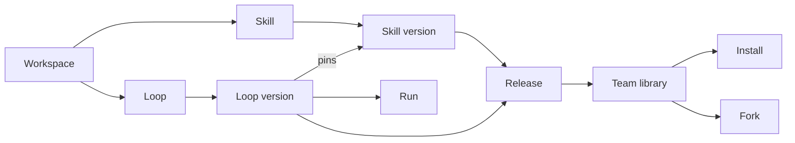

# Information Architecture and User Flows

## 1. Navigation Model

Primary navigation contains only:

- Skills
- Loops
- Team library

The global Create menu exposes Create Skill, Upload Skill, Create Loop, and Upload Loop.

Secondary workspace routes live under the workspace switcher: Members, Connections,
Publishing rules, Audit history, Theme, Language, and Account.

Templates are Team library items filtered by “Starting points” and appear in the Create Loop
flow. Runs belong to Loop detail. Builder belongs to a Loop draft.

See [information architecture diagram](../diagrams/01-information-architecture.mmd).

## 2. Route Map

```text
/skills
/skills/new
/skills/imports/new
/skills/:skillId
/skills/:skillId/edit
/skills/:skillId/tests
/skills/:skillId/versions

/loops
/loops/new
/loops/imports/new
/loops/:loopId
/loops/:loopId/edit
/loops/:loopId/runs/:runId
/loops/:loopId/versions

/library
/library/skills/:skillId
/library/loops/:loopId
/library/collections/:collectionId

/workspace/members
/workspace/connections
/workspace/publishing
/workspace/audit
```

Routes are conceptual. Existing `/workflows` Product API paths may remain without forcing the
Web route or user language to say Workflow.

## 3. Object Relationships



Templates do not introduce another version system. A Loop version becomes a starting point by
release metadata.

## 4. First-Use Flow

The first-use experience asks what the user wants to bring into the workspace:

1. Create or upload a Skill.
2. Create a Loop from a goal, starting point, upload, or blank draft.
3. Invite a teammate or browse Team library.

Do not present an empty database with one blocked fixture. Use realistic starter assets only
when they are executable or clearly labeled as preview examples.

## 5. Create and Publish Skill

See [Skill lifecycle diagram](../diagrams/02-skill-lifecycle.mmd).

1. `Create Skill` opens a choice between guided creation, upload, repository import, or fork.
2. Guided creation asks outcome, examples, needs, creates, connections, external actions, tests.
3. Upload shows file inventory, format, secrets/permission findings, and version conflict.
4. Draft editor provides Overview, Instructions, Files, Needs and creates, Permissions, Tests.
5. Validation runs static, security, setup, and real runtime checks.
6. Test output shows input, result, assertions, side effects, duration, and safe diagnostics.
7. Publish review shows diff, affected Loops, permissions, visibility, and approver.
8. Published version appears in private or Team library based on visibility.

Exit paths are always explicit: Save draft, Discard draft, Fix issue, Test again, Publish.

## 6. Create and Publish Loop

See [Loop lifecycle diagram](../diagrams/03-loop-lifecycle.mmd).

1. `Create Loop` offers Describe a goal, Start blank, Use a starting point, Upload, Duplicate.
2. Goal-based creation drafts Goal, Context, Constraints, Done when, Verify, Output, Stop rules.
3. The user reviews suggested Skills and ordered steps before opening Builder.
4. Builder synchronizes Definition, Outline, and Canvas.
5. Server validation separates Fix required from Needs setup.
6. Test Run uses safe inputs and presents review gates, final result, evidence, and checks.
7. Publish review shows contract/graph/version/permission changes and Team visibility.
8. Published Loop can run, be installed, or be used as a starting point.

## 7. Team Reuse Flow

See [Team sharing diagram](../diagrams/04-team-sharing-and-update.mmd).

1. User searches by desired outcome.
2. Detail explains owner, version, validation, permissions, connections, dependencies, examples.
3. `Install` keeps upstream identity; `Fork` creates an independent editable identity.
4. Workspace connections are rebound locally without transferring publisher credentials.
5. An update notice shows diff and all affected Loops.
6. Updating a pinned Skill creates a Loop draft, recompiles, and requires a new test/publish.

## 8. Run and Review Flow

1. Loop detail shows goal, expected output, required input, exact version, Skills, review points.
2. `Run Loop` opens the generated input form and preflight.
3. The Run page shows current step, completed summaries, reconnect state, and cancellation when
   supported.
4. Review presents candidate output, evidence, missing information, and downstream impact.
5. Approve continues; request changes creates a new attempt with real feedback input; reject
   ends the remaining plan.
6. Completed Run shows final result, Done-when/Verify results, evidence, gaps, versions, timeline.
7. User may Run again, compare, or create a Loop draft from this Run.

## 9. Decision Hierarchy

When the user opens an object, the UI orders information as:

1. Purpose: what this Skill/Loop helps accomplish.
2. Availability: whether it can be used here and why.
3. Next action: create, continue, test, run, publish, install, or review update.
4. Inputs/outputs and side effects.
5. Ownership, version, usage, and history.
6. Technical detail.

## 10. Navigation Rules

- Preserve selected object when switching between list and detail on desktop.
- Back returns to the same filters and scroll position.
- Opening Builder does not replace the browser history with transient panel state.
- Unsaved draft navigation requires Save, Discard, or Continue editing.
- Workspace switching checks unsaved drafts before changing tenant context.
- Deep links resolve permission and missing-object states without exposing existence across
  workspaces.
