# Selected Direction Key Frames

- Date: 2026-07-10
- Direction: [AI-native Lifecycle Board](../visual-directions/selected-ai-native-lifecycle-board.png)
- Interaction source: [Selected Direction and Functional Closure](../docs/SELECTED_DIRECTION_AND_FUNCTIONAL_CLOSURE.md)

These frames extend the selected lifecycle board into a coherent Loop creation, editing, Run,
review, publication, and team-update path. They are individual screens in one visual system, not
alternative product directions or a composite dashboard.

## Core Loop Flow

### Lifecycle Home

The board is a quick-action overview. It owns stage scanning, selection, Run/Edit/Publish entry,
drag intent, AI proposal entry, and Inbox access. It does not own object details or editing.

### Create Loop

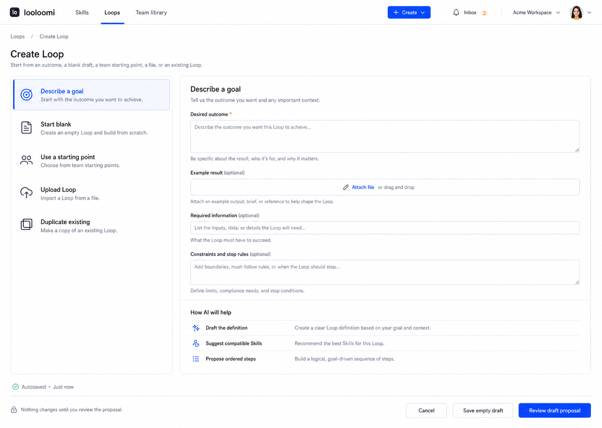

Five explicit entry paths: describe a goal, start blank, use a starting point, upload, or
duplicate. The selected goal path gathers intent before proposing structure.

### Review AI Proposal

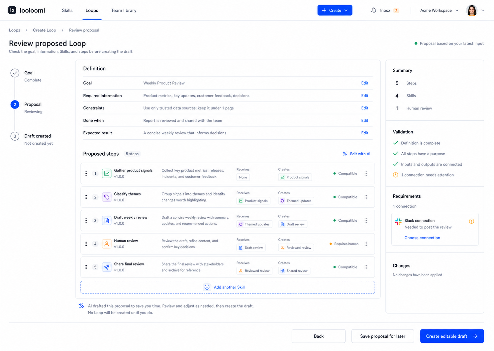

AI proposes the definition, compatible Skills, and ordered steps. Nothing changes until the user
creates the editable draft.

### Loop Overview

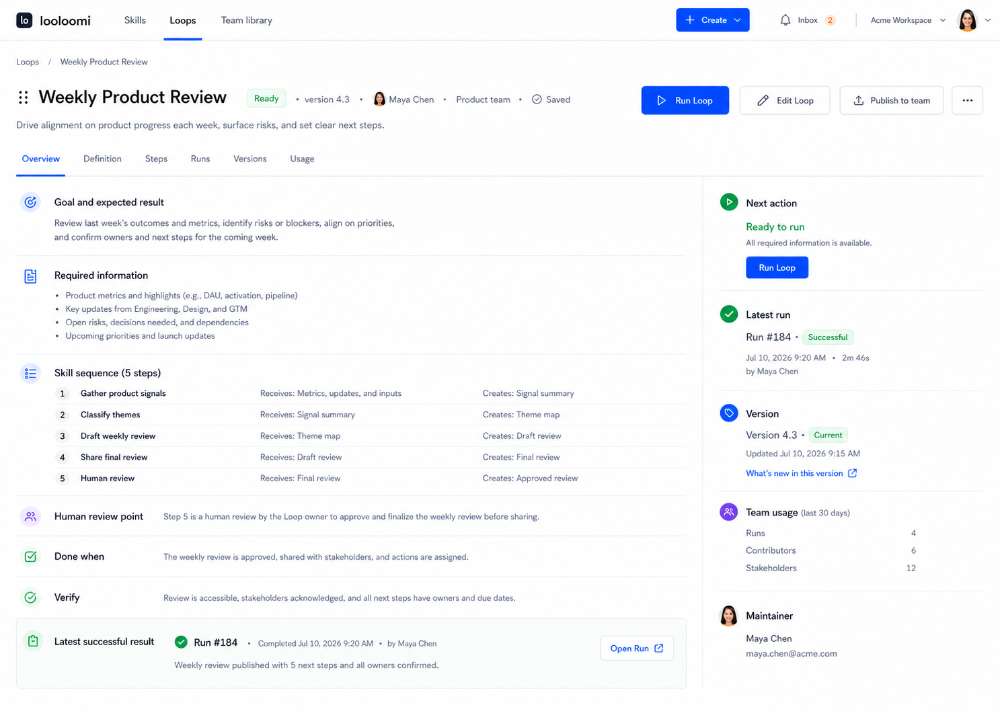

The object route explains the Loop without Canvas and exposes the next valid action, latest Run,
version, team usage, and maintainer.

### Builder Definition

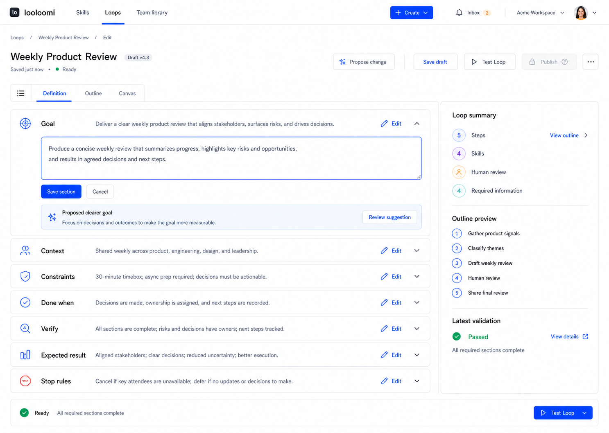

Goal, context, constraints, completion, verification, result, and stop rules remain readable and
editable without turning the page into a form wall.

### Builder Outline

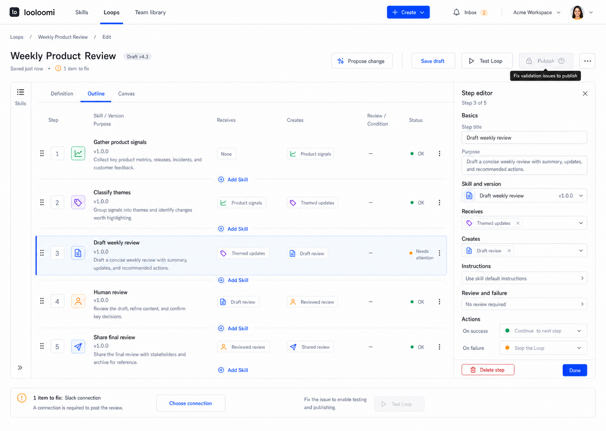

Outline is the fast, accessible editing mode. The Step editor is contextual and the Skill picker
is collapsed until requested.

### Builder Canvas

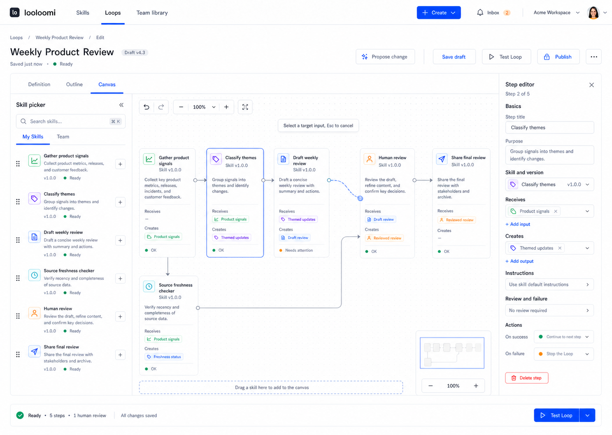

Canvas supports drag, add, selection, ports, connect, reconnect, zoom, fit, minimap, Step editor,
and a compact test dock. It is an advanced representation of the same draft.

### Run Preflight

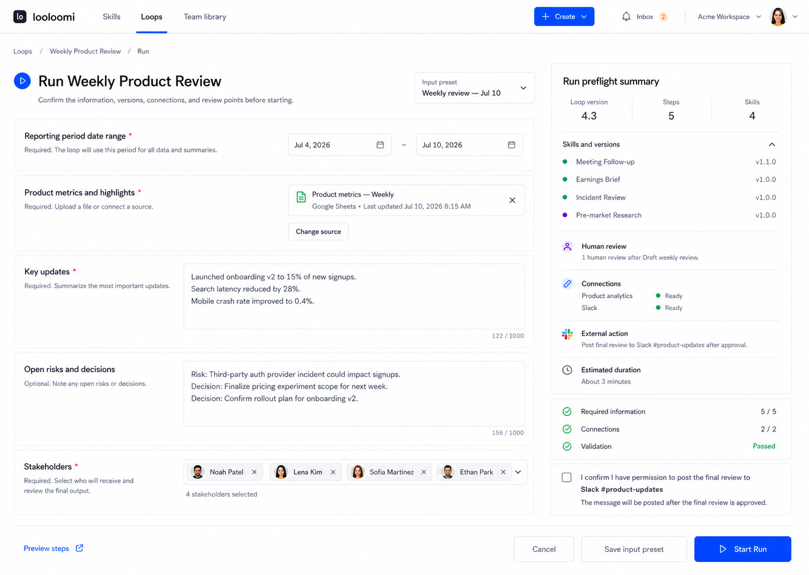

The user confirms inputs, pinned versions, connections, review points, and external-action consent
before starting a Run.

### Waiting For Review

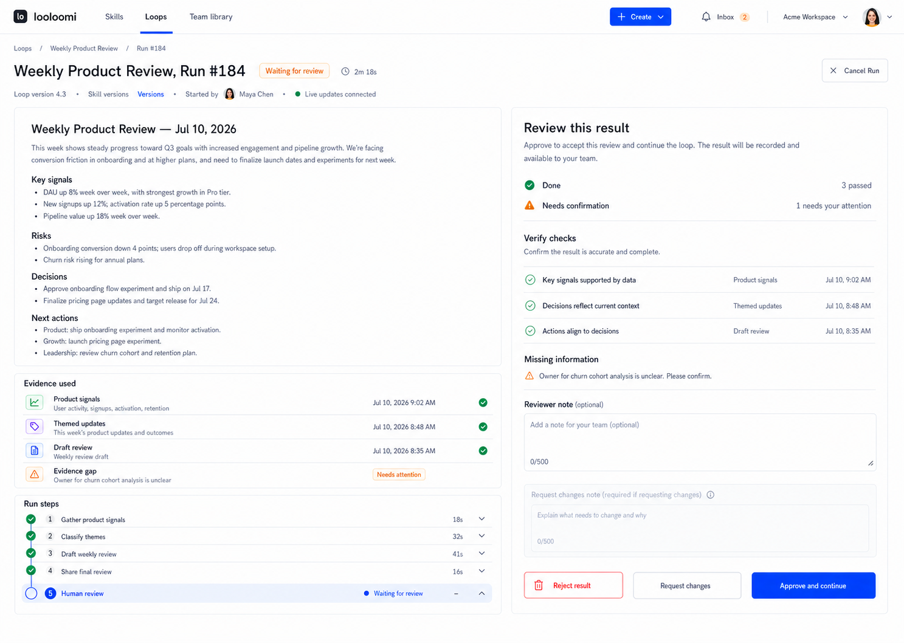

Candidate result, evidence, gaps, checks, and downstream effect precede Approve, Request changes,
and Reject.

### Completed Run

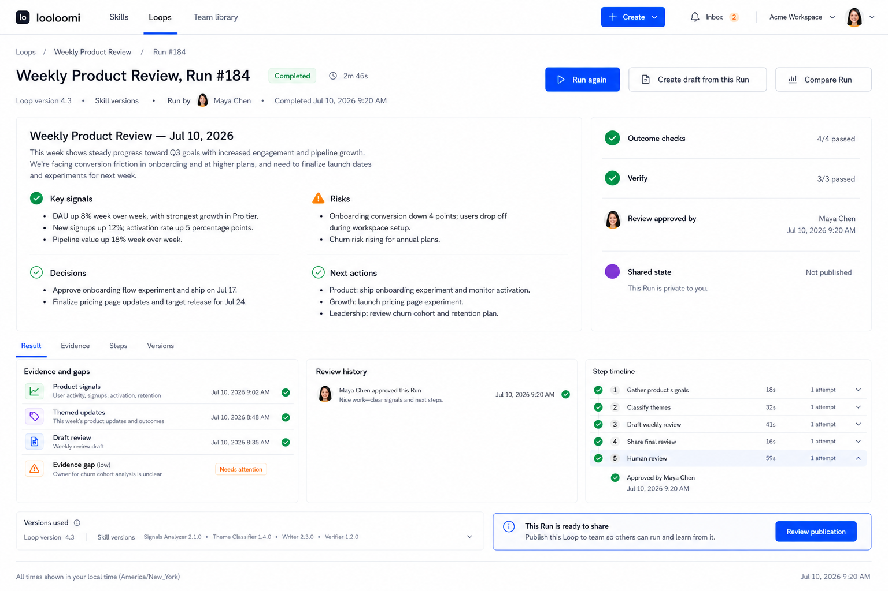

The authoritative result leads. Checks, evidence, review history, attempts, pinned versions, and
next actions remain available without exposing runtime internals.

### Publish Review

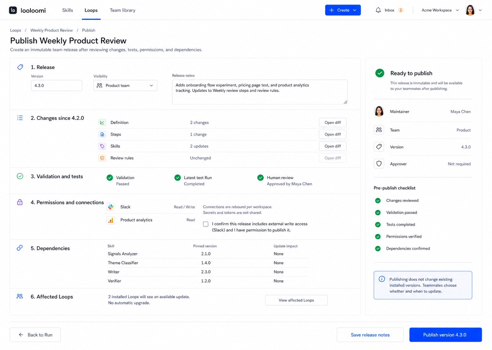

Publication is distinct from save and test. The review covers immutable version, changes,
permissions, dependencies, affected Loops, notes, and explicit consent.

### Team Reuse And Update

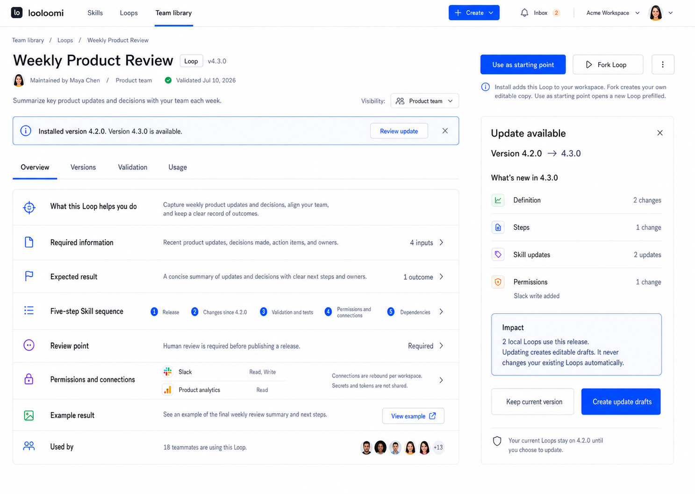

The team object route distinguishes use as a starting point, Fork, install identity, and explicit
version update. Updating creates drafts and never changes installed Loops silently.

## Remaining Design Frames

The core Loop path above is visually specified. Full V1 design acceptance still requires:

- Skills library, Skill detail, Skill create/upload, validation, tests, versions, and usage;
- Team library search/list and publish approval states beyond the selected Loop detail;
- error, offline, conflict, permission, first-use, and empty-search frames;
- dark-theme and Chinese equivalents;
- mobile 390 lifecycle list, creation, Builder Outline, Canvas full-screen, Run review, and sheets;
- loading skeletons, keyboard/focus states, 200% zoom, and reduced-motion review.

These remaining frames must use the same selected direction. They are not permission to introduce
another shell, navigation model, or visual language.
