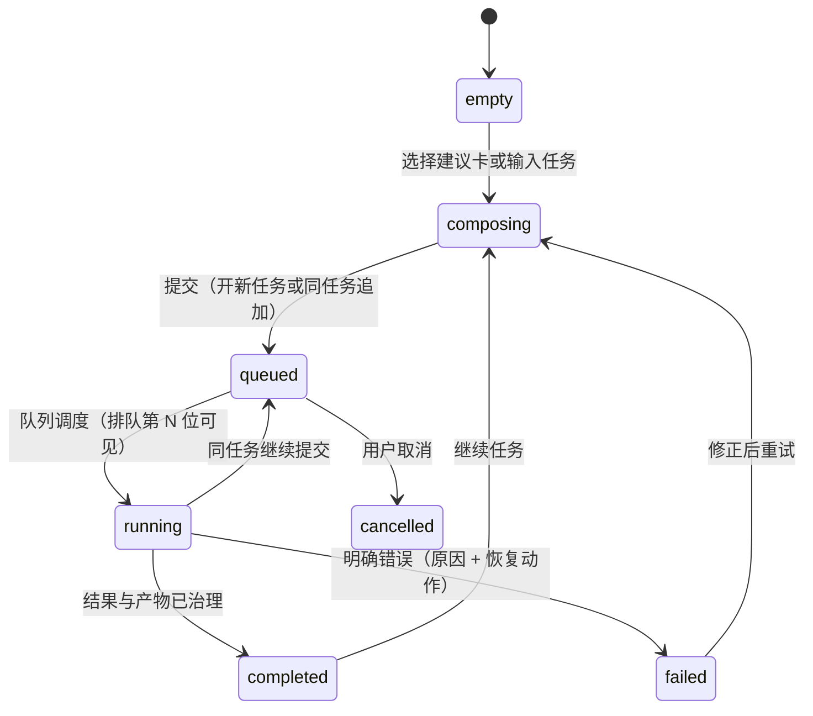
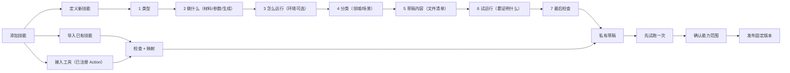
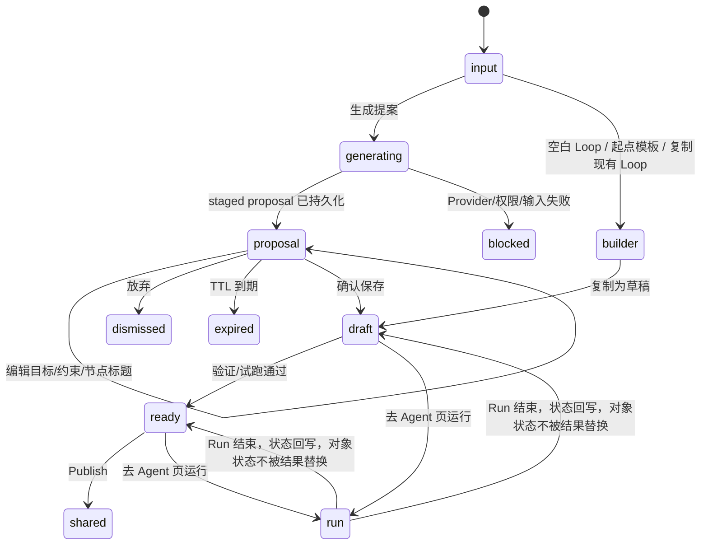
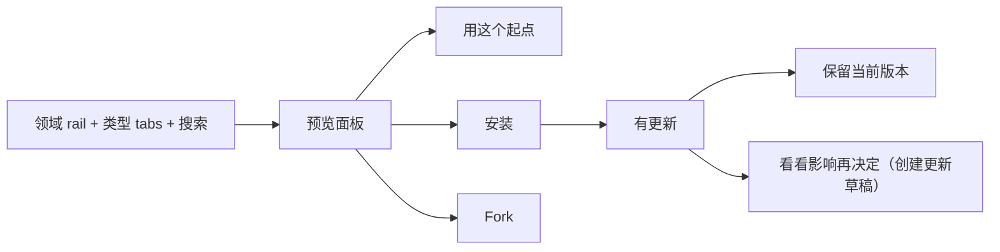

# M5 核心用户流与状态转换

- 2026-07-28：随 v2 交互重构更新（多 session 版面、材料/参数、环境可选、第二跳页面、
  结果阅读页、资源库领域分类）。

## 1. Agent 任务

规则：

- 多 session 版面：左栏任务列表按时间分组，状态点区分进行中/排队/待确认/完成；
  Loop 运行以 ⤴ 标记出现在任务栏；任务栏可折叠；
- 同一任务只有一个 active Turn，后续消息排队；
- composer 无文本/图像模式切换；拖入图片而模型不支持时输入时检测，给出
  换模型/移除图片两个出路；
- 上下文内联于执行步骤；运行详情 = 进行中内联"执行细节 ▾" + 完成后阅读页底部
  "运行信息"折叠区；
- "打开结果" → 结果阅读页（桌面右侧面板 / 移动端整页）；
- unavailable、permission denied、offline 与 execution failed 分开表达；
- 任务列表是 workspace-scoped 轻量 read model，每项必须包含正确 `workflowId` 和
  `runId`，不能借用首个 Loop 的 Run 列表。

## 2. Skill 定义和导入

边界：

- Tool 只能导入带精确 Action ID 的 package，任意命令进不来；
- Workflow 跳转创建 Loop；
- Script 运行环境可选（Python 3.12 / Node.js 20 · TypeScript），均在隔离沙箱，
  不联网、不碰工作区连接；环境目录由后端下发；
- "需要什么" = 材料（文件，必须/可选）+ 参数（入参，必须/可选），都可为空；
  风险不由用户自评，由系统按能力边界推导；
- 试运行收集自然语言目的与示例，不是 exact JSON；
- wizard 完成只创建私有 Draft。

## 3. Loop 创建和运行

规则：

- proposal 在确认前没有 Workflow 或 revision；
- URL 只携带 proposal ID，刷新从 Product API 恢复；
- proposal 只允许创建者 get/commit/dismiss；
- 第二跳落地页：空白 Loop→builder 大纲；从起点开始→起点模板库；复制现有
  Loop→选择对话框复制草稿；
- Run 是 immutable execution record，不是 Loop lifecycle；运行与结果统一在
  Agent 页（⤴ 任务）呈现，看板不内嵌运行；
- `.loop.json` 只走高级导入和依赖映射。

## 4. Team Library

更新不会静默修改本地 Loop，只创建新草稿；正在跑的继续用各自锁定版本。本版不含
权限设置：团队内均可安装，可见性以标签区分（团队 / 仅本组）。

## 5. 通用恢复

| 状态 | 页面行为 | 恢复动作 |
|---|---|---|
| loading | 与目标布局同形的 skeleton | 自动完成，无循环 spinner |
| offline | 保留已确认内容，禁止新 mutation | 重试连接 |
| permission | 可读内容保留，写动作禁用 | 复制访问申请 |
| not found | 不回退 Agent，不泄漏对象存在性 | 返回上一级 |
| conflict | 显示本地/服务端冲突摘要 | 下载我的修改 / 用最新版本 |
| proposal expired | 不创建空 Loop | 返回输入并重新生成 |
| recovered | 说明已恢复及恢复来源（Banner，可关闭） | 继续当前任务 |
| 模型无能力 | 输入时检测 notice（如图片不支持） | 换模型 / 移除附件 |
