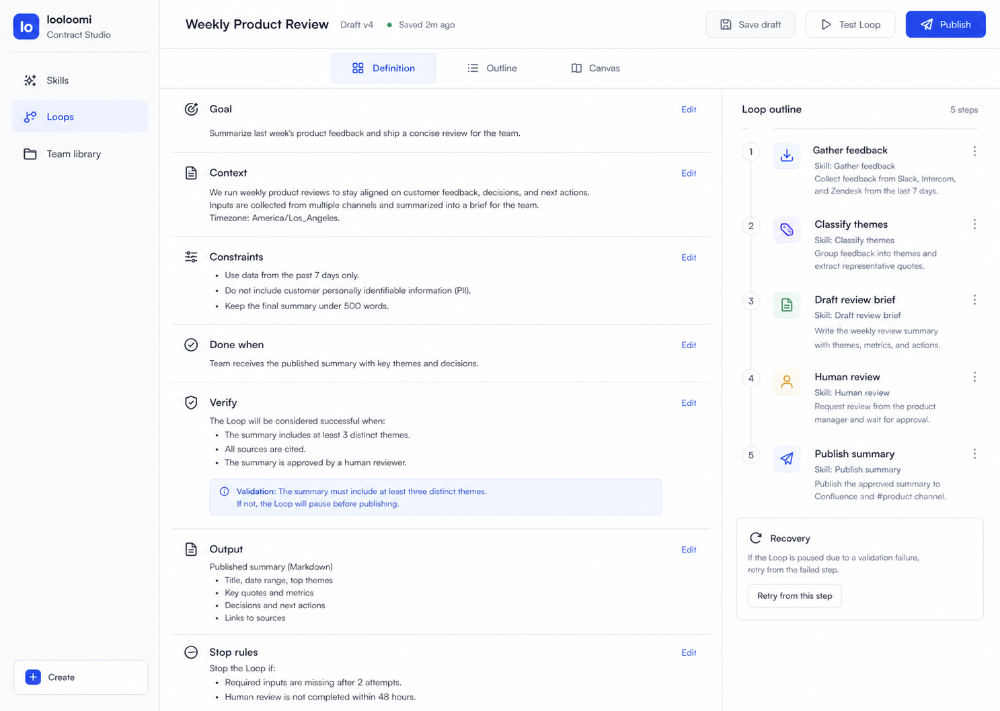
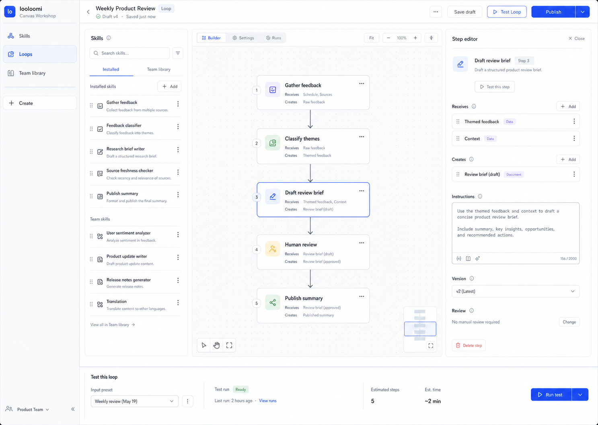
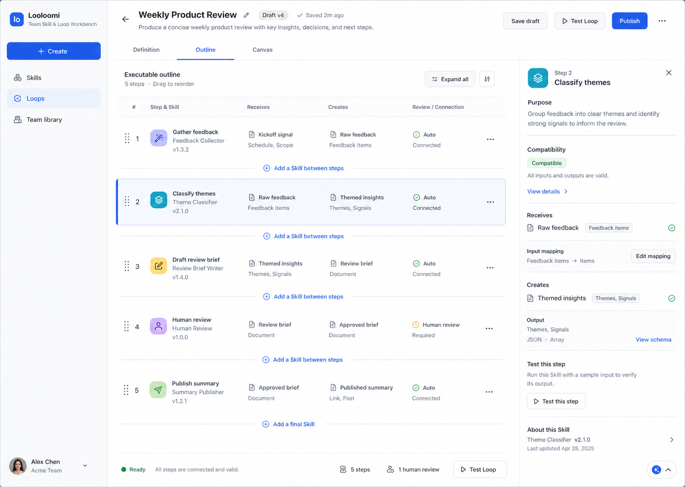
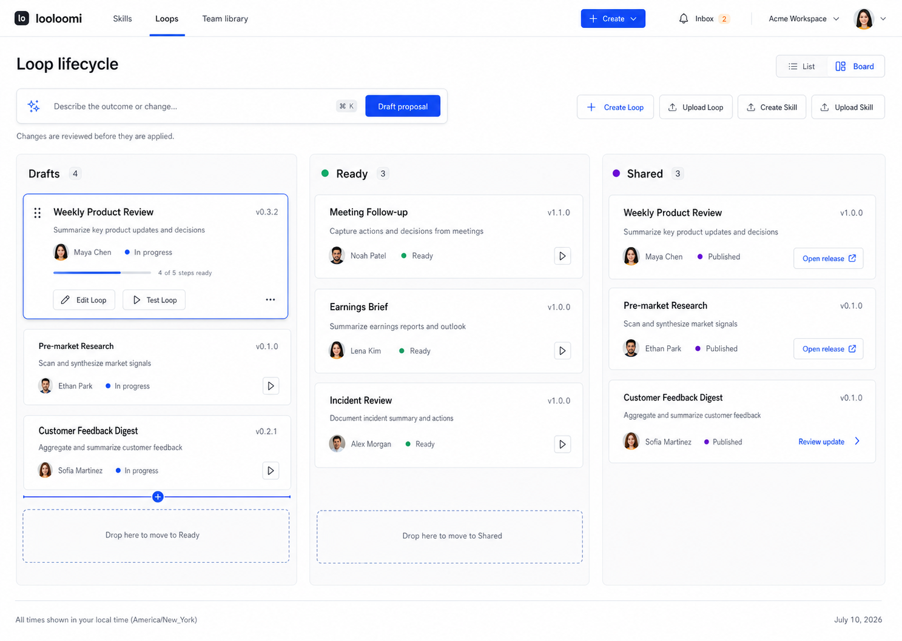

# Visual Directions

This folder owns the first three desktop 1440 x 1024 visual explorations for the target V1
workbench. Product review rejected all three as default implementation targets. Keep them as
historical references only.

## Direction A: Contract Studio

Definition is the default. The Loop goal, context, constraints, completion, verification,
output, and stop rules are the primary reading surface; the executable outline stays visible
without turning the screen into a graph editor.

## Direction B: Canvas Workshop

Canvas is the default. Skill discovery, node graph, Step editor, and a compact test dock form a
focused low-code editor while preserving explicit version, save, test, and publish actions.

## Direction C: Operational Outline

Outline is the default. Steps read as an ordered operational database with receives/creates,
review, connection, and version information; Canvas remains available for complex dependencies.

Selection status: Directions A, B, and C are rejected as default product directions.

## Selected Direction: AI-native Lifecycle Board

The selected direction uses a compact three-stage Loop lifecycle (`Drafts`, `Ready`, `Shared`),
an Inbox for derived issues, and a command field that creates reviewable AI proposals. It removes
the permanent detail rail and the oversized bottom drawer: the board owns quick stage decisions,
while creation, object detail, Builder, Run, and publication use dedicated routes.

The main frame is not the complete product handoff. Required secondary routes and interaction
semantics are defined in
[Selected Direction and Functional Closure](../docs/SELECTED_DIRECTION_AND_FUNCTIONAL_CLOSURE.md).

Decision record: [Design Handoff](../HANDOFF.md)

All directions must preserve:

- Skills, Loops, Team library navigation;
- one global Create action;
- quiet light-first B2B visual language;
- realistic useful assets rather than blocked fixtures;
- Definition, Outline, and Canvas as one Loop draft;
- clear version, ownership, validation, Run, and team-sharing actions;
- no decorative gradients, glass, card nesting, dashboard metrics, or chat-first framing.

Before implementation, the selected direction must be expanded into the complete key-frame and
state inventory. The accepted direction record includes:

- selected image;
- retained hierarchy and interaction decisions;
- rejected-direction rationale;
- required refinements;
- target screens for final high-fidelity design and implementation QA.
