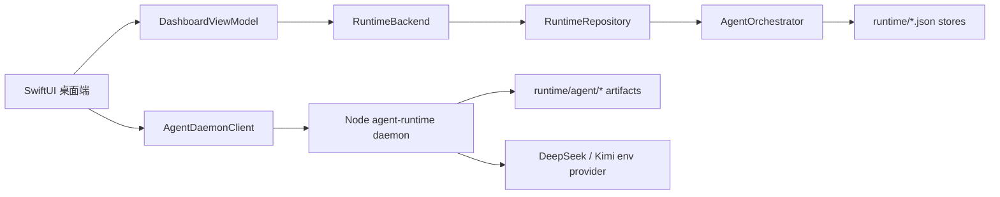

# 后端、数据与 Agent 能力审计

日期：2026-05-27

范围：本文只审计 `wechat-intelligence-radar-mvp`。`assignment-agent-raw` 与 `wechat-cli_raw` 继续作为只读参考，不纳入修改范围。

## 1. 总结结论

当前项目已经具备一个可信的本地优先后端与 Agent MVP，但它不是一个单一后端服务，而是由两层 runtime 共同组成：

1. Swift 进程内产品 runtime：
   `DashboardViewModel -> RuntimeBackend -> RuntimeRepository -> AgentOrchestrator -> stores -> UI`。
2. Node 本地 agent daemon：
   `Agent 工作台 UI -> AgentDaemonClient -> agent-runtime HTTP/SSE daemon -> runtime/agent artifacts`。

当前后端还不是生产级数据平台。它更准确的定位是：本地 JSON artifact runtime，已经具备 fixture 驱动的数据获取、策略边界、模块运行记录、健康状态、以及 Pi-compatible daemon shell。

当前 Agent 层是 **Pi-compatible 的结构和概念实现**，但还不是完整的 PiAgent runtime 集成。项目中已有 `agent-runtime/extensions`、`agent-runtime/skills`、`agent-runtime/prompts`、capability registry、model provider registry 和本地 daemon。但 daemon 没有引入外部 PiAgent package，没有动态执行 TypeScript extensions，也还没有把正式 function/tool calling 作为唯一工具执行机制。它目前是按 Pi package 形态和执行思想做的自研最小实现。

下一阶段最重要的工作不是继续堆前端，而是把数据获取、数据规范化、工具执行、模型路由、持久化、生命周期管理和运维观测补强。

## 2. 当前架构总览



Swift runtime 当前负责产品数据闭环：微信形态消息、token entity、市场快照、链上 fixture 快照、证据、预警、任务、观察列表、Crystal、Proposal、Memory、Handoff、runtime health 和 bridge status。

Node daemon 当前负责 Agent 工作台闭环：session、message、selected tools、attachment metadata、model route、policy decisions、event stream artifacts、tool-call records 和 final output。

这两层共享同一个本地 `runtime/` 目录，但还没有合并成一个统一的 Agent execution kernel。

## 3. PiAgent / 参考架构对齐情况

### 3.1 已实现部分

项目已经在 `agent-runtime/` 下实现了 Pi-compatible package 结构：

```text
agent-runtime/
  package.json
  bin/wechat-agent-daemon.mjs
  extensions/
  skills/
  prompts/
  runtime/capability-registry.json
  runtime/model-providers.json
  runtime/schemas/
```

`agent-runtime/package.json` 里包含 Pi metadata，用于描述 extensions、skills 和 prompts。capability registry 定义了 Pi-style tools 与权限状态。daemon 提供 health、capabilities、sessions、messages、run events 和 run controls 等本地 API。

已经落地的参考架构思想包括：

- Capability registry。
- Skill 与 prompt 文件。
- Extension-like 模块契约。
- Planner envelope。
- Policy decisions。
- Tool-call records。
- Model provider routing。
- Swift UI 与本地 daemon 解耦。
- Artifact-first 的执行追踪。

### 3.2 尚未实现部分

当前还不是完整 PiAgent runtime，原因如下：

- daemon 没有引入外部 PiAgent package dependency。
- `agent-runtime/extensions/*.ts` 目前是契约描述，不是动态加载执行的 runtime module。
- skills 还是 Markdown guidance 文件，不是带完整生命周期的可执行 skill handler。
- tool call 主要是推断出来的 deterministic record，还没有完全交给成熟 extension runner。
- DeepSeek tool/function calling 还没有成为 planner 的标准接口。
- Kimi vision 已出现在 provider routing 和 attachment metadata 里，但完整图片分析执行链路还没完成。
- daemon 的 tool call 还没有通过统一 backend mutation API 写回所有 Swift 产品 store。

### 3.3 实际结论

准确说法是：**Pi-compatible 本地 daemon 和 package skeleton 已存在；完整 PiAgent-style extension execution 还不存在。**

这对当前 MVP 是可以接受的，但下一阶段后端/Agent PRD 必须做一个明确决策：

1. 继续保留自研 runtime，并把它强化为第一方 agent kernel。
2. 引入真实 PiAgent runtime dependency，替换当前自研执行层。
3. 采用混合方案：Swift 保留产品 store，Node daemon 成为唯一工具执行和 skill orchestration kernel。

## 4. 后端能力盘点

| 模块 | 当前状态 | 现在能做什么 | 主要缺口 |
| --- | --- | --- | --- |
| Swift Runtime Backend | MVP 有效 | Command、Query、本地 Mutation、Repository 边界 | 没有 durable DB，没有 schema migration |
| Agent Orchestrator | MVP 有效 | 多模块 refresh pipeline 与 artifacts | 主要还是 deterministic / fixture-driven |
| Node Agent Daemon | 基础有效 | Sessions、chat/task runs、artifacts、provider readiness | 还不是完整动态 Pi runtime |
| 数据获取 | 部分有效 | fixture file、normalized market bridge、seeded CMC snapshot、on-chain fixture | 没有 live WeChat/export ingestion，没有 live on-chain bridge |
| 数据存储 | 本地 JSON MVP 有效 | runtime JSON stores 覆盖多数产品对象 | 没有 indexing、encryption、retention engine、migration |
| 数据分析 | 基础有效 | token resolution、evidence、crystal、proposal、memory seed、alert | 排序和语义分析较浅，缺少更强 LLM/规则分析 |
| Skill / Tool 层 | 基础契约 | tool manifest 和 policy-visible tool calls | tool handler 还没有插件化，也没有完全统一写入 Swift stores |
| Model Providers | 契约 + 部分执行 | DeepSeek text route、env-only keys、mock provider smoke | 默认路径没有强 live verification；Kimi vision 未闭环 |
| Ops / Monitoring | MVP 有效 | runtime health、module runs、artifacts、policy matrix、bridge state | 没有 daemon supervisor、queue dashboard、retention alerts |

## 5. 数据获取层

### 5.1 微信数据

已实现组件：

- `WeChatDataAdapter` protocol。
- `WeChatFixtureFileAdapter`。
- `MockWeChatDataAdapter`。
- `WeChatCLIExportAdapter` contract。
- `WeChatCLIAdapterBoundary`，其中 live command 列表保持 blocked。

当前行为：

- App 读取 `Sources/WeChatIntelligenceRadarApp/Fixtures/wechat/messages.sample.json` 里的可编辑 fixture JSON。
- fixture 文件读取失败时，会降级到 hardcoded mock adapter。
- live WeChat 读取被 policy 阻断。
- `wechat-cli` export import 只是契约，需要用户确认。
- App 不运行 `wechat-cli init/history/search`。

主要缺口：

项目还没有生产级的“用户提供微信导出文件”导入流水线。下一阶段需要定义 normalized export schema、validator、redaction rules、import manifest、replayable ingestion run。

### 5.2 市场数据

已实现组件：

- `MarketSnapshotStore`。
- `CMCRefreshBridge`。
- `CMCMarketDataProvider`。
- `CMCSkillHubCapability`。
- `MockWeb3MarketDataAdapter`。

当前行为：

- Swift app 不直接调用 CMC MCP 或 live API。
- market provider 优先读取 `runtime/market/latest-market-snapshot.json`。
- 如果 snapshot fresh 且覆盖需要的 symbols，则直接使用。
- 如果没有 fresh external snapshot，可以 seed 当前 CMC Skill Hub snapshot。
- mock market fixture 会明确标记为 mock/degraded/standby，不会伪装成 live 数据。

主要缺口：

还没有独立的 scheduled market refresh runner。生产形态应该是外部 agent/MCP bridge 写入 normalized JSON 到 `runtime/market/latest-market-snapshot.json`。

### 5.3 链上数据

已实现组件：

- `TokenResolutionService`。
- `OnchainSnapshotService`。
- `RuntimeBridgeStatus` on-chain bridge state。

当前行为：

- 从 normalized WeChat messages 提取 token symbol 和疑似 contract 字符串。
- 已知 token 包括 BTC、ETH、SOL。
- 如果 entity 有 contract，则生成 deterministic fixture on-chain fields。
- 如果 token 没有 contract/provider，则 on-chain 状态标记为 degraded。

主要缺口：

当前没有 live RPC、DEX、block explorer、address graph、token holder、liquidity、transfer 或 wallet-risk bridge。链上数据目前是用于 UI 和生命周期验证的 fixture/proxy evidence。

## 6. 数据分析与产品对象层

Swift product runtime 已经能生成一条有效的本地对象链：

```text
Message
  -> NormalizedWeChatMessage
  -> TokenEntity
  -> MarketDataSnapshot
  -> OnchainSnapshot
  -> EvidenceItem
  -> AlertRecord / UserTask / WatchlistItem / AlertRule
  -> IntelligenceCrystal
  -> AgentProposal
  -> MemoryEntry
  -> HandoffPacket
  -> ProactiveSession
```

### 6.1 Token Resolution

`TokenResolutionService` 负责提取：

- BTC、ETH、SOL 等已知 symbol。
- EVM address。
- Solana-style address。
- linked token IDs。

它还会补充 confidence、chain inference、first/last seen time、source message IDs、aliases 和 freshness。

当前限制：

symbol matching 仍然较轻量。还不能很好处理 noisy ticker ambiguity、更多中文别名、项目名、官方合约校验、垃圾 token、false-positive scoring。

### 6.2 Evidence

`RuntimeProductBuilder.evidence` 会把 messages、token entities、market assets、on-chain snapshots 组合成 `EvidenceItem`。

当前限制：

Evidence 还是 deterministic 和 shallow。还没有多跳推理、实体消歧、quote-level citation scoring、source reputation、contradiction detection。

### 6.3 Crystals

`IntelligenceCrystal` 是当前的融合情报单元。它包含：

- WeChat message references。
- Token references。
- Evidence references。
- Artifact references。
- Memory references。
- Freshness。
- Risk。
- Confidence。
- Next action。

当前限制：

Crystal 质量主要由规则生成。ranking quality、clustering、deduplication、status progression、long-term learning 仍需要更强后端逻辑。

### 6.4 Proposals

`AgentProposal` 会把 crystals 转成 local action，比如创建任务或加入 watchlist。

当前限制：

Proposal execution 目前故意保持 local-only 和保守。还不支持确认后的外部动作、多步骤计划、依赖追踪、agent-generated tool schemas。

### 6.5 Memory

`MemoryEntry` 支持 useful/wrong/false-positive 类型的 review 和本地 purge 语义。

当前限制：

Memory 以 JSON 持久化，但还没有 index、vectorize、按 project/user/group 分域，也没有完整 retention policy。即使 memory 被 purge，历史 run artifacts 仍可能保留旧引用，除非后续增加更强的 retention model。

### 6.6 Handoff

`HandoffPacket` 负责生成本地 handoff draft，包含 redacted message preview 与 artifact references。

当前限制：

Handoff 目前是 local JSON/redacted preview。外部 export 仍然 confirmation-gated，还不是完整发布或交接工作流。

## 7. Agent Runtime 与 Skill 层

### 7.1 Node Daemon APIs

`agent-runtime/bin/wechat-agent-daemon.mjs` 暴露：

- `GET /health`
- `GET /capabilities`
- `POST /sessions`
- `GET /sessions/{sessionID}`
- `POST /sessions/{sessionID}/messages`
- `GET /runs/{runID}/events`
- `POST /runs/{runID}/pause`
- `POST /runs/{runID}/resume`
- `POST /runs/{runID}/cancel`

daemon 是 local-first，默认绑定 `127.0.0.1`。

### 7.2 Agent Runtime Artifacts

daemon 写入：

```text
runtime/agent/
  sessions/{sessionID}.json
  tasks/{taskID}.json
  runs/{runID}/events.ndjson
  runs/{runID}/planner-envelope.json
  runs/{runID}/tool-calls.json
  runs/{runID}/model-route.json
  runs/{runID}/attachments.json
  runs/{runID}/policy-decisions.json
  runs/{runID}/final-output.md
  attachments/{attachmentID}/attachment.json
```

这对 auditability 和 UI recovery 有价值。但它还不是完整 job queue，没有 retry、lease、concurrency limit、worker ownership 或 crash-safe task resumption。

### 7.3 Tool Registry

当前 manifest 包括：

- `wechat.read_normalized_messages`
- `token.resolve_entities`
- `market.read_snapshot`
- `onchain.read_snapshot`
- `crystal.create_or_update`
- `proposal.create`
- `memory.save`
- `handoff.write`
- `image.analyze_with_kimi`
- `computer_use.request`

权限模型：

- 本地 runtime 读写：`pass`。
- DeepSeek 文本调用：provider config 存在且内容符合 policy 时允许。
- Kimi 图片调用：设计上允许，但必须记录 attachment hash 和 policy decision。
- Computer Use：`needs_confirmation`。
- live WeChat、live `wechat-cli`、trade、send message、publish external：`blocked`。

当前限制：

tool registry 和 tool-call cards 已存在，但 tool execution 还不是成熟插件系统。生产级 agent runtime 需要真实 handler modules、typed input/output schemas、idempotency keys、error taxonomy、retry rules，以及统一写入 Swift product stores 的 mutation boundary。

### 7.4 Model Providers

已配置 provider：

- DeepSeek：用于 text、planning、tool-call style interaction。
- Kimi：用于 vision/image attachment analysis。

Provider 只从环境变量读取配置：

- `DEEPSEEK_API_KEY`
- `DEEPSEEK_BASE_URL`
- `DEEPSEEK_DEFAULT_MODEL`
- `DEEPSEEK_FAST_MODEL`
- `KIMI_API_KEY`
- `KIMI_BASE_URL`
- `KIMI_VISION_MODEL`

当前行为：

- provider config 缺失时会显示 blocked/missing。
- smoke-check 可以在 mock provider mode 下运行。
- raw API keys 和 Authorization headers 不会写入 runtime artifacts。

当前限制：

- DeepSeek live call 已有 generic OpenAI-compatible route，但 formal function/tool calling 还不是 planner 唯一机制。
- Kimi vision 已在 route 和 attachment metadata 中体现，但 image-to-analysis artifact loop 还需要完成。
- 还没有 provider quality evaluation、retry/fallback strategy、token/cost accounting、per-task model policy。

## 8. 存储映射

| 路径 | Owner | 用途 | 状态 |
| --- | --- | --- | --- |
| `runtime/wechat/messages.normalized.json` | Swift runtime | normalized 微信形态消息 | 已实现 |
| `runtime/entities/token-entities.json` | Swift runtime | token/entity 提取结果 | 已实现 |
| `runtime/market/latest-market-snapshot.json` | Swift runtime / external bridge | normalized market data | 已实现，缺 refresh runner |
| `runtime/onchain/{chain}/{id}.json` | Swift runtime | on-chain snapshots | fixture/degraded |
| `runtime/evidence/evidence.json` | Swift runtime | evidence bundles | 已实现 |
| `runtime/tasks/tasks.json` | Swift runtime | local tasks | 已实现 |
| `runtime/watchlist/watchlist.json` | Swift runtime | watchlist items | 已实现 |
| `runtime/alerts/alerts.json` | Swift runtime | alert records | 已实现 |
| `runtime/alerts/alert-rules.json` | Swift runtime | alert rules | 已实现 |
| `runtime/crystals/crystals.json` | Swift runtime | fused intelligence units | 已实现 |
| `runtime/proposals/proposals.json` | Swift runtime | local agent proposals | 已实现 |
| `runtime/memory/memory.json` | Swift runtime | local memory entries | 已实现 |
| `runtime/handoffs/index.json` | Swift runtime | handoff index | 已实现 |
| `runtime/sessions/latest-session.json` | Swift runtime | proactive session | 已实现 |
| `runtime/bridges/*.json` | Swift runtime | bridge status contracts | 已实现 |
| `runtime/runs/{runID}/` | Swift runtime | refresh artifacts | 已实现 |
| `runtime/agent/sessions/*.json` | Node daemon | chat sessions | 已实现 |
| `runtime/agent/tasks/*.json` | Node daemon | long task records | 已实现 |
| `runtime/agent/runs/{runID}/` | Node daemon | agent chat/task artifacts | 已实现 |
| `runtime/agent/attachments/{attachmentID}/` | Swift/Node agent workspace | attachment metadata/originals | metadata 已实现，vision analysis 未闭环 |

## 9. 生命周期管理

### 9.1 Swift Refresh Run 生命周期

当前生命周期：

1. UI 或 smoke-check 触发 refresh。
2. `RuntimeBackend` 派发 refresh command。
3. `RuntimeRepository` 调用 `AgentOrchestrator`。
4. Orchestrator 加载数据，按时间窗口过滤，解析 token，加载 market，创建 on-chain fixture、evidence、alerts、tasks、memory、crystals、proposals、handoff、session、bridge status、health 和 manifest。
5. Stores 写入 JSON artifacts。
6. UI 读取 runtime snapshot。

优点：

- deterministic，容易审计。
- 对本地 MVP 很适合。
- policy boundary 清晰。

弱点：

- 没有 incremental ingestion。
- 没有 durable event sourcing。
- 没有 rollback 或 migration。
- 历史 artifacts 没有完整 retention/purge 策略。
- 没有 scheduler/worker 分层。

### 9.2 Agent Chat / Long Task 生命周期

当前生命周期：

1. UI 创建或选择 agent session。
2. 用户提交 prompt、selected tools、context references 和 attachments。
3. `AgentDaemonClient` 把 message 发给本地 daemon。
4. daemon 创建 run，并写入 events/artifacts。
5. 选择 provider route。
6. 写入 tool-call records 和 policy decisions。
7. 写入 `final-output.md`。
8. UI 读取 session/task/events/tool artifacts。

优点：

- App 可以从磁盘恢复 sessions 和 task records。
- Chat/task artifacts 可审计。
- provider config 缺失会显式展示，不会静默假装真实模型可用。

弱点：

- pause/resume/cancel 目前更像 artifact/control records，不是强 process supervisor。
- long task 还没有真实 background scheduling、retry 或 checkpointed work units。
- Swift client 还没有把 SSE 作为主要 live stream 消费方式，更多是读取 artifacts。
- daemon 和 Swift product runtime 还没有统一到一个 tool mutation API。

## 10. 安全与策略边界

当前安全策略比较保守：

- live WeChat read：blocked。
- live `wechat-cli` execution：blocked。
- 用户提供 WeChat export file：needs confirmation。
- trading：blocked。
- send message：blocked。
- external publishing：blocked。
- Computer Use：`needs_confirmation`，v1 不直接执行。
- API keys 只从环境变量读取。
- raw Authorization headers 和 API keys 不写入 runtime artifacts。

仍需修复的后端风险：

- 未来接入真实导入后，JSON runtime artifacts 可能包含敏感 preview，需要强 redaction。
- Attachments 被复制到 runtime，需要 retention/encryption policy。
- Memory purge 不会自动重写所有历史 run artifacts。
- 目前只有轻量 privacy metadata，没有完整 per-source privacy classifier。

## 11. 真实能力 vs 契约能力

| Capability | 真实已实现 | 契约 / 部分实现 | 缺失 |
| --- | --- | --- | --- |
| Local Swift runtime refresh | 是 |  |  |
| Runtime JSON object stores | 是 |  |  |
| Fixture WeChat ingestion | 是 |  |  |
| User WeChat export import |  | 是 | 生产级 importer |
| Live WeChat read |  |  | 按设计 blocked |
| CMC normalized snapshot consumption | 是 |  |  |
| External CMC/MCP refresh runner |  | 是 | scheduled runner |
| On-chain fixture snapshots | 是 |  |  |
| Live on-chain/RPC/DEX bridge |  | 是 | bridge runner |
| Token/entity extraction | 是 |  | 高级消歧 |
| Evidence/crystal/proposal generation | 是 |  | 质量与排序增强 |
| Memory and handoff stores | 是 |  | 强 lifecycle/retention |
| Node local agent daemon | 是 |  |  |
| Pi-compatible package shape | 是 |  |  |
| Full PiAgent runtime dependency |  |  | 未集成 |
| Dynamic extension execution |  | 部分契约 | runtime loader/handlers |
| DeepSeek provider route | 部分 | 是 | production live validation/tool calling |
| Kimi vision route |  | 是 | 完整 image analysis loop |
| Computer Use tool |  | proposal only | confirmed execution boundary |
| Job queue/scheduler |  | partial task artifacts | real queue/supervisor |

## 12. 建议的后端与 Agent 路线图

### Phase A：规范化数据契约

目标：先把外部数据接入变可靠，再继续加 UI。

交付物：

- `schemas/wechat-export.normalized.schema.json`。
- `schemas/market-snapshot.schema.json`。
- `schemas/onchain-snapshot.schema.json`。
- 带清晰错误的 import validator。
- message text、sender、group、attachment 的 redaction policy。
- import manifest，包含 source hash、import time、row count、rejected row count。
- 针对指定 import artifact 的 replay command。

### Phase B：建设 Bridge Runner 层

目标：把 bridge contracts 变成可执行的 permissioned workers。

交付物：

- Market bridge runner，写入 `runtime/market/latest-market-snapshot.json`。
- On-chain bridge runner，写入 normalized token/address snapshots。
- WeChat export bridge runner，只消费用户选择的 export JSON。
- Bridge health records：last run、last success、freshness、error、input hash、output path。
- Swift 不直接调用 MCP/RPC/live WeChat。

### Phase C：升级 Agent Tool Runner

目标：让 tools 成为真实后端能力，而不是只显示 UI cards。

交付物：

- typed tool input/output schemas。
- tool handler registry。
- idempotency keys。
- tool execution state machine。
- tool results 通过统一 backend boundary 修改 Swift runtime stores。
- 每个 tool call 都执行 formal blocked/needs-confirmation/pass policy check。
- DeepSeek function/tool calling 接入 planning。

### Phase D：完成多模态 Attachment Pipeline

目标：让 image + prompt + context 生成持久可追踪的 analysis artifacts。

交付物：

- Attachment retention policy。
- Kimi vision request builder。
- `analysis.json` writer。
- Image hash、dimensions、mime、source、redaction status。
- DeepSeek follow-up 默认只读取 analysis artifact 和 pointers；除非显式允许，否则不直接使用 raw private content。

### Phase E：从 JSON Files 走向 Managed Storage

目标：保留 JSON artifacts 的审计价值，同时增加可查询的后端 store。

可选方案：

- SQLite 存本地产品状态和 indexes。
- JSON artifacts 作为 immutable run evidence。
- 每个 schema 带 migration version。
- retention 与 purge jobs。
- 对 crystals、tasks、handoffs、messages、memory 做 FTS search。
- 私密导入和附件可选 encryption。

### Phase F：生命周期与 Ops 硬化

目标：让 daemon 与数据生命周期真正可运维。

交付物：

- Daemon supervisor script 或 LaunchAgent 选项。
- 带 lease 和 retry 的 task queue。
- Run state machine：queued、running、waiting_for_approval、completed、degraded、failed、canceled。
- Health API 覆盖 queue depth、provider readiness、bridge freshness、artifact write status、disk usage、last error。
- Product-level QA smoke 同时验证 backend artifacts 和 UI recovery。

## 13. 下一份 PRD 建议结构

下一份 PRD 应该以后端/Agent 优先，并回答这些决策：

1. 哪个真实数据源先做：用户 WeChat export、market bridge，还是 on-chain bridge？
2. 哪个对象作为后端核心单元：message、token、crystal、task，还是 session？
3. Node daemon 是否要成为唯一 agent kernel，还是 Swift orchestrator 继续作为主 product runtime？
4. 下一阶段存储继续 JSON-only，还是引入 SQLite？
5. Agent 在用户确认后允许执行哪些动作？
6. 哪些数据是 private，哪些可以 summarize，哪些绝不能离开本机？
7. v2 最小可用 skill set 是什么：import、analyze、monitor、alert、handoff，还是 research？

推荐 PRD 标题：

`Backend and Agent Runtime v2: Permissioned Data Bridges, Executable Skills, and Managed Local Memory`

推荐 v2 产品目标：

构建一个 local-first agent backend，能够导入用户确认的 WeChat export 数据和 normalized market/on-chain bridge artifacts，将它们转换为 evidence-backed crystals，执行 permissioned local skills，持久化具备生命周期管理的 memory/tasks/handoffs，并向 Swift Agent 工作台暴露可运维的 health 状态。

## 14. 最终判断

当前项目已经有正确骨架：Swift product runtime、本地 JSON artifacts、保守 policy gates、Crystal/Proposal/Memory/Handoff 对象，以及 Pi-compatible 本地 agent daemon。

下一版不应该主要加新页面，而应该把骨架变成真正可依赖的后端与 Agent 系统：

- 真实 normalized import contracts。
- 真实 bridge runners。
- 真实可执行 tools。
- 真实 model tool-calling。
- 真实 image analysis artifacts。
- 真实 lifecycle 与 retention controls。
- 真实可查询 local storage。

这是从“好看的 Agent 工作台”走向“可依赖的微信 x 链上情报操作系统”的最短路径。
