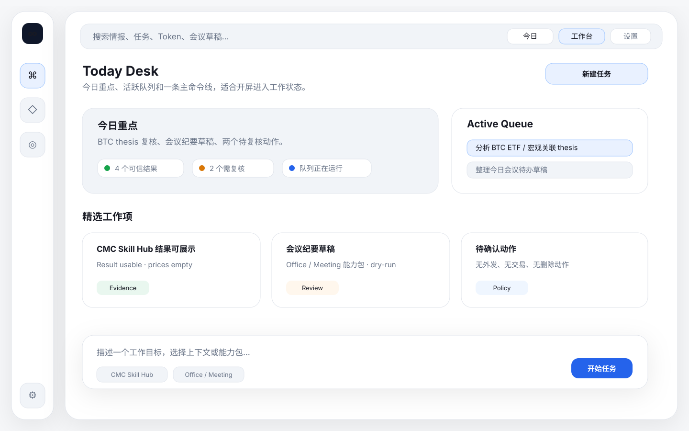
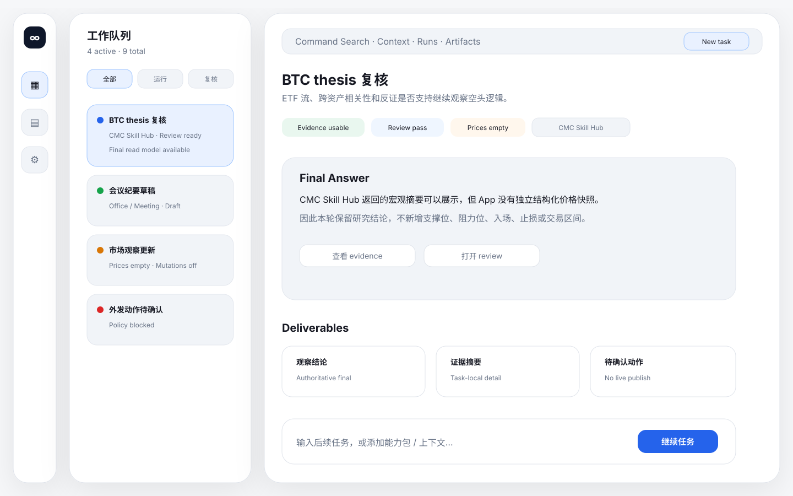
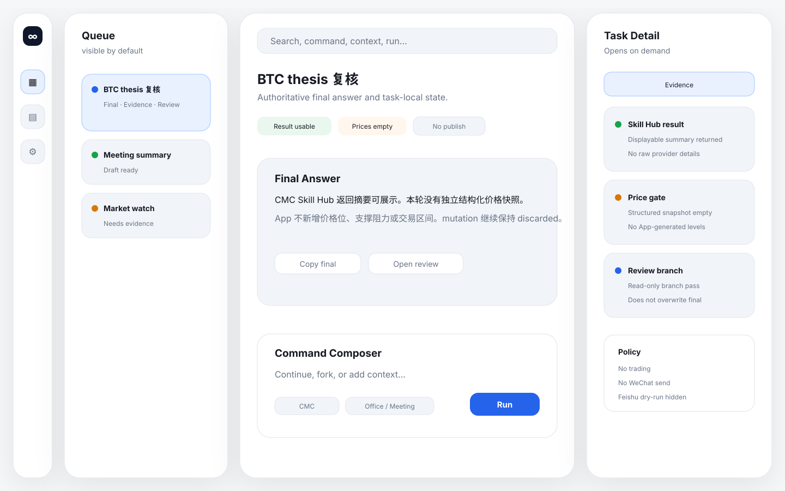
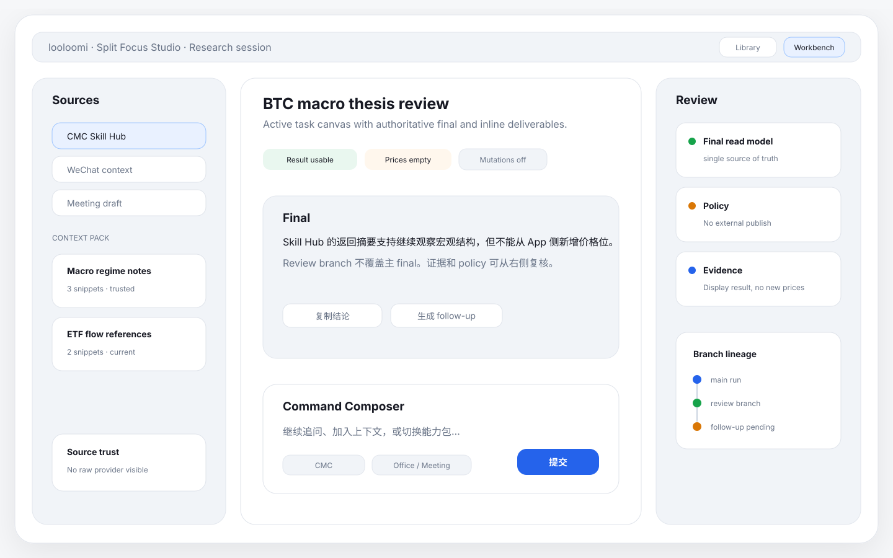

# Apple 极简综合工作台重构

- 日期：2026-06-09
- 范围：macOS App UI 的产品/设计基线、原型门禁与 Today Desk SwiftUI 落地
- 状态：Today Desk 已选定并完成首轮实现

## 1. 设计读法

这个 App 应被视为原生 macOS 生产力工作台：一位个人操作者使用本地优先统一 Agent 处理 Web3 研究、Office/Meeting 草稿、review 和后续任务。

它不是：

- Web3 terminal，
- ops dashboard，
- chat-only agent shell，
- marketing page，
- office-suite clone。

设计参数：

- `DESIGN_VARIANCE=4`
- `MOTION_INTENSITY=2`
- `VISUAL_DENSITY=6`

产品方向是 Apple-minimal product UI：克制、清晰、原生，适合反复使用。

## 2. 当前问题

早期前端迭代分别解决了局部问题：

- Research OS 让 App 显得更强，但也把它推向了高密度 terminal/ops surface。
- Apple minimal 减少了 chrome，但仍保留 `Home`、`Agent`、`Library`、`Ops` 等并列产品表面。
- Work Queue Canvas 把 Agent 侧推向 queue-first，但它仍嵌在一个产品中心不够清楚的 App shell 中。
- CMC 和 final-output 修复稳定了可信边界，但没有解决整体工作台组合问题。

当前界面仍显得割裂，因为它缺少一条产品级主层级：

```text
当前工作 -> 活跃任务 -> 权威 final -> evidence/review/policy -> library/settings
```

下一轮不应继续修补孤立 panel，而应围绕单一工作台循环定义整个 App。

## 3. 产品基线

新增根目录设计基线文件：

- `PRODUCT.md`：产品类别、用户、产品目的、反参考、设计原则、无障碍。
- `DESIGN.md`：视觉系统、IA、布局、色彩、字体、组件和文案规则。

这两个文件是后续 App UI 工作的 design source of truth。未来 Product Design、图像原型、SwiftUI 和 QA 工作都应先读取它们，再编辑屏幕。

## 4. 目标信息架构

全局导航应收束成三个用户可见区域：

1. Workbench
2. Library
3. Settings

### Workbench

Workbench 是默认屏幕，也是主产品表面。

它包含：

- 左侧工作队列和最近 sessions，
- 中央 focus canvas，
- 权威 final answer，
- task-local review/policy/evidence summary，
- 底部 command composer，
- 按需打开的 context、evidence、review branch 和 artifact lineage 详情 sheet。

### Library

Library 统一 sources 和 saved references：

- WeChat sources，
- Token references，
- Watchlist，
- Artifacts/context sources。

它应该像 source browser，而不是第二个 dashboard。

### Settings

Settings 承载 runtime 状态、隐私、retention、provider readiness、diagnostics 和 logs。

Ops 仍然可用，但不再是主工作表面。

## 5. 原型方向

原型门禁要求在任何 Swift 实现前，先产出并评审三张静态桌面方向稿。

### 方向 A：Today Desk（已选定）

适合早上打开 App 后立即看到今日重点。

结构：

- 左侧全局导航，
- 顶部今日摘要，
- 活跃工作 strip，
- 精选情报和办公草稿，
- 底部 command composer。

优势：

- 第一印象最安静，
- 日常工作节奏最强。

风险：

- 如果 daily brief 占比过高，queued/running Agent work 可能退到次级。

落地决定：

- 2026-06-09 已按用户选择采用 Today Desk。
- 首屏改为顶部今日摘要、活跃队列、当前任务 preview、精选情报/草稿和底部 Command Composer。
- 活跃队列仍是常驻对象，避免 Today Desk 退回纯 daily brief。

原型：



### 方向 B：Queue Canvas 2.0

未采用，保留为后续 queue-first 深化参考。

结构：

- 左侧工作队列作为主对象，
- 中央显示选中任务和 final read model，
- 以紧凑状态行表达 evidence/review/policy/capabilities，
- 底部 command composer，
- 右侧详情只以 sheet/drawer 按需打开。

优势：

- 直接贴合统一 Agent runtime，
- 让 queued/running/completed work 可见，
- 防止 chat history 重新变成产品中心。

风险：

- 需要强 empty state，否则用户没有 run 时会显得稀疏。

原型：



推荐详细稿：



### 方向 C：Split Focus Studio

适合重研究、重来源对比的工作。

结构：

- source/context column，
- 中央 active work/final answer，
- 右侧 review 和 policy state，
- composer 挂在中央工作区。

优势：

- 对深度研究和 evidence inspection 最强。

风险：

- 信息密度最高；如果每个 panel 都变成常驻，就会回到 cockpit UI。

原型：



## 6. 视觉系统

选定方向应使用：

- system-adaptive、light-first appearance，
- Apple system font，
- solid surfaces 和 hairline separators，
- restrained blue accent，
- green/warning/red 只表达语义状态，
- 默认不使用 gradients，
- 不使用 glow，
- 不使用 black-gold cockpit treatment，
- 不使用 nested card stacks。

控件应使用可识别的 macOS 模式：sidebar row、segmented control、sheet、popover、compact toolbar、command field、disclosure row。

## 7. Runtime 与产品边界

必须保留这些约束：

- `agent-final-read-model-v1` 仍是唯一权威 final answer source。
- Swift 不得从 SSE、stream blob、session message 或 `final-output.md` 重建 final output。
- Feishu dry-run 仍是后台/channel capability，不是常驻 workbench surface。
- 可以展示公开能力包；不能展示 internal tools、providers、normalizers、workers、raw artifact fields 或 secrets。
- CMC / Office / Meeting 应作为能力包和任务状态出现，而不是基础设施。
- UI 重构不得引入 live trading、WeChat sending、Feishu publish/reply、external publishing、deletion 或 destructive action。

## 8. 实现门禁

用户已选择 `Today Desk`。本轮 Swift 实现必须只落这一个方向，不混合 Queue Canvas 2.0 或 Split Focus Studio 的布局系统。

本轮 Swift pass 已完成：

1. App shell 收束为 `工作台 / 资料库 / 设置` 三入口；`Agent Console` 保留为任务打开后的兼容工作区，不再作为主导航并列产品。
2. Workbench 默认显示 Today Desk，包含活跃队列、当前任务 preview、精选情报/草稿和 Command Composer。
3. Evidence / Review / Policy / CMC 进入 task-local detail sheet。
4. `AgentFinalReadModel.finalText` 继续是唯一 final answer 来源；Swift 没有新增 SSE/session/final-output precedence。
5. UI smoke 改为验证默认 `Workbench`、Today Desk、active queue、单一 final source、Feishu dry-run hidden 和能力包名称无 internal ID。

## 9. 验收标准

设计验收：

- 三张桌面原型图存在，
- 一个推荐详细稿存在，
- `PRODUCT.md` 和 `DESIGN.md` 存在，
- `PROJECT_WIKI.md` 链接本次 redesign checkpoint。

Swift 验收：

- `swift build` 通过。
- `swift test` 通过。
- `swift run WeChatIntelligenceRadar --ui-smoke-check` 通过。
- UI smoke 输出 `ui_smoke_workspace=Workbench`、`ui_smoke_today_desk_visible=true`、`ui_smoke_active_queue_visible=true`、`ui_smoke_single_final_answer_source=true`、`ui_smoke_feishu_dry_run_hidden=true`、`ui_smoke_public_ability_names_clean=true`。
- 剩余人工视觉验收：screenshots 覆盖 1440x900、1280x800、1024 宽度、light/dark、空队列、长中文标题、running、blocked、review-ready、disabled submit、popover/sheet 关闭路径。

## 10. 后续风险

- Today Desk 已解决默认首屏安静和工作流入口问题，但如果任务数量继续增长，队列排序、过滤和 review-ready 聚合仍需要后续迭代。
- 当前 UI smoke 只能验证窗口和契约性输出，仍需要人工截图或 Browser/Computer Use 级视觉验收来确认 1024 宽度、长中文标题和暗色模式没有重叠。
- `Agent Console` 作为兼容任务详情仍存在；后续应继续把详情能力迁移到 Today Desk 的 task-local sheet，而不是重新让 Agent Console 成为主产品表面。
