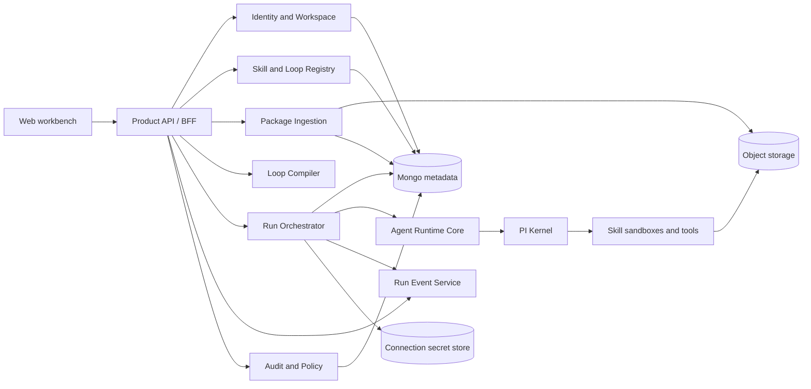

# Backend and Agent Platform PRD

- Date: 2026-07-10
- Status: target product requirements
- Parent: [Skill & Loop Cloud Workbench Master PRD](2026-07-10-skill-loop-cloud-workbench-master-prd.md)
- Current implementation: [Current System Architecture](../architecture/CURRENT_SYSTEM_ARCHITECTURE.md)

## 1. Goal

Provide the secure product and execution platform required for real Skill creation, Loop
authoring, team cloud sharing, versioned Runs, and Agent execution.

The platform must preserve the current good boundaries: browser to same-origin Product API,
server-owned readiness, immutable revisions, graph-owned execution order, PI-backed Skill
execution, resumable product events, and authoritative final results.

## 2. Current Baseline

Implemented P0 foundations include:

- same-origin `/api/workbench/v1` Product API;
- TypeBox product contracts;
- Mongo repositories for the current catalog, templates, Workflow revisions, Runs, and events;
- deterministic DAG compiler;
- persisted sequential Runner;
- Review Gate decisions;
- SSE cursor and product-safe Run read model;
- Agent Runtime Core and PI Kernel bridge;
- one test-only conformance Skill through the real loader/executor path.

The visible non-test catalog intentionally contains a blocked sample. The platform does not
yet provide generic Skill mutation/import/publish, generic Loop creation, cloud package
storage, identity/team authorization, Builder proposals, real business Skill activation,
durable unfinished-job recovery, or review feedback injection.

## 3. Target Platform Topology



These may initially be modules in one deployable Node service. They require separate contracts,
repositories, and injected ports. Product behavior must not move into the legacy Agent daemon.

## 4. Product Backend Capabilities

### 4.1 Identity and Workspace

- authenticated user and HttpOnly browser session;
- workspace create/switch;
- memberships and Viewer/Member/Publisher/Admin roles;
- object ownership and private/workspace visibility;
- CSRF, Host/Origin validation, request ID, rate limits, and session renewal;
- authorization at repository/service boundaries, not only route middleware.

### 4.2 Registry

Owns stable Skill and Loop identities, drafts, immutable versions, installation, fork lineage,
dependencies, templates, collections, deprecation, usage, and publication.

The existing `Workflow` persistence is the Loop execution aggregate. The target system must
extend or migrate it, not create a parallel Loop store with divergent revisions and Runs.

### 4.3 Package Ingestion

- resumable upload with size/type limits;
- quarantine object storage;
- archive extraction without traversal or unsafe links;
- package inventory and content hash;
- format/frontmatter validation;
- secret, malware, executable, dependency, and permission scans;
- asynchronous progress and product-safe diagnostics;
- promotion from quarantine to immutable release storage only after policy allows it;
- import provenance for upload, repository, fork, and generated package.

### 4.4 Validation and Test Service

- static package checks;
- runtime discovery and explicit executor binding checks;
- isolated test invocation;
- input/output validation;
- timeout, cancellation, egress, filesystem, and side-effect enforcement;
- test artifacts and final result;
- content-hash-specific validation status;
- workspace approval handoff for high-risk versions.

### 4.5 Loop Compiler

Extend the current compiler with:

- Loop contract completeness and policy checks;
- Condition nodes and declared branches;
- installed/pinned Skill dependency resolution;
- workspace connection and permission readiness;
- portable package import diagnostics;
- test/publish readiness separate from Run-input readiness;
- deterministic execution plan and compatibility version;
- recovery actions tied to product fields or steps.

Readiness remains derived. No Web or assistant mutation can set it.

### 4.6 Run Orchestrator

Extend the current Runner with:

- durable queue, worker lease, startup scan, and crash recovery;
- checkpoints and idempotent node attempts;
- cancellation and bounded retry propagation;
- review feedback applied to the configured revision attempt;
- condition evaluation;
- connection handle resolution;
- per-Run isolated filesystem and artifact budget;
- terminal state transaction/reconciliation;
- Run comparison and draft-from-Run provenance;
- exact Loop and transitive Skill version capture.

V1 may keep sequential execution. Controlled parallel branches are a later optimization and
must not change graph semantics.

### 4.7 Events and Read Models

Use durable monotonic events with reconnect cursor. Add product events for:

- upload/validation/test/publish progress;
- Loop compile/test progress;
- Run queued/started/node progress/review/completed/failed/cancelled;
- workspace asset update/deprecation where real-time delivery is needed.

The Web receives product-safe read models. Raw provider events, tool calls, prompt internals,
artifact paths, tokens, and credentials remain internal.

### 4.8 Search and Usage

- tenant-scoped search across product metadata and approved examples;
- dependency index: Skill version -> Loop versions;
- usage index: asset -> installs, Runs, active owners;
- update impact calculation;
- no indexing of secrets, private artifacts, or unrestricted Run content.

### 4.9 Audit and Policy

- append-only product audit events;
- publication policy based on role, risk, permission, external action, and validation;
- Run-time policy separate from publish approval;
- safe audit summaries and access controls;
- deprecation and retention rules preserving pinned history.

## 5. Canonical Target Models

Every durable model includes `schemaVersion`, stable ID, workspace ID, timestamps, actor,
revision/version, and product-safe status.

### SkillAggregate

- `skillId`, owner, workspace, visibility, lifecycle state;
- mutable draft reference;
- published versions;
- fork/source lineage;
- install and usage summaries.

### SkillVersion

- semantic/product version and immutable package hash;
- `SKILL.md` metadata and localized display;
- input/output declarations;
- permissions, dependencies, setup requirements;
- runtime execution reference;
- validation/test evidence;
- release and deprecation data.

### LoopAggregate

- `loopId` mapped to the current Workflow identity;
- owner, workspace, visibility, lifecycle state;
- mutable draft/base version;
- current published version;
- source template/fork lineage;
- latest compile/test/Run summaries.

### LoopVersion

- immutable readable contract;
- graph, input form, output definition, policies, assets, and pinned Skill versions;
- compile/test evidence;
- content hash, version, author, release notes, and provenance.

### Run

- pinned Loop and Skill versions;
- inputs and connection references;
- execution plan version;
- node attempts/checkpoints;
- review decisions;
- monotonic event cursor;
- authoritative final read model;
- restart/retry lineage.

### WorkspaceAssetRelease

- object type/ID/version;
- workspace visibility;
- validation/policy decision;
- package/blob references;
- publisher and approval;
- release notes and timestamp.

## 6. API Requirements

Continue under `/api/workbench/v1` when changes are backward compatible. Introduce a new
version only for real breaking changes. The Web uses product language even when current v1
paths retain `workflows`.

### Workspace and Membership

```text
GET/POST /workspaces
GET/PATCH /workspaces/{workspaceId}
GET/POST /workspaces/{workspaceId}/members
PATCH/DELETE /workspaces/{workspaceId}/members/{memberId}
GET /workspaces/{workspaceId}/audit
```

### Skills

```text
GET/POST /skills
GET /skills/{skillId}
PATCH /skills/{skillId}/draft
POST /skill-imports
POST /skills/{skillId}/validations
POST /skills/{skillId}/tests
POST /skills/{skillId}/versions
POST /skills/{skillId}/versions/{version}/publish
POST /skills/{skillId}/install
POST /skills/{skillId}/fork
GET /skills/{skillId}/usage
POST /skills/{skillId}/deprecate
```

### Loops / Current Workflows

```text
GET/POST /workflows
GET/PATCH/DELETE /workflows/{workflowId}
POST /workflows/{workflowId}/duplicate
POST /loop-imports
POST /workflows/{workflowId}/revisions
POST /workflows/{workflowId}/compile
POST /workflows/{workflowId}/tests
POST /workflows/{workflowId}/proposals
POST /workflows/{workflowId}/proposals/{proposalId}/apply
POST /workflows/{workflowId}/versions/{revisionId}/publish
GET /workflows/{workflowId}/versions/{revisionId}/diff
GET /workflows/{workflowId}/dependency-impact
```

### Team Library

```text
GET /library
GET/POST /collections
POST /library/{objectType}/{objectId}/install
POST /library/{objectType}/{objectId}/fork
POST /releases/{releaseId}/approvals
```

### Runs

Keep current start/history/detail/SSE/review endpoints and add supported command, comparison,
checkpoint, and draft-from-Run behavior.

All writes require idempotency. Draft/version mutations require ETag or explicit base revision.
Errors use stable codes, safe details, retryability, and request ID.

## 7. Agent Runtime Requirements

### 7.1 Skill Package Loader

- resolve by immutable Skill version and content hash;
- load `SKILL.md` and only required references/assets through progressive disclosure;
- register explicit executable binding;
- report discovery, validation, and setup diagnostics;
- prevent path escape and mutable package substitution.

### 7.2 Execution Sandbox

- isolated working directory per test/Run;
- declared filesystem, tool, network, and connection capabilities;
- default-deny egress and secret access;
- bounded CPU/time/output/artifact limits appropriate to the local/cloud runtime;
- cancellation and cleanup;
- safe artifact promotion after completion.

### 7.3 Loop-Aware Agent Core

- accept a compiled step, Loop contract context, bounded upstream values, and policy;
- never reorder the saved graph or execute downstream nodes early;
- preserve Review and stop rules;
- support deterministic and agentic Skill modes inside the step boundary;
- return normalized output, evidence, diagnostics, and safe progress;
- evaluate completion using declared Done-when and Verify rules;
- create structured proposals for changes, never direct durable mutations.

### 7.4 Final Authority

The Agent Core produces one versioned final read model. The Runner persists it before the
terminal event. Product adapters may localize labels and redact restricted fields but must not
reconstruct a different answer from raw tool output.

### 7.5 Review Revision

`revise` creates a new attempt. Requested changes are mapped to the configured upstream step's
input/context, retained in history, and visible in the next review packet. It must not overwrite
the prior attempt or merely record the note.

## 8. Cloud and Multi-Tenant Security

- tenant identity is carried through HTTP, jobs, repositories, caches, events, blobs, audit,
  and runtime invocation;
- use deny-by-default authorization and object ownership checks;
- credentials remain in an encrypted secret store and are accessed through connection handles;
- signed blob access is short-lived and scoped;
- uploads are untrusted until quarantine/scan completes;
- logs and errors redact secrets and private payloads;
- high-risk external actions require explicit policy and optional human review;
- rate, size, concurrency, retention, and execution quotas are enforced per workspace;
- package deletion cannot break an immutable release pinned by a Loop or Run.

## 9. Reliability and Observability

Required operational signals:

- API latency/error by product action;
- upload, validation, compile, Run, review, and publish durations;
- queue age, active lease, retries, crash recovery, and terminal reconciliation;
- Skill/Loop version failure rates;
- event cursor lag and reconnect success;
- object storage and artifact usage;
- policy denials and suspicious upload findings;
- request/run correlation without exposing user secrets.

Health endpoints cannot claim readiness if Mongo, object storage, queue, Agent bridge, or
required runtime registry is unavailable.

## 10. Migration from Current P0

### Phase 1: Product Truth

- replace blocked sample bootstrap with first real business Skill and useful starter Loop;
- implement generic Skill/Loop draft CRUD and cloud package metadata;
- preserve existing current IDs, revisions, Runs, and API safety.

### Phase 2: Creation and Validation

- add Skill/Loop upload, quarantine, creator flows, validation jobs, tests, and publication;
- add Loop contract and proposal contracts;
- implement review feedback input and durable Runner recovery.

### Phase 3: Team Workspace

- add identity, membership, tenant authorization, object storage, secret bindings, Team library,
  install/fork/update, approvals, and audit;
- migrate existing local data into one default private workspace with an explicit migration.

### Phase 4: Hardening

- retention, quotas, advanced policy, evidence lineage, version rollback UX, performance,
  and operational readiness.

No phase may claim completion with schemas and empty handlers only. Each service needs proof
of use through the real Product API, persistence, Agent path, and Web flow.

## 11. Verification Requirements

### Contracts

- strict positive/negative examples for all public models;
- backward compatibility tests for retained v1 endpoints;
- unknown-field rejection for mutation safety;
- tenant ID not accepted from an unauthorized browser body;
- product responses contain no provider/tool/secret/blob path fields.

### Storage and Authorization

- immutable release/version tests;
- ETag, idempotency conflict, transaction, and restart tests;
- cross-workspace list/detail/mutation/blob/SSE denial tests;
- archive and pinned-history retention tests;
- object metadata/blob consistency reconciliation.

### Ingestion and Runtime

- traversal, symlink, bomb, secret, malware, unsupported executable, and oversized package
  rejection;
- real Skill loader invocation by immutable release hash;
- declared permission enforcement and default-deny egress;
- cancellation, timeout, cleanup, and artifact limits;
- output schema and final-authority tests.

### Compiler and Runner

- contract completeness, cycle, reachability, port, schema, Skill version, connection,
  permission, and Result checks;
- graph order independent of array/canvas order;
- approve/revise/reject with revision input applied;
- durable queue/lease/checkpoint/retry/cancel;
- process crash at each terminal commit boundary and successful reconciliation;
- SSE reconnect and duplicate-event idempotency.

### End To End

From empty cloud test infrastructure, two users in one workspace create/upload, validate,
publish, share, install/fork, compose, compile, test, review, run, update, and rerun a real
Skill and Loop. The proof records workspace, users, Skill/version/hash, Loop/version, Run,
review, update, final-result authority, restart readback, and tenant-denial evidence.

## 12. Non-Goals

- public marketplace, billing, or cross-organization federation;
- browser access to Agent daemon credentials or raw provider streams;
- arbitrary uploaded code running outside quarantine/sandbox;
- graph reordering by the Agent;
- duplicate Loop and Workflow persistence systems;
- enterprise identity suite before minimal workspace collaboration works;
- unrelated monitoring dashboards or vertical-product backends.
