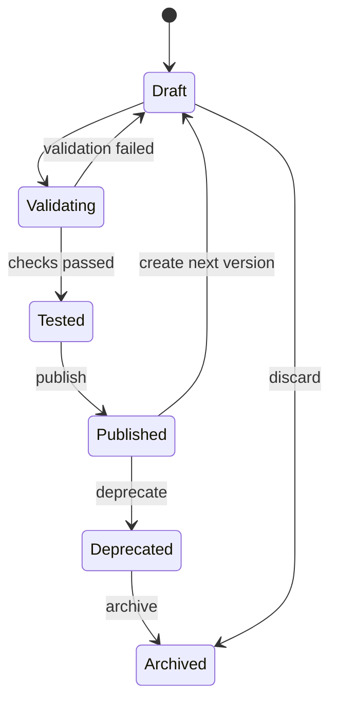

# Skill Lifecycle and Creator PRD

- Date: 2026-07-10
- Status: target product requirements
- Parent: [Skill & Loop Cloud Workbench Master PRD](2026-07-10-skill-loop-cloud-workbench-master-prd.md)

## 1. Goal

Give individuals and teams one safe, understandable place to create, upload, test, version,
publish, discover, and improve Agent Skills.

A Skill must be useful as both a human-readable capability and an executable package. A name,
input schema, or runtime binding alone is not a complete Skill product.

## 2. User Problems

- Skills are spread across local directories and repositories.
- Users cannot tell what a Skill does, what it needs, what it creates, or whether it can run.
- Editing a Skill may break unknown Loops.
- Uploading code and instructions has no consistent validation or permission review.
- Team members copy folders instead of reusing a trusted version.
- Current UI status such as “blocked binding” explains infrastructure but not how to make the
  capability usable.

## 3. Product Definition

A `Skill` is a versioned capability package containing:

- required `SKILL.md` with YAML frontmatter `name` and `description`;
- concise procedural instructions;
- optional `scripts/` for deterministic operations;
- optional `references/` for selectively loaded domain context;
- optional `assets/` used by outputs;
- recommended `agents/openai.yaml` for human-facing metadata;
- declared inputs, outputs, permissions, dependencies, and runtime requirements;
- test cases and validation evidence stored by the product;
- an executable binding resolved by the Agent Runtime.

The uploaded package remains portable. Product metadata such as owner, visibility, versions,
validation results, usage, and workspace bindings is stored outside the package and must not
be forced into `SKILL.md`.

## 4. Skill Lifecycle



User-facing states:

| State | Meaning | Allowed actions |
|---|---|---|
| Draft | Editable and not available for production Loops. | Edit, upload files, add tests, validate, discard |
| Validating | Automated checks are running. | View progress, cancel when safe |
| Tested | Validation passed for the current content hash. | Test again, compare, publish |
| Published | Immutable version available at its visibility level. | Install, add to Loop, create next version, deprecate |
| Blocked | A required check, connection, permission, or runtime binding is unavailable. | Follow recovery action, edit draft, rerun checks |
| Deprecated | Existing pinned Loops may still run under policy; new use is discouraged or blocked. | View replacement, migrate, archive |

`Ready` is not an editable field. It is derived from package validation, runtime validation,
required connection readiness, and policy.

## 5. Creation Entry Points

### 5.1 Create with Guided Builder

The user provides:

- the outcome the Skill should produce;
- example requests that should trigger it;
- required information and expected result;
- tools or connections it may use;
- whether it can perform external actions;
- at least one example test.

The assistant may generate a proposed package structure and `SKILL.md`, but the UI must show
the generated files, permissions, and tests before saving. Generation never publishes.

### 5.2 Upload Package

Support a folder or `.zip` containing a valid Skill root. The upload preview must show:

- discovered `SKILL.md`;
- package file tree and total size;
- executable scripts and file types;
- missing required fields;
- requested permissions and network destinations;
- likely secrets or credentials found in files;
- conflicts with an existing Skill name/version.

Uploads enter quarantine and create a draft. They do not become executable or shared until
validation succeeds.

### 5.3 Import from Repository

V1 should support a repository URL and path for public or already-authorized repositories.
The product records source commit and content hash. Repository credentials remain a workspace
connection and never become package content.

### 5.4 Fork Team Skill

Forking creates a new Skill identity with provenance. Installing keeps the same identity and
pins a published version; forking creates an independently editable lineage.

## 6. Skill Editor

The editor uses six sections:

1. `Overview`: name, plain-language purpose, owner, category, visibility, examples.
2. `Instructions`: structured editor for `SKILL.md` with frontmatter validation.
3. `Files`: scripts, references, assets, and `agents/openai.yaml`.
4. `Needs and creates`: human labels plus typed input/output definitions.
5. `Permissions and setup`: connections, network, filesystem, external actions, secrets.
6. `Tests and versions`: cases, latest results, diffs, usage impact, and publish history.

Raw JSON schema is an advanced view. The primary UI says “Needs” and “Creates,” provides
examples, and explains required fields in human language.

## 7. Validation Pipeline

Validation is content-hash specific and produces product-safe diagnostics.

### 7.1 Package Checks

- one valid root `SKILL.md`;
- frontmatter contains only supported metadata;
- normalized, unique Skill name;
- referenced files exist and paths stay within the package;
- unsupported binaries, symlinks, path traversal, and excessive size are rejected;
- `agents/openai.yaml`, when present, matches the Skill instructions.

### 7.2 Security Checks

- secret and credential scan;
- executable-file inventory;
- declared versus observed network destinations;
- dangerous shell and filesystem pattern scan;
- dependency and license inventory where applicable;
- malware scan for uploaded binary assets;
- permission summary requiring explicit author acknowledgement.

Static findings may block, warn, or require workspace approval. They must never be hidden
inside logs.

### 7.3 Runtime Checks

- the Agent Runtime can discover the package from an immutable release location;
- execution binding resolves through the explicit Skill executor registry;
- declared input is accepted and output validates;
- timeout and cancellation work;
- external actions remain in the declared boundary;
- test artifacts and final result are product-safe;
- the Skill behaves consistently in an isolated environment.

### 7.4 Test Cases

Each test contains:

- name and purpose;
- input fixture or parameter set;
- expected output shape and optional assertions;
- allowed side effects;
- required connections or safe substitutes;
- timeout;
- result, logs summary, output preview, and validation timestamp.

At least one passing test is required before workspace publication. High-risk Skills require
an approval policy and a non-production test connection.

## 8. Versions and Change Management

- Drafts are mutable; published versions are immutable.
- A published version pins package content hash, runtime binding version, schemas, permissions,
  and validation evidence.
- A new draft starts from a published version or blank package.
- The publish screen shows file diff, instructions diff, input/output changes, permission
  changes, dependency changes, and affected Loops.
- Breaking input/output or permission changes require a major version recommendation.
- Existing Loops never auto-upgrade. Owners receive an update and impact preview.
- A deprecated version may name a replacement version or Skill.

## 9. Skill Detail Requirements

The first viewport must answer:

- What does this Skill help me do?
- Can it run in this workspace?
- What information does it need?
- What will it create?
- What connections or external actions are involved?
- Who owns it, which version is selected, and when was it last validated?
- Which Loops use it?
- What is the next valid action?

Primary actions depend on state:

- Draft: `Continue editing`
- Tested: `Publish version`
- Published and not installed: `Install Skill`
- Published and installed: `Add to Loop`
- Blocked: one recovery action such as `Connect account`, `Fix package`, or `Run test`

Do not show an enabled action that cannot complete. Do not use generic `Open` or `Apply` labels.

## 10. Team Library Behavior

Library cards or rows include:

- name and outcome-oriented summary;
- author/maintainer and workspace verification;
- published version and release date;
- last validation status;
- permissions and external-action indicator;
- install count, Loop usage count, and example;
- update or deprecation status.

Search supports name, outcome, category, required input, created output, owner, risk, connection,
and readiness. Internal capability IDs and tool names are advanced metadata, not search labels.

## 11. Backend Requirements

The Product Backend must provide:

- Skill draft CRUD and optimistic concurrency;
- resumable package upload and quarantine;
- package inventory and content-addressed object storage;
- asynchronous validation jobs and event progress;
- immutable version publication;
- visibility, ownership, and workspace authorization;
- usage lookup across Loop versions;
- install, fork, update, deprecate, archive, and provenance;
- product-safe diagnostics and audit events;
- idempotency on all writes.

Minimum API groups:

```text
POST   /skills
GET    /skills/{skillId}
PATCH  /skills/{skillId}/draft
POST   /skill-imports
GET    /skill-imports/{importId}
POST   /skills/{skillId}/validations
GET    /skills/{skillId}/validations/{validationId}
POST   /skills/{skillId}/tests
POST   /skills/{skillId}/versions
POST   /skills/{skillId}/versions/{version}/publish
POST   /skills/{skillId}/install
POST   /skills/{skillId}/fork
GET    /skills/{skillId}/usage
POST   /skills/{skillId}/deprecate
```

Existing `/api/workbench/v1` contracts should be extended compatibly. Breaking public schema
changes require a new API version, not silent reinterpretation.

## 12. Agent Runtime Requirements

- Load the exact immutable package version selected by the Loop.
- Separate Skill instructions from untrusted uploaded content.
- Resolve workspace connections server-side without exposing credentials to the package or Web.
- Execute in an isolated filesystem with declared network and tool allowlists.
- Enforce timeout, cancellation, output limits, and artifact limits.
- Normalize results to the Skill's declared output before returning to the Loop Runner.
- Preserve Agent final-result authority and product-safe error mapping.
- Record execution provenance: Skill ID/version, package hash, runtime version, connection IDs,
  and policy decisions without recording secret values.

## 13. Acceptance Criteria

A fresh workspace can:

1. create a Skill from a description;
2. upload a valid Skill package;
3. reject an invalid or secret-containing package with a clear recovery path;
4. edit instructions and files without publishing;
5. run a passing test through the real loader and executor path;
6. publish an immutable private version;
7. publish a workspace-visible version with authorization;
8. let a teammate install or fork it;
9. add the pinned version to a Loop;
10. publish a compatible update and show affected Loops;
11. prevent automatic update until each Loop owner confirms;
12. deprecate the old version while preserving historical Runs.

No acceptance scenario may use the current blocked sample as its product proof.
