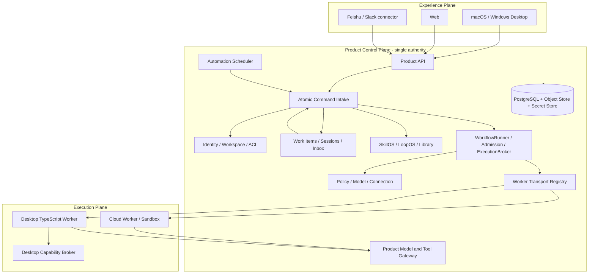

# Turnsu 工作台 Master PRD

- Date: 2026-08-04
- Status: **authoritative PRD v0.6 — local desktop workbench + cloud shared project, 2026-09-22**
- Confirmed route: **Route C — cloud-authoritative Product Control Plane + desktop-first experience + governed local worker**
- Target users: an internal team of approximately eight people, with a path to a larger workspace product
- Existing implementation authority: [Current System Architecture](../architecture/CURRENT_SYSTEM_ARCHITECTURE.md)
- Existing backend authority: [2026-08-01 SkillOS / LoopOS Backend Architecture](../architecture/2026-08-01-skillos-loopos-backend-architecture.md)
- Prior product requirements: [Skill & Loop Cloud Workbench Master PRD](2026-07-10-skill-loop-cloud-workbench-master-prd.md) and its linked detailed PRDs

The filename and historical Looloomi references are retained for stable links and migration
identity. From v0.6 onward the user-facing product name is **Turnsu 工作台**.

> This document has been reconciled through two rounds of cross-review with the blueprint document
> ([2026-08-04 Three-in-One Upgrade Blueprint](../architecture/2026-08-04-three-in-one-upgrade-blueprint.md));
> the review record is
> [2026-08-04 Cross-Review: Master PRD vs Blueprint](2026-08-04-cross-review-master-prd-vs-blueprint.md).
> Final rulings: **D1 — Postgres single-store migration approved; D2 — observation/manipulation
> separation with workspace-default read observation.** From v0.3 onward this PRD is the
> authoritative product PRD (see §25).

---

## 0. Executive Decision

### 2026-09-22 owner correction: local desktop workbench first (v0.6)

The owner rejected continued Web/mobile iteration and identified **LinkCode + Tutti**
([confirmed reference](https://tutti.sh/zh)) as the product direction. This amendment takes priority
over earlier Web/mobile entry requirements and the v0.5 delivery order below. Those remain history,
not the next implementation queue. Existing user data and verified Product behavior must survive.

**Product promise:** open Turnsu on a computer, work in a real project with your own Codex, Claude Code
or Pi, and bring that work into a shared cloud project where teammates and their Agents can continue.
The product must be useful locally before cloud setup. A connector command, a remote task dashboard
or the existing Web application inside a desktop window does not satisfy this promise.

The first complete path is:

```text
Open desktop -> open local project -> choose an available personal Agent -> describe the work
  -> answer its question/approval in place -> inspect an actual file/result -> close and resume
  -> enable project sharing -> another member joins from desktop with their own Agent
  -> reference the shared work/file/decision -> continue -> updated result visible to both
  -> save a proven method as Skill/Loop -> reuse locally or through an authorized team environment
```

#### Product surfaces and interaction

- Start with recent local projects and conversations. Selecting a project opens its work immediately;
  cloud authentication, library catalogs, model scans and optional integrations cannot block this shell.
- Detect supported installed Agents without changing their global configuration. Show usable choices
  and actionable sign-in/install failures. Agent choice does not imply a model or account substitution.
- Keep projects/conversations in navigation, the current conversation and work in the main area, and
  files/results/preview in panels opened when needed. A permanent engineering inspector is not the
  default. Show activity only when it helps someone understand progress or take the next action.
- `@` references project files, shared conversations, decisions and usable team methods from the current
  context. References resolve real accessible objects and versions; users should not copy context into
  another form. The referenced material remains distinguishable from the user's instruction.
- Skill and Loop creation starts from useful completed work. Guided capture proposes a reusable method;
  people review it and can adjust dependencies visually when necessary. Neither a mandatory long form
  nor a mandatory node canvas is the everyday starting point.
- Project collaboration exposes who is working, what changed, the usable output and what needs a person.
  IDs, lease events, hashes, gateway routes and raw internal errors belong in diagnostic tools.

#### What local and cloud mean

- Local project: files, native sessions, draft input and resumable host metadata remain usable without
  the Turnsu cloud. Provider network requirements still apply; offline product support does not imply
  offline model inference. Private native history is not automatically uploaded.
- Shared project: joining/creating it explicitly establishes the audience and the managed shared file
  area. New work launched there can publish its declared conversation, activity and outputs automatically
  within that audience. Do not reduce collaboration to manually submitting a summary after every run.
  Existing private sessions, outside folders, credentials and personal memory remain outside the scope.
- Room-like sharing is a project behavior, not a second team/ACL database. Reuse the Product Project,
  membership, Work Item, versioned artifact and invocation authorities. A local host owns native process
  and session truth; cloud records of that activity are projections with provenance, not competing
  native execution owners. Local persistence is allowed for that responsibility and pending sync.
- Synchronization includes actual declared files/results and shared context, not just task status.
  Reconnecting reconciles revisions and acknowledged mutations without replaying Agent execution.
  Concurrent conflicting file changes must preserve both versions and offer resolution; never silently
  overwrite. File synchronization does not claim to migrate running processes or native model state.
- A persistent shared runtime/preview and Agent borrowing are part of the team destination. Native
  provider credentials stay with their owner. Borrowing needs a revocable project grant and isolated
  execution context, distinct from installing someone's Skill. An unavailable owner device is visible;
  an explicitly configured team host is required for work that must outlive it.

#### Implementation order and evidence

1. Learn the actual LinkCode host/session/project path and Tutti local-versus-VM boundary. Keep public
   demonstrations, source inspection and hands-on acceptance separate. The current research is linked
   below; it does not establish that either competitor's cloud behavior has been tested here.
2. Deliver a runnable desktop vertical slice: real local directory, own Agent, native interactions,
   file/result inspection, interruption and restart/resume. No Docker or Turnsu cloud required for this
   personal path. Establish measured cold/warm startup and large-history behavior on the target machine.
3. Complete the same path with two independent desktop members and a cloud project: real files/context,
   cross-Agent continuation, disconnect/reconnect, conflicting edits and revoked membership. Local
   working state remains available when cloud synchronization is unavailable; shared mutations clearly
   show pending/conflict/denied state and are reauthorized on delivery.
4. Complete Skill/Loop reuse, authorized provider execution and the team always-on environment on that
   path. Keep the weekly-feedback case, including real source files and reviewable results, as one
   business acceptance scenario. Web/mobile product expansion is deferred until this desktop/team path
   works; it is not required to make the desktop slice look complete.

Reuse existing cloud authorization, versioning, actual execution receipts and native Product tools.
Retire the Web-first entry sequence as product priority, without deleting working modules or data.
Do not copy LinkCode's full codebase into a competing product without resolving its BUSL conditions;
Tutti's Apache-licensed local code does not by itself supply the VM edition's complete cloud service.
Choose a desktop implementation from a runnable host/packaging evaluation, not a cosmetic reskin.

Research: [LinkCode + Tutti correction and evidence](../design/2026-09-22-team-agent-collaboration-research.md#14-local-desktop-and-cloud-project-correction-v06).

### 2026-09-21 rebuild amendment

The owner explicitly authorized a comprehensive product and implementation rewrite, with independent
product/engineering ownership, grounded in the linked TypeSafe/Jev evaluation and LinkCode/Pi research.
This amendment supersedes the earlier blanket prohibition on a full rewrite in §§2, 13 and 22. It does
not authorize destruction of existing uncommitted work, user data, permission boundaries or verified
execution semantics. Rebuild complete user journeys in the current product, replacing the responsible
modules as needed and keeping one Product authority throughout.

**The value moment:** a person describes a real outcome, the workspace advances the necessary work,
and returns a usable result with its evidence and any unresolved decisions. The user should not have
to understand execution profiles, Work Item internals or Skill administration before starting.

The primary journey is:

```text
Project goal + authorized materials -> shared work + chosen Agent / team capability
  -> shared progress, usable result and evidence -> teammate continues with their own Agent
  -> proven work becomes a reviewed Skill/Loop -> governed recurring execution

Personal task -> private execution -> optional explicit promotion into team work
```

Interaction rules:

- Login opens the Agent task entry. Mobile opens the composer, with history one action away.
- Goal, material input and submission form one visual group. The empty state contains actionable
  starting prompts; it never fabricates tasks, statistics, progress or deliverables.
- Normal reads, preparation and reversible work already covered by the command continue automatically.
  Ask one specific question only for missing user-owned facts, a material tradeoff or new authority.
- A question or approval binds to its originating work, current revision and authorized principal.
  Answering resumes the applicable work; stale answers cannot override newer decisions.
- Accepted, queued, running, waiting for input/approval, failed and completed remain distinct.
  A visible result requires a durable receipt. Unavailable capabilities expose a recovery action.
- Project work publishes its declared progress and authorized outputs under the scope shown at
  submission. Personal work requires explicit promotion. Private execution context remains private;
  a model confidence score never grants sharing or execution permission.

Execution responsibilities:

- **Product/PostgreSQL** owns identity, commands, shared work, versions, grants, receipts and scheduling.
- **Pi** owns bounded model/tool execution beneath that control chain; retain native Session/recovery
  behavior and gateway restrictions. Pin versions and validate live invocation before claiming readiness.
- **LinkCode** is a reference for native-agent hosting and lifecycle interactions. The existing
  internal Pi bridge is not a shipped multi-agent host. Product remains the authority; commercial
  code adoption requires checking the applicable license, and real adapters need execution evidence.
- **Jev** is a narrow structured-decision participant: batch independent evidence/requirement judgments
  from one bounded, versioned snapshot; use results to trigger permitted follow-up work or flag an
  uncertainty. Arithmetic, permissions, persistence, completion and visual acceptance remain in code.
  Default enablement requires an independent task-level comparison, including wrong decisions, total
  latency and cost. The linked Codex replay did not establish a benefit from default context pruning.

Delivery covers the whole journey above, including the shared Web/Desktop experience, recovery,
team handoff and reusable/automated work. Implement the real Web/Product vertical path first, then
the desktop adapter and remaining shared consumers, without declaring the first slice the whole
rewrite. Public release, signed platform delivery, external integrations and an eight-person pilot
retain their own real-environment evidence gates. §17 is historical sequencing where it conflicts
with this authorized rebuild; its capability scope and security acceptance remain applicable.

Acceptance must show real authenticated Product API operations, isolated PostgreSQL reload/restart
behavior, native execution traces and browser operations at desktop and 390px widths. Controlled
models prove contracts only. Record live-provider, LinkCode application, platform packaging and pilot
results separately in the current architecture, never infer them from a green build.

The referenced task discussions are `01a0ba7b-e5c8-7741-86ad-ecd2cec828a4` and
`01a0a30e-d5b0-70d2-8d8c-f32bc0fe99f3`. Their experimental findings are design inputs, not proof that
this project is already integrated or production-ready.

### 2026-09-22 owner correction: native agents and workflow authoring

The owner explicitly requested bringing their own Claude Code, Codex and Pi into the workbench,
following LinkCode's native-agent hosting model. This overrides Pi-only execution as a product
requirement; the existing managed Pi path remains an available execution environment. The latest
workflow-authoring correction rejects the form-first replacement: direct canvas editing and visible
dependencies must remain central, with configuration opened in context. See the
[interaction research and decision](../design/2026-09-22-workflow-interaction-research.md).

- The primary journey begins with a task, a project directory and the user's chosen available
  Agent. Agent choice is distinct from model choice. Existing native sessions can be resumed where
  their provider supports it; a new transcript must not masquerade as the original session.
- Preserve native account configuration, skills, tools, approvals and session identity on the
  user's device. Do not import credentials or all local conversation history into the Product Store.
  Connecting an Agent does not share its workspace or transcript with teammates.
- Product remains authoritative for membership, shared Work Items, explicit handoffs, grants,
  versioned workflows and schedules. Native sessions are private external execution contexts linked
  to Product work, not a second mutable copy of that work. Product mutations still pass through
  authenticated Product commands. Native local tools retain the native agent's permission owner;
  Product must not claim its Gateway governs those tools when it does not.
- Managed Turnsu workers retain the existing Admission/Broker/Gateway restrictions. A BYO native
  agent is a client integration, not a managed Pi worker with another provider label. The registered
  device connection supplies the authenticated transport; native session capabilities need their own
  explicit adapter semantics for start/resume, events, approvals, interruption and disconnect.
- Reusable work should emerge from a reviewed successful task. The saved-workflow editor opens on
  the canvas, with visible input/output connections, direct manipulation and reversible changes.
  Selecting a node opens its settings; adding steps and editing the overall brief are on demand.
  Saving, checking and trying a draft form one recoverable action, with results beside the graph.
  Users should not need to understand compilation internals or complete a long setup form first.
- Workflow publication pins the work definition and governed dependencies, not an entire native
  conversation or an arbitrary moving workspace. A local Agent becoming unavailable is visible;
  cloud automation cannot silently substitute another Agent or borrow a desktop account. Unattended
  execution is offered only when its actual host, capability and authorization are verified.

This is the corrected target. Native CC/Codex/Pi hosting and task-to-workflow capture are not yet
implemented product consumers. The implementation architecture records those gaps separately from
the canvas editor and the existing managed execution path.

### 2026-09-22 owner correction: team work and cross-member capability reuse

The owner requested deeper product research and a workbench where members bring CC, Codex or Pi,
work together, and use one another's Skills and Loops. This amendment makes team participation and
capability reuse primary journeys. It supersedes private-first-only flows and any Pi-only product
assumption; it does not widen existing data permissions. The
[research and product rationale](../design/2026-09-22-team-agent-collaboration-research.md)
separates official source evidence, inspected code, design decisions and unverified hypotheses.

**Value moment:** a member completes a project outcome using their preferred Agent and a teammate's
published capability; shared progress and usable results remain in the same Work Item so another
member can continue without obtaining the first member's credentials or private history.

#### Shared work as the normal project path

- Work started inside a Project shows its audience before submission. Its objective, accountable
  owner, authorized inputs, safe execution progress, declared outputs and decisions belong to the
  Project Work Item and are visible to authorized project members without repeated manual forwarding.
- A personal task remains private. Promotion selects the shareable input/result scope atomically;
  existing Sessions, attachments and native histories are never bulk-converted to team visibility.
- Shared progress uses explicit public event fields. Raw tool streams, private native session IDs,
  personal memory, secrets and arbitrary local files are not shared progress. Outputs outside the
  declared publishable set require review rather than model-only sensitivity guesses.
- A Work Item has one accountable human owner. The requesting member, capability maintainer,
  execution-environment owner and reviewer may differ. Delegating execution does not reassign
  accountability; accepting a result and completing the work remain distinct from Run completion.
- Teammates can comment, review or continue from the shared context with their own Agent. A new
  personal branch is labelled as a continuation, not as resuming another member's native session.

#### Two ways to use one published capability

Skill and Loop releases remain the canonical reusable assets. Their user-facing use modes are:

| Action | Contract | Execution and cost |
|---|---|---|
| Use with my Agent | Install or bind an exact version with its declared dependencies and compatibility evidence | User-selected eligible personal/team environment; no publisher credential copied |
| Ask the provider to execute | Invoke a versioned capability under the provider's explicit project/caller grant, input/output scope and execution policy | Provider-approved dedicated context; payer and limits are known before dispatch |

An asset may support either or both modes. Publishing a method does not automatically expose an
execution host. Viewing, using, delegating, maintaining and changing access are separate operations.
Keep simple user roles, with operation-specific server authorization underneath. Do not create a
parallel Agent marketplace or duplicate Skill/Loop version lifecycle.

Provider execution must not inject another member's input into an active personal conversation.
The host must create an isolated task context and enforce the declared file/tool/connection scope;
changing `cwd` alone is insufficient. If that host cannot enforce the scope, expose an explicit
human-accepted handoff rather than unattended dispatch. The caller never impersonates the provider.

Each invocation binds the requester, Work Item, release/version, input artifacts, provider grant
revision, actual Agent/adapter version, execution environment, payer/limits, attempt and output ACL.
Reuse existing Product Command, Invocation/Run and authority records. Accepted work, waiting for
device, queued, running, waiting for input/approval, outcome unknown and terminal outcomes must be
distinguishable through existing states plus explicit reasons; no new parallel execution ledger.

#### Native participation and honest compatibility

- Support both a Turnsu-hosted native experience and participation from the member's existing
  native client through authenticated Product tools. Both read shared context, discover authorized
  releases, request execution, inspect status and submit results through the same Product commands.
- Keep Agent choice, model choice and execution location distinct. The UI reports actual adapter
  support for resume, interruption, approvals, inputs, outputs and isolation. Discovery is not login,
  login is not readiness, and package installation is not a successful native execution.
- A Skill is only verified for the tested package digest, Agent/adapter version and environment.
  Portable instructions, native-only extensions and hosted capabilities receive different readiness
  explanations. Missing dependencies cannot silently fall back to a different Agent.
- A Loop pins method and dependency versions plus allowed execution requirements. Installation/run
  bindings resolve permitted environments and connections, then record the exact resolution in the
  Run. Publication does not freeze a whole personal workspace or follow a moving `latest` reference.
- Codex App Server, Claude's supported SDK/native integration and Pi RPC/extensions are adapter
  inputs. MCP can expose Product tools; ACP/A2A are optional interoperability mappings, not new
  Product authorities. Current native-provider login/usage terms must be respected. In particular,
  do not promise to pool personal Claude subscriptions for a third-party team execution service.
- Managed workers retain Product Gateway enforcement. Native clients retain their actual native
  model/tool permission owner, while all Product business writes and shared execution admission
  remain Product-owned. Never claim a native local tool was governed by a Gateway it did not use.

#### Continuity, ownership and maintenance

- Personal-device and team-always-on environments are explicit choices. An offline provider leaves
  a visible wait with cancellation/deadline or an explicitly authorized alternative; no silent host,
  Agent, credential or cost substitution. Team automation needs a verified unattended environment.
- A shared task uses an isolated filesystem/worktree or governed artifact handoff; members' Agents
  do not concurrently modify one unisolated working directory. ETags and revisions remain the MVP
  editing conflict mechanism; real-time collaborative canvas editing is not required.
- Revocation blocks new calls and future authorized reads and controls in-flight work where the
  host can enforce it. Previously downloaded packages/results cannot be promised remotely erased.
  Unknown external effects require reconciliation before retry.
- Organization-owned releases and project outputs outlive a departing member. Maintainer transfer,
  environment replacement and connection reauthorization are explicit; dependent automations pause
  when their authority or execution environment disappears.
- Shared context consists of project instructions, authorized materials, accepted decisions and
  results. Team learning creates reviewed candidates from this evidence; it never mines private
  native memory or silently rewrites a published method.

#### Delivery order and product acceptance

1. Complete Skill/Resource dependency publication and consumer binding, then let a second member
   execute the fixed Loop in a Project and see its result attached to the Work Item.
2. Connect real Codex, Claude Code and Pi participants through supported native tools/adapters;
   preserve native identity, fixed Skill installation, status and result submission. Native-client
   participation need not wait for a complete desktop shell.
3. Prove cross-member dispatch: B's Codex invokes a capability A explicitly serves through Pi;
   inputs, grant, payer, isolation, device wait, cancel/revoke and result provenance are real.
4. Move suitable published methods to a team-maintained always-on environment and Automation;
   prove offboarding, updates and recovery without changing method versions silently.

Use the existing weekly-feedback workflow as the first complete scenario. A nontechnical member
must also be able to use a team capability from Web without installing an Agent. Acceptance needs
distinct principals, real native clients/provider traces, retained PostgreSQL state and meaningful
negative paths. A build, mock dispatch, same-user demo or installed asset row is insufficient.
These are target requirements, not a declaration that the present implementation meets them.

### Preserved product foundation

Looloomi will evolve from a Skill/Loop management workbench into a **team intelligence workspace**.

The product has one visible Workspace Agent entry, but it does not have one shared global conversation,
one shared memory, or one shared credential set. The unified entry routes each piece of work into a
durable, permission-scoped Session and can invoke Skills, Loops, cloud Workers, or a registered
desktop Worker without exposing that internal topology to the user.

The product combines four layers without turning them into four separate products:

```text
Team Work OS   = the team's goals, work items, decisions, activity, ownership, and handoffs
SkillOS        = versioned, tested, governed capabilities
LoopOS         = versioned, repeatable work methods and automation definitions
Execution      = cloud and desktop Workers governed by the same Broker, leases, fences, and policy
```

The confirmed physical topology is:

```text
Desktop / Web / Channel connector
  -> Cloud Product Control Plane (single authority)
      -> Product Store / Session / Policy / Scheduler / Runner
          -> Execution Broker
              -> Cloud Worker | Registered Desktop Worker
```

The cloud continues accepted background work when a member closes the desktop application. The
desktop application is the primary personal experience and a possible local execution hand, not a
second Product Store, Scheduler, Session authority, or Runner.

---

## 1. Why the Product Direction Changes

### 1.1 Current product strength

The current system already has substantial foundations:

- versioned Skill and Loop assets;
- personal Main and Module Agent Sessions;
- durable Product Commands and FIFO Turns;
- Product-owned Admission, Execution Broker, leases, fences, and cancellation;
- PI-backed deterministic and bounded-Agent execution;
- governed model routing, attachments, Resources, Artifacts, Memory, and Connections;
- immutable revisions, proposal branches, three-way merge, and conflict persistence;
- event-sourced V2 Run state, Effect Receipts, recovery, and product-safe read models;
- Team Library release, install, Fork, and draft-based update foundations.

These are expensive correctness properties and remain the foundation of the new product.

### 1.2 Current product limitation

The current product still makes the user begin with system objects: create a Skill, define a Loop,
open a Builder, or inspect a Library. That is useful for maintainers but insufficient as the daily
workspace for a team.

The missing product loop is:

```text
Do real work
  -> make progress and decisions visible
  -> produce a usable outcome
  -> identify a repeatable pattern
  -> turn the pattern into a governed Skill or Loop
  -> reuse it through interaction or automation
  -> improve it from Run evidence
```

Without this loop, SkillOS and LoopOS remain asset administration. They do not yet create the
organizational compounding effect the product is meant to deliver.

### 1.3 New product thesis

**Work first; reusable assets emerge from proven work.**

- A user describes an outcome instead of selecting an Agent role.
- The platform creates or resumes the correct task Session.
- The Agent routes to the required Skills, Loop, model, tools, and execution location.
- Humans can observe, redirect, review, branch, or take ownership.
- Results, decisions, evidence, and artifacts remain addressable after the Worker disappears.
- A successful or repeated work pattern can become a Skill or Loop proposal.
- Publication and automation always require governed Product actions.

This does not weaken LoopOS. It prevents temporary model reasoning from being mistaken for a stable
business process. A Loop is promoted only when its goal, boundaries, inputs, outputs, evidence, and
review rules are worth repeating.

---

## 2. Product Goals and Non-Goals

### 2.1 Goals

1. Give every team member one obvious place to delegate and continue work.
2. Let the same task move between personal work, team review, desktop execution, and cloud execution
   without losing product state or responsibility.
3. Turn repeated work into versioned, inspectable, testable Skill and Loop assets.
4. Run published Loops on demand, on schedule, or from governed events while the initiating desktop
   is offline.
5. Make every consequential Agent action attributable to an actor and an authorizer.
6. Keep private working context isolated while sharing the work item, decisions, approved outputs,
   proposals, and artifacts required for collaboration.
7. Preserve one Product control chain and one authority for Session, permission, scheduling, Run,
   canonical objects, and final results.
8. Use the desktop to add local files, local applications, voice, notifications, and governed local
   tools without moving cloud authority onto the device.
9. Make organizational learning measurable through reuse, outcome quality, saved time, and improved
   Skill/Loop versions.
10. Keep the implementation TypeScript-first while preserving verified existing behavior.

### 2.2 Non-goals for the first team release

- a public marketplace, billing, or creator monetization;
- cross-organization federation;
- a human-style organization chart of PM, engineer, designer, or QA Agents;
- one shared global Agent transcript, Memory, or credential pool;
- a general-purpose Slack/Feishu replacement, social chat, voice rooms, or video conferencing;
- Nostr, blockchain, cryptographic Agent identity, or a Rust relay;
- transparent desktop/cloud dual-master synchronization;
- automatic publication or silent mutation of Skills and Loops;
- automatic model fallback that changes capability or data policy;
- a second Worker execution HTTP API that bypasses Product control;
- Kubernetes, Temporal, a fleet scheduler, or multi-region infrastructure before the eight-person
  deployment proves a real need;
- a Linux desktop client in the first macOS and Windows team release;
- full offline team collaboration or offline mutation of canonical team objects;
- adopting a reference project (such as QM) as a business dependency or a second authoritative
  system — reference projects provide patterns or isolated UX comparison only;
- a destructive cutover that discards verified behavior or user work (see the authorized rebuild amendment).

---

## 3. Target Users

### 3.1 Team member

Delegates research, preparation, writing, operations, analysis, or implementation work. Wants a
finished result, visible progress, understandable approvals, and an easy way to reuse good work.

### 3.2 Work owner

Owns a shared objective or recurring responsibility. Needs assignment, status, decisions, review,
artifacts, deadlines, recovery, and the ability to turn successful work into an automation.

### 3.3 Skill author

Creates and maintains a governed capability. Needs conversational creation, package import,
validation, tests, versions, permissions, usage, and safe publication.

### 3.4 Loop maintainer

Turns a proven work method into a repeatable Loop. Needs a readable contract, an executable graph,
test Runs, schedules, version impact, review gates, and evidence-driven improvement.

### 3.5 Workspace administrator

Manages membership, policy, publication, Connections, models, devices, budgets, audit, and incident
recovery. The administrator must not need access to every private transcript to govern execution.

---

## 4. Canonical Product Language

| Term | Meaning | Not the same as |
|---|---|---|
| `Workspace Agent Entry` | One visible workspace display identity and entry that routes work | one shared Session, authority, or model process |
| `Work Item` | Shared team record for a goal, owner, status, decisions, Runs, and outcomes | private Agent transcript |
| `Work Thread` | Shared product-safe activity around a Work Item | raw Worker or PI transcript |
| `Session` | Durable record for one piece or branch of work | model context window |
| `Session branch` | A user's independent continuation from approved shared state | concurrent mutation of another user's branch |
| `Turn` | One ordered user-to-Agent interaction within a Session | one Worker process |
| `Worker` | A bounded execution resource for one invocation or attempt | a visible employee-like Agent role |
| `Skill` | Versioned, validated capability package | a team member or an entire workflow |
| `Loop` | Versioned, reusable work contract plus executable plan | a graph cycle or a live Run |
| `Automation` | Trigger and policy that start a pinned Loop version | the Loop definition itself |
| `Run` | One execution of a pinned Loop and Skill set | the lifecycle state of the Loop |
| `Artifact` | Governed execution output | input Attachment or reusable Resource |
| `Resource` | Reusable, versioned workspace material | temporary personal Attachment |
| `Proposal` | Reviewable structured change to a Product object | an already-applied edit |
| `Handoff Capsule` | Bounded goal, decision, risk, status, and Artifact references for continuation | copied private transcript |
| `Execution Profile` | Internal bundle of model, Skills, tools, sandbox, and policy | a user-selected Agent persona |

The primary interface uses `Agent`, `Work`, `Loops`, `Skills`, and `Library`. `Workflow` may remain a
backend compatibility term. Harness, lease, fence, provider payload, tool ID, and runtime path remain
technical details rather than primary product language.

---

## 5. Product Principles and Invariants

1. **One entry, isolated work.** The Agent is unified; Sessions, branches, permissions, and context
   remain scoped.
2. **Cloud authority, many hands.** Cloud Product state is canonical; cloud and desktop Workers are
   replaceable execution hands.
3. **Work before asset administration.** Users may complete useful work without first creating a
   Skill or Loop.
4. **Proven work becomes reusable.** Skill/Loop proposals reference real evidence and outcomes.
5. **Agent output is a proposal when Product state changes.** Canonical mutation, publication,
   scheduling, permission, and Connection changes remain Product actions.
6. **Private reasoning is not team collaboration.** Share product-safe work state and approved
   outputs, not another person's raw transcript or credential context.
7. **Authorship and authority are separate.** Every consequential action records who or what
   performed it and who or which approved policy authorized it.
8. **Unattended does not mean elevated.** Background execution changes where approvals wait, not the
   maximum permission boundary.
9. **Versioned by default.** Published Skill and Loop versions are immutable; Runs pin exact versions.
10. **No silent execution-location fallback.** A task that requires a desktop waits for that device
    unless the compiled plan explicitly permits cloud execution.
11. **Readiness is server-derived.** Clients do not infer model, connection, runtime, permission,
    device, or Loop readiness.
12. **Session is not context.** Durable history remains recoverable; the harness selects bounded
    context for each model call.
13. **Artifacts are first-class outcomes.** The product returns usable files, structured results,
    decisions, and evidence rather than only chat text.
14. **Learning remains governed.** Memory, Skill changes, and Loop changes are candidates or
    proposals until policy and human review allow promotion.
15. **Simple infrastructure first.** The eight-person release uses a modular monolith and existing
    durable primitives before external queues or fleet orchestration.

---

## 6. Product Surfaces

### 6.1 macOS and Windows desktop application — primary personal surface

The desktop application is the default daily entry for each team member. It provides:

- Agent composer with text, governed attachments, and voice input;
- personal and team Work views;
- active Session progress, results, and Artifact reader;
- Inbox approvals, failures, blocked work, and handoffs;
- desktop notifications, deep links, tray status, and update status;
- local file/folder selection through an explicit capability broker;
- local Worker and device readiness;
- clear indication of whether work will run in cloud or on this device;
- cached safe read models, private Drafts, and an outbox for temporary disconnection.

The WebView does not receive cloud bearer tokens, Provider credentials, Connection secrets, host
paths outside granted handles, or a generic native-command bridge.

### 6.2 Web application — complete collaborative and administrative surface

The Web application uses the same Product API and React feature packages. It supports:

- Agent and Work continuation;
- Work Item, decision, Artifact, Run, Skill, Loop, and Library review;
- workspace membership, policy, models, Connections, devices, publication, and audit;
- all cloud-executable flows;
- an explicit explanation when a desktop-only capability is required.

The Web is not a reduced monitoring dashboard. It is the fallback and collaboration surface, minus
native local-device capabilities.

### 6.3 Channel connector — meet the team where it already works

The first connector targets Feishu/Lark. WeCom (Enterprise WeChat) follows through the same port
with explicitly degraded capabilities, and Slack is third. A connector may:

- map an authorized channel or thread to a Project or Work Item;
- accept an explicit mention or governed trigger;
- create or append a Product Command;
- post product-safe progress, approval requests, results, and links;
- preserve sender identity, source channel, source thread, and workspace scope.

Adapter capability degradation is explicit: where a platform lacks a product capability, the
adapter degrades rather than forks — for example, a WeCom approval request degrades from an
interactive approval card to a link that opens Web approval. Connector capability differences are
modeled in the adapter contract; core Product code contains no per-platform branches.

The connector does not mirror the entire messaging platform, import unrelated conversation by
default, or become a second Session/permission authority.

An external thread maps only to shared Work state. Every authenticated sender acts through their
own effective principal and personal Session/branch; the connector never reuses the previous
sender's Session, Connection, or authority. Only an authorized owner or reviewer may cancel,
approve, or change shared status. Unknown, departed, guest, or workspace-mismatched identities fail
closed and receive a safe recovery message.

### 6.4 Native collaboration view

Looloomi owns work-oriented collaboration, not general chat. The native collaboration view groups
authorized Projects, Work Items, Work Threads, decisions, Loops, and Artifacts. It is a UI/read-model
aggregation, not a new canonical `CollaborationSpace` object or permission container. External
channels bind to a Project or Work Item.

V1 does not implement DMs, social presence, general chat history, audio rooms, or video calls.

### 6.5 Mobile — Expo development-build companion

The first iOS and Android companion is an Expo development build, not a browser wrapper and not a
second full editor. It covers Work, results, Inbox, approval decisions, notifications, and Product
deep links. Product content is read-only except for the same idempotent approval commands used by
Desktop and Web. Native refresh/session credentials use the platform protected store through
`expo-secure-store`; Provider and Connection secrets never enter the app. It consumes the same
Product API and read models, push delivery arrives through the outbound-event outbox (§12.3), and
it is not a new Session, execution, or permission authority.

---

## 7. Information Architecture

Primary navigation:

1. `Agent` — start or continue personal or project work; the composer shows audience and actual Agent.
2. `Work` — My Work, Team Work, Projects, and active/blocked/completed Work Items; it shows related
   Automation activity and responsibility but does not manage Automation definitions.
3. `Loops` — drafts, published versions, Automations, Runs, and improvement proposals.
4. `Skills` — private, installed, shared, draft, validation, test, and version views.
5. `Library` — discover team capabilities, use a fixed version with one's own Agent or request
   provider execution; maintenance, updates and provenance remain contextual.

`My Agents / Execution environments` exposes personal native connections and eligible team hosts,
with online/authentication/compatibility status. Reach it from the task's Agent selector and related
settings; it is not a second task system. A Work Item detail combines shared results, execution
activity, discussion and continuation actions without exposing private raw native history.

`Inbox` is globally reachable and shows a stable count. It is not a separate competing product.
Global discovery is available from the shell and returns ACL-filtered Work Items, Decisions,
Artifacts, Skills, and Loops; private transcript is not a team-search source.

Workspace administration contains:

- members and invitations;
- roles, object access, and publishing policy;
- Connections and Secret bindings;
- model and execution policy;
- registered devices and cloud Worker readiness;
- budgets and usage;
- audit and retention;
- connector bindings.

Builder, Run detail, Session detail, Work Item detail, Automation detail, and review screens are
addressable routes but not additional top-level products.

---

## 8. Core Product Flows

### 8.1 Delegate a new outcome

1. User chooses one target: `Private task`, `New team Work Item`, or `Continue Work Item`, then
   enters text, voice, and optional Attachments from Desktop, Web, or an authorized channel.
2. Product API authenticates principal and workspace, then one `CommandIntakeService` atomically
   persists a durable Product Command and its target before returning `accepted`: a private Session
   Turn; or a new/existing Work Item plus the sender's personal execution branch and Turn.
3. The member chooses an eligible native Agent, managed environment or published team capability.
   Managed routing resolves the Execution Profile and model; native adapters preserve their actual
   configuration. Skill/Loop versions, execution location, limits and authority are resolved explicitly.
4. The user sees the audience, intended executor/location, payer and any material approval or
   unavailable capability before submission; permitted low-risk work does not require repeated approval.
5. Admission and Broker dispatch to cloud or a registered desktop Worker.
6. Project-scoped progress is projected into the shared Work timeline; personal progress stays
   private. Disconnect does not cancel accepted work, but execution may wait for its required device.
7. The result contains a readable answer, Artifacts, evidence, decisions, remaining risk, and next
   valid actions.

### 8.2 Continue or share work with the team

1. Team work may begin as a Work Item from the first command; an existing personal result may also
   remain private or be promoted later.
2. Promotion uses one atomic `PromoteToWorkItem` operation. It creates the Work Item when needed,
   an immutable Handoff Capsule and safe derived summary, and explicitly shareable Artifact
   versions/hashes with target ACL. A partial failure changes no sharing scope.
3. Attachment bodies, raw private transcript, Worker logs, and private Session identifiers remain
   private. The operation applies Artifact retention/TTL and records a revocable share grant rather
   than treating a reference as authorization.
4. The Work Item has one accountable owner, requestor, assignees, reviewers, participants/watchers,
   status, optional due date, and a shared Work Thread.
5. Another member may comment, review, claim/accept/decline an assignment, or start a personal branch using a
   Handoff Capsule.
6. The new branch uses that member's identity, permissions, Connections, and Session.
7. Project runs publish their declared authorized outputs and progress to the Work Thread under
   the submitted scope. Personal branches publish selected outputs explicitly. Decisions and
   result acceptance retain their human authority in either case.
8. Handoff does not silently transfer accountability; reassign, coverage, and reopen are explicit
   commands. Conflicting canonical-object changes use proposal rebase and durable MergeConflict handling.

### 8.3 Turn proven work into a Skill

1. User selects `Save as Skill` from a successful result or repeated pattern suggestion.
2. The Agent creates a private Skill proposal containing purpose, triggers/examples, inputs,
   materials, outputs, permissions, implementation mode, and evidence references.
3. Conversational copilot fills prose-heavy fields; structured requirements remain explicitly
   reviewable.
4. User edits, tests with governed materials, validates, and reviews permissions.
5. Publication creates an immutable private or workspace release under policy.
6. Team usage and failures may generate a future improvement proposal; they never mutate the
   published version.

### 8.4 Turn proven work into a Loop

1. User selects `Save as Loop`, `Automate this`, or accepts a repeated-work suggestion.
2. The proposal references the source Sessions, decisions, Artifacts, and successful outcomes.
3. The proposed Loop defines Goal, Context, Constraints, Done when, Verify, Output, Stop rules,
   required Skills, data mappings, reviews, and execution-location requirements.
4. Agent-generated temporary reasoning steps are not automatically frozen into the Loop.
5. User reviews and adjusts the saved workflow on its primary Canvas; Definition, node settings
   and trial results open in context without replacing direct graph interaction with a long form.
6. The compiler validates exact Skill versions, materials, Connections, policy, model capability,
   execution location, evidence, and output.
7. A safe test Run and explicit publish create an immutable Loop version.

### 8.5 Automate a published Loop

1. User opens a published Loop and chooses `Create automation`.
2. User selects a supported trigger: schedule, authorized webhook/event, or channel event.
3. Automation pins one Loop version, input source/mapping, timezone, owner, Connection bindings,
   execution policy, budget, approval policy, misfire policy, and dedupe key.
4. Activation runs a server-side preflight and, where required, an approval.
5. Trigger submits through the same `CommandIntakeService` used by Desktop, Web, and connectors;
   the service atomically creates the durable Product Command and Run intake, then hands it to
   Admission and WorkflowRunner.
6. If approval is needed, the Run pauses and creates an Inbox item; it never self-elevates.
7. The Automation exposes last/next Run, outcome, failure streak, cost, and one recovery action.

### 8.6 Use a desktop capability

1. A compiled task declares `cloud`, `desktop_required`, or `either` execution location.
2. For desktop execution, the Product Control Plane selects an authorized online device belonging
   to the effective principal and requests a short-lived device execution lease.
3. The desktop shows requested files, tools, effects, and approval requirements.
4. Rust shell resolves opaque file grants and supervises the TypeScript Worker.
5. Worker communicates only through the governed device protocol and Product Gateway.
6. Device loss produces `waiting_for_device`, `device_disconnected`, or a recoverable checkpoint.
7. Cloud fallback occurs only when the compiled plan explicitly declares `either`; it is recorded
   as a visible routing event.
8. A local output remains `device_local` until policy and user authorization upload an immutable,
   hashed Artifact to Product Object Store. A Work Item never presents device-only output as
   readable by teammates. External effects return an Effect Receipt; unknown outcomes are
   reconciled rather than reported as success or blindly retried.

### 8.7 Review and improve from evidence

1. Completed or failed work can receive an outcome rating and structured reason.
2. Product metrics group failures and repeated correction patterns without exposing private text.
3. Agent may propose a new Skill/Loop draft, test case, default, or policy adjustment.
4. Maintainer reviews source evidence, diff, affected objects, permissions, and expected metric.
5. Change is tested and published as a new immutable version.
6. Adoption remains explicit; historical Runs retain their original pins.

---

## 9. Canonical Product Domains

### 9.1 Identity and workspace

Required capabilities:

- create, list, switch, rename, and archive workspace;
- invite, accept, suspend, remove, and restore membership;
- revoke sessions and registered devices;
- unify authentication and workspace role semantics;
- deny cross-workspace object, blob, event, search, cache, job, and device access;
- keep account identity separate from workspace membership.

Recommended workspace roles:

| Role | Workspace authority |
|---|---|
| `owner` | transfer/delete workspace, manage all policy and administrators |
| `admin` | membership, Connections, devices, models, policy, publication and audit |
| `member` | create private work/assets and use allowed team capabilities |
| `viewer` | read authorized shared work and library assets; no execution by default |

Object access is separate from workspace role:

```text
owner | maintainer | editor | reviewer | viewer
```

Publishing and high-risk approval are capabilities derived from policy and grants, not a second
conflicting global role enum.

### 9.1a Scope (isolation container)

A workspace is not one flat permission and context space. It decomposes into scopes:

```text
workspace -> scopes[]
```

- scope granularity is `person × room(project)`: a personal scope per member, plus the scopes of
  the rooms/projects the member participates in;
- each scope carries its own memory, files, credential view, policy, cron/automations, and sandbox
  view;
- object ACL attaches to a scope; an Agent pulled into a room/project receives that scope's shared
  view rather than a merge of personal contexts;
- Session observation visibility (§9.2) and permission modes (§10.2a) are configured per scope.

A scope is an **isolation and permission container**, not a collaboration record container. The
collaboration record container is the Work Item (§9.3). The two layers do not conflict: scopes
decide who may see and do what; Work Items record what the team is doing.

The existing single `workspace-local` form migrates to the `workspace -> scopes[]` model: current
workspace data maps to one default scope per member until rooms/projects are introduced.

### 9.2 Workspace Agent Entry and Sessions

The workspace exposes one Workspace Agent Entry. It has product display metadata and a versioned
default routing policy; it does not own credentials or bypass permissions. Consequential UI and
audit show `displayAgent`, `performedFor`, and `authorizedBy` so “Looloomi · for Alice” cannot be
mistaken for an independent team-wide principal.

Session kinds:

| Kind | Scope | Visibility |
|---|---|---|
| Personal task | user × workspace | user and explicitly authorized reviewers |
| Work branch | user × workspace × Work Item × branch | branch owner by default |
| Module creation | user × workspace × object × branch | branch owner and proposal reviewers |
| Automation session | workspace × Automation × Run | policy-authorized operators and reviewers |
| Worker session | invocation × attempt | internal; transcript is governed Artifact |

The Visibility column above describes ownership-level access. Observation by other workspace
members is a separate, scope-configurable tier:

| Tier | Meaning |
|---|---|
| `private` | owner and explicitly authorized reviewers only |
| `workspace_readable` | workspace members may read the product-safe timeline (read-only observation) |
| `observation_disabled` | no observation beyond the owner and explicitly authorized reviewers |

Observation is configured per scope (§9.1a). For the eight-person team the default is
`workspace_readable` observation of product-safe timelines; sensitive scopes (HR, legal,
compensation) are created with observation disabled.

Rules:

- one Session has one active Turn; messages queue FIFO;
- one Turn may fan out bounded Workers;
- different Sessions and Runs may execute concurrently;
- steer affects the active Turn; a normal message queues another Turn;
- Session branch does not copy another user's private transcript;
- manipulation is never shared: every collaborator acts through their own principal, personal
  Session/branch, Connections, and budget; continuation uses a Handoff Capsule;
- observation never exposes Attachment bodies, Worker logs, Provider payloads, or secrets;
- all Session kinds record into one Session Events ledger with unified branch, replay, and
  watermark semantics (§11.3);
- shared continuation uses a Handoff Capsule and authorized Artifact references;
- Context Capsule, Durable Memory, and PI compaction remain separate;
- accepted work survives observer disconnect and process restart;
- model and Execution Profile revisions are pinned per Turn or Run.

### 9.3 Team Work OS

#### Project

Optional container for a durable team objective, members, Work Items, related Loops, Artifacts,
decisions, and external channel binding.

#### Work Item

Minimum fields:

```text
workItemId / workspaceId / projectId?
title / objective / status / priority
accountableOwner / requestor / assignees / reviewers / participants / watchers
source / createdBy / dueAt?
workThreadId
authorizedBranchRefs / linkedLoopRef? / runRefs
artifactRefs / decisionRefs / proposalRefs
blockedReason? / nextAction?
createdAt / updatedAt / completedAt?
```

Work Item states:

```text
draft -> ready -> active -> waiting_review -> completed
                    |             |
                    v             v
                 blocked       cancelled
```

State changes require stable commands and audit. Agent summaries cannot silently mark shared work
complete.

#### Work Thread

Product-safe shared events may include:

- human-visible message;
- Agent public response;
- assignment/status change;
- decision and review;
- Run/Automation summary;
- Proposal and MergeConflict;
- Artifact reference;
- handoff and recovery request.

Raw prompts, private Session messages, Worker transcript, Provider payload, secret, and internal
tool stream are excluded unless a user explicitly publishes a safe derivative.

Two records appear together in the UI but remain distinct in storage:

- `WorkThreadEntry` is an immutable canonical collaboration record for human messages, Decisions,
  explicitly published Agent responses, reviews, and Handoffs;
- `WorkActivityProjection` is a rebuildable projection of Session, Run, Proposal, Automation, and
  status events, keyed by `sourceDomain + sourceEventId` for idempotent reconstruction.

Rebuilding activity cannot overwrite, duplicate, or delete a `WorkThreadEntry`.

#### Decision

A Decision records question, options, chosen outcome, author, approver if required, evidence,
affected objects, and supersession. This makes the rationale of Agent-assisted work discoverable
without requiring someone to read an entire transcript.

### 9.4 SkillOS

The existing Skill lifecycle remains valid:

```text
private draft -> validating -> tested -> published -> deprecated -> archived
```

New requirements:

- Skill creation can start from a Session outcome or repeated-work candidate;
- creation copilot accepts text and governed realtime voice;
- materials are declared separately from test-time Attachment/Resource bindings;
- deterministic scripts run without creating a PI Session or model request;
- registered Tools use exact Product Gateway Action IDs;
- execution location and data classification are part of the versioned contract;
- tests capture outcome assertions, cost/latency bounds, effects, and evidence;
- publication shows real Work/Loop usage impact;
- team quality and failures create proposals, never silent updates.

### 9.5 LoopOS

A Loop contains:

1. readable goal contract;
2. executable graph/plan;
3. run interface and evidence requirements;
4. policy, model, execution-location, and failure behavior;
5. immutable lifecycle and provenance.

Loops support deterministic and agentic steps, but the outer pinned graph remains Product-owned.
Dynamic subgraphs may exist only inside a fixed agentic node and may propose a future Loop version;
they cannot rewrite the active Run.

The first team release may keep graph execution sequential while the product layer is rebuilt.
Safe parallel DAG branches are a later controlled optimization and must preserve review/effect
semantics.

### 9.6 Automations and triggers

`Automation` is a separate Product object that points to one immutable Loop version.

Minimum contract:

```text
automationId / workspaceId / ownerId
loopId / loopRevisionId
triggerKind / triggerConfig
timezone / nextRunAt / lastRunAt
inputBindings / connectionBindings
executionLocationPolicy / modelPolicy
budget / approvalPolicy
misfirePolicy / dedupePolicy
status / failureStreak / lastOutcome
createdAt / updatedAt
```

States:

```text
draft -> checking -> active -> paused -> archived
                  \-> blocked
```

Supported initial trigger kinds:

- cron-like schedule;
- signed Product webhook;
- selected Feishu/Lark event;
- internal Product event with explicit loop-prevention rules.

Every trigger creates a Product Command. Scheduler and connector code may not invoke PI, scripts,
Tools, or Workers directly.

### 9.7 Artifacts, Attachments, and Resources

The existing separation remains mandatory:

- `Attachment`: temporary personal or Turn input with TTL and processing status;
- `Resource`: reusable, versioned workspace material;
- `Artifact`: governed execution output.

Desktop file grants are additional opaque input handles. A browser, Work Item, Loop, or channel
message never stores an unrestricted host path.

Local Artifact metadata declares `device_local | product_stored`. Keychain material is resolved
only inside the Desktop Capability Broker; the TypeScript Worker receives a bounded handle, not the
secret. Sharing a local Artifact requires an authorized upload, immutable content hash, Product
ACL, and safe retention policy.

### 9.8 Connections and secrets

- Connection metadata is Product data; secret material is not.
- Cloud secrets live in a governed Secret Store and are resolved through opaque references.
- Desktop secrets live in the platform protected credential store (macOS Keychain or Windows
  Credential Manager) and are resolved by the security shell.
- Worker and model receive only bounded capability handles through the Gateway.
- Shared assets declare Connection requirements; they never copy publisher credentials.
- Automations use explicit workspace/service grants rather than an indefinitely borrowed personal
  session token.
- Credential loss, rotation, expiry, and scope change produce visible readiness and Inbox items.

Secret resolution has one truth at any instant. A deployment or Profile revision records an
explicit `secretSource` and `storeBindingRevision`; a credential reference resolves through that
selected store only. Cloud Secret Store failure never falls back silently to Keychain, and a
desktop-local secret handle cannot satisfy a workspace cloud Connection. Migration is an explicit
copy -> probe -> binding switch -> old binding revoke operation. Readiness reflects the selected
store, and Workers, model adapters, and connectors may not probe multiple secret backends on their
own.

### 9.9 Model and Execution Profile routing

The Model Catalog remains the only model truth. A profile revision declares protocol,
capabilities, limits, cost policy, data policy, and readiness.

Capabilities include at least:

```text
text | image_input | image_generation | realtime_audio | tool_calling
```

Routing considers:

- task capability and output schema;
- workspace and object policy;
- data sensitivity and allowed Provider;
- budget and latency class;
- execution location and device readiness;
- explicit user selection among allowed profiles;
- pinned Loop or Automation policy.

Routing precedence is fixed:

```text
workspace hard policy
  > published Loop/Automation pinned contract
  > explicit allowed user selection
  > Execution Profile defaults
```

A published Loop may use another model only when its immutable revision declares an evaluated
allowed-model set and the fallback remains inside that set; otherwise it fails closed. Selecting a
Loop always creates a Product-owned Run through WorkflowRunner. AgentTurnRunner cannot execute the
whole Loop as an ordinary Tool call.

The client sends `modelProfileId`, not a Provider payload. Requested and actual revisions are
audited. A policy-authorized fallback is visible and capability-equivalent; otherwise execution
fails closed.

An internal Execution Profile may bundle system prompt, Skills, tools, model defaults, sandbox
policy, and budget. It is selected by routing and policy, not presented as a department Agent.

For native Agent participation, the member's actual native configuration remains separate from
the managed Model Catalog. Product records the selected Agent and available execution evidence;
the managed profile precedence above must not be misrepresented as controlling native local tools.
Cross-member capability execution follows the additional grant and isolation rules in §0.

### 9.10 Devices and Workers

A registered `Device` is a Product object distinct from a Worker process.

Device contract includes:

```text
deviceId / ownerId / workspaceBindings
platform / architecture / appVersion / workerProtocolVersion
publicIdentity / registrationStatus
capabilityInventory / lastSeenAt / health
revokedAt? / updateRequired?
```

Initial rules:

- one member may register one or more Macs; V1 optimizes for one active Mac per person;
- enrollment generates a non-exportable device keypair; the private key remains in Keychain,
  Secure Enclave, or an equivalent governed store owned by the Rust shell and is not exposed to
  the WebView or TypeScript Worker;
- after challenge-response, cloud issues a short-lived connection credential bound to
  `deviceId`, `userId`, workspace bindings, and protocol version; reconnect rotates it;
- connection is outbound from desktop to cloud; no public inbound port is required;
- heartbeat and protocol compatibility determine readiness;
- each dispatch has invocation, attempt, capacity lease, capability lease, fence, budget, and TTL;
- child permission remains a subset of the parent;
- device cannot resolve another member's local secret or file grant;
- app and bundled Worker update as one signed unit in V1;
- dispatch, acknowledgement, event, checkpoint, and result are bound to invocation, attempt,
  current fence, and authenticated connection identity to prevent replay;
- revoked devices, removed memberships, incompatible protocols, and expired credentials cannot
  receive new dispatches;
- Docker unavailable means sandbox-required execution is blocked, never host-fallback success.

### 9.11 Inbox and notifications

Inbox aggregates:

- approval and review requests;
- Work Item assignment and handoff;
- Proposal and MergeConflict;
- Automation or Run blocked/failed;
- model, runtime, device, Connection, and material unavailable;
- Loop/Skill update and deprecation impact;
- credential or device security action;
- retained local outbox conflict after reconnect.

Every item has stable identity, reason, severity, object/action target, created time, status, and
idempotent decision command. Desktop notification, Web popover, mobile route, and channel message
consume the same read model.

### 9.12 Memory and organizational learning

Three layers remain separate:

| Layer | Purpose | Authority |
|---|---|---|
| Session history/Capsule | recover one piece of work | Session service |
| Durable Memory | approved cross-Session fact | Product Memory service |
| Skill/Loop knowledge | executable reusable operating asset | Product registry and publication |

Agents and Workers submit Memory Candidates only. Repeated-pattern analysis submits a Skill/Loop
proposal with evidence; it does not write Durable Memory or publish an asset automatically.

Private raw transcripts are not mined for team learning without explicit scope and policy.
Workspace learning operates on approved shared Work events, safe outcome signals, canonical
objects, and authorized Artifacts.

### 9.13 Audit, provenance, cost, and evaluation

Every consequential operation records:

```text
workspaceId
requestedByPrincipal
performedByAgentDefinition/revision or system component
authorizedByPrincipal or policyGrant
effectivePrincipal
sessionId / turnId / workItemId?
commandId / invocationId / attemptId / runId?
capabilityLeaseId / capacityLeaseId
effectReceiptId? / artifactRefs
object and version references
deviceId? / deviceConnectionId? / localCapabilityGrantId?
localApproverPrincipal? / workerBuildId? / workerProtocolVersion?
safe result / decision / occurredAt
```

Audit never stores a real host path, secret, raw local file content, or device private material.

Evaluation covers:

- task outcome quality;
- human correction/rejection;
- Skill/Loop version success and failure;
- latency, cost, and queue time;
- blocked-state recovery;
- reuse and time saved;
- unsafe or unauthorized attempt rate.

Audit and evaluation exclude secret values, raw Provider payloads, unrestricted private prompts,
and Artifact contents unless a dedicated authorized review requires them.

---

## 10. Permission and Trust Model

### 10.1 Trust levels

Treat these as distinct trust classes:

1. system and signed Product policy;
2. authenticated human command;
3. canonical Product object and approved Resource;
4. Agent proposal or Memory Candidate;
5. Worker output and external Tool result;
6. uploaded Attachment, imported package, web/channel content, and arbitrary file;
7. Provider-generated free text.

Lower-trust content cannot become instruction, permission, Durable Memory, or canonical state merely
because a model repeats it.

### 10.2 Effect classes

Each Skill/Tool action declares one effect class:

| Class | Examples | Default behavior |
|---|---|---|
| `read` | read approved data or metadata | allowed within scope |
| `write_local` | write within an approved local/work directory | explicit path grant and audit |
| `execute` | run script, shell, build, or sandbox command | governed sandbox and approval policy |
| `external_write` | send, publish, change remote state | explicit capability and Effect Receipt |
| `administrative` | membership, policy, secret, release, destructive operation | owner/admin or dedicated approval only |

Destructive patterns remain denied even in unattended mode unless an explicit, narrowly scoped
Product operation exists. The product does not offer a generic “allow everything forever” switch.

### 10.2a Permission modes

Effect class describes how risky an action is; it does not by itself decide who must approve it.
That second axis is the permission mode, configured per scope (§9.1a) and overridable per Session:

| Mode | Approval behavior |
|---|---|
| `discuss` | read-only: no writes, no execution, no external effect |
| `plan` | read-only analysis and planning; may propose actions but executes none |
| `interactive` | default: writes, execution, and external effects ask for approval per policy |
| `auto` | approved policy may auto-approve declared effect classes within budget |
| `custom` | whitelist auto-approval of explicitly enumerated actions; everything else asks |

The two axes compose: effect class defines the risk category of an action, permission mode defines
the approval policy of the scope/Session, and their combination decides whether each individual
tool call requires human approval.

Unattended execution does not raise the mode. Per Principle 8 (§5), an unattended Run only changes
where approvals wait — the Inbox — never the maximum permission boundary.

Pre-declared destructive patterns (recursive delete, destructive SQL, and similar) are hard-denied
in **all** modes, including `auto` and `custom`. No mode or whitelist can bypass them; the only
escape is an explicit, narrowly scoped Product operation, consistent with §10.2.

### 10.3 Action authority

An Agent-visible identity may author a response, but every effect uses the effective principal and
active policy grant. Agent identity never substitutes for authorization.

An Automation uses a revocable Automation Grant bound to workspace, Loop revision, Connection,
effect classes, budget, and expiry/review policy. Removing its owner or changing policy triggers
revalidation rather than silently inheriting another administrator.

---

## 11. State and Concurrency Semantics

### 11.1 Session concurrency

- one active Turn per Session;
- FIFO queued Turns;
- bounded parallel Workers inside one Turn;
- branches are separate Sessions with separate fences;
- a shared Work Item may link many Sessions but does not merge their active context;
- explicit public updates are appended to the Work Thread in stable order;
- late Worker results cannot overwrite a newer attempt or branch.

### 11.2 Canonical object collaboration

- collaborators have personal branches;
- Module Agent edits become structured proposals;
- non-overlapping changes may rebase;
- same-path conflicts produce `MergeConflict` and leave canonical state unchanged;
- publication and schedule activation require current ETag/base revision and policy;
- there is no live concurrent mutation of one canonical Draft in V1.

### 11.3 Event authority

Do not convert the entire product to one global event source. Domain ledgers remain the
authorities:

- Session events are authoritative for Session history. Within the Session domain, the four
  existing Session classes (MainAgentSession, ModuleAgentSession, SkillCreationSession,
  WorkerSession) converge into **one Session Events ledger** with unified branch, replay, and
  watermark semantics; this is intra-domain consolidation, not a cross-domain merge;
- Run state events are authoritative for V2 Run lifecycle;
- Effect Receipts are authoritative for external effect intent/outcome;
- Skill/Loop revisions and releases remain immutable canonical objects;
- Work Thread Entries are canonical collaboration records; Work Activity is a rebuildable,
  product-safe projection from domain ledgers and never owns human-authored content;
- audit is append-only evidence, not a command bus.

Across domains, only three non-authoritative layers are unified:

- a unified event envelope: `eventId / domain / seq / scopeId / actor / authorizer / occurredAt /
  payloadRef`;
- unified cursor/watermark semantics shared by SSE timelines, incremental sync, and the
  outbound-event outbox (§12.3);
- a unified query and projection interface.

`WorkActivityProjection` consumes the unified envelope; the outbound-event outbox consumes it as
well. No envelope, cursor, or projection becomes an authority over another domain's ledger.

---

## 12. Target Technical Architecture

### 12.1 Three planes



The Worker transport dispatches work; it does not resolve Provider credentials or execute Product
Tools. A running Worker calls back through the Product Model/Tool Gateway for governed cloud-side
capabilities. Desktop-only files and applications are resolved through the narrow Desktop
Capability Broker. Neither Gateway owns Session, Run, scheduling, or dispatch authority.

`CommandIntakeService` is the only owner for accepting commands from Desktop, Web, connectors,
Scheduler, and Automations. It atomically persists the Product Command with its target Turn/Run
intake, applies the same idempotency, principal resolution, workspace/ACL, and admission rules, and
only then reports `accepted`. `Accepted` means the cloud has durably taken responsibility; it does
not mean a Worker has started or succeeded. Connectors and Scheduler cannot create Sessions, Runs,
or invocations directly.

### 12.2 Control-chain invariant

```text
Experience client
  -> Product API
      -> CommandIntakeService
          -> AgentTurnRunner | WorkflowRunner
              -> AdmissionController
                  -> ExecutionBroker
                      -> Worker transport
                          -> Cloud Worker | Desktop Worker

Cloud Worker | Desktop Worker
  -> Product Model / Tool / Connection Gateway

Desktop Worker
  -> Desktop Capability Broker
      -> granted file | local app | signed native capability
```

No client, connector, Scheduler, desktop shell, Skill, or Worker may skip this chain for governed
execution.

### 12.3 Deployment for the eight-person release

Use a modular monolith and separate Worker processes:

- one cloud Product Control Plane deployment;
- one PostgreSQL instance appropriate for transactional and recovery requirements;
- one S3-compatible Object Store;
- one governed Secret Store;
- a bounded cloud Worker pool;
- outbound desktop device connections;
- HTTPS for commands, SSE with cursors for product-safe Web/Desktop timelines, and authenticated
  outbound WebSocket for device dispatch, heartbeat, and acknowledgement;
- one unified outbound-event outbox (a PostgreSQL outbox table with LISTEN/NOTIFY or an equivalent
  mechanism) as the single egress for every event that must be pushed outward; the SSE hub, the
  channel connector, and the mobile push gateway (APNs/FCM) are outbox consumers, and adding a
  consumer never changes the core;
- backups, metrics, logs, traces, and release rollback;
- Feishu/Lark connector as an adapter, not another product database.

External MQ, Kubernetes, multi-region data, and a separate search cluster are introduced only when
measured load or reliability requirements justify them.

---

## 13. Technology Stack Decision

### 13.1 Accepted direction

2026-09-28 product correction: Electron replaces Tauri 2 as the desktop shell. Preserve the
local-first v0.6 Host and native Agent ownership; see [migration decision](../design/2026-09-28-electron-gateway-migration.md).
This is an extensibility decision, not a measured memory claim.

| Layer | Direction |
|---|---|
| Shared UI | React 19, Vite, strict TypeScript |
| Desktop shell | Electron for macOS/Windows; sandboxed React renderer, narrow preload, Node utility-process Host |
| Desktop Worker | TypeScript/ESM on Electron’s bundled Node runtime; private Host separate from the renderer |
| Cloud services | Node.js with progressive strict TypeScript migration |
| Public schemas | Authoritative TypeBox schema source; TypeScript types use `Static<>`, and client/OpenAPI artifacts are generated from it |
| Agent Runtime | PI Kernel and existing Agent Runtime behind public typed package exports |
| Persistence | PostgreSQL single cloud canonical store (one-shot migration from Mongo, see §20.5) |
| Blob storage | S3-compatible ObjectStore adapter |
| Secrets | cloud SecretStore; platform protected credential store for device-local secrets |
| Desktop local state | SQLite for cache, Draft, outbox, UI preference, and cursors only |
| Monorepo | pnpm workspace and one lockfile; no Nx/Turbo until build evidence requires it |
| Events | SSE is the product timeline stream; authenticated WebSocket is the device control transport; HTTP carries normal commands |
| Observability | structured logs, metrics, traces, and product lineage without payload leakage |

### 13.2 TypeScript-first migration rule

- all new desktop business, UI, protocol, Worker, and Product Client code is TypeScript; only the
  minimal security shell, system integration, credential access, updater, and process supervision
  use Rust;
- old `.mjs/.js/.jsx` code is migrated by stable domain boundary, not by a bulk extension change;
- existing behavior and conformance tests are frozen before moving each boundary;
- Backend may not import Agent internals by deep relative path after the package-boundary phase;
- Web and Desktop share feature packages and `ProductClient`; components do not scatter platform
  checks;
- Rust contains no Agent routing, Skill/Loop semantics, model logic, scheduling, or Product state.

### 13.3 Target package shape

```text
apps/
  web/
  desktop/
  control-plane/
  cloud-worker/
  desktop-worker/
  channel-gateway/

packages/
  contracts/
  product-core/
  work-core/
  execution-core/
  agent-runtime/
  worker-core/
  execution-protocol/
  desktop-protocol/
  product-client/
  workbench-ui/
  test-support/
```

This is a migration target, not authorization for a big-bang directory rewrite.

Allowed dependency direction is enforced by architecture tests:

```text
contracts <- product-client <- desktop-protocol / execution-protocol
product-core -> contracts + declared ports
execution-core -> contracts + execution-protocol
agent-runtime -> contracts + execution-protocol
control-plane -> product-core + execution-core + adapters
cloud-worker / desktop-worker -> worker-core + agent-runtime + protocols
web / desktop -> product-client + workbench-ui
```

`agent-runtime` cannot import Product Store, Product HTTP, or desktop-shell internals. `web` and `desktop`
cannot import server or Agent internals. Cross-package deep-path imports are forbidden.

### 13.4 Desktop packaging and protocol gate

Before local Worker distribution is committed as production-ready, the Electron release candidate
must prove:

- macOS arm64 and x64 packaging;
- Windows x64 packaging;
- PI Resources, Extensions, and Skills loading from the signed bundle;
- stream backpressure, crash supervision, active-Run drain/checkpoint, and restart recovery;
- code signing, notarization, signed updater, rollback, SBOM, and CVE evidence;
- cold start, memory budget, uninstall, and cache cleanup.

The gate records platform credential-store/file-broker/IPC security, Node Worker supervision,
signing, updater, memory, package size, cold start, and eight-person TypeScript-team maintenance
evidence. Electron is the selected desktop shell; the gate determines release readiness, while product
contracts and `ProductClient` remain shell-neutral.

If the gate fails, the desktop cloud client ships first and the local Worker is delayed. The
fallback is not a Python sidecar or an unsigned daemon. App and Worker are one signed version unit.
The Control Plane supports the current device protocol and N-1; `updateRequired` blocks new
dispatch while allowing a policy-safe active attempt to checkpoint or drain. Capability inventory
includes a signed schema/version/hash and is not trusted as arbitrary device strings.

### 13.5 Explicitly rejected technical routes

- destructive replacement without preserved authority and behavior (see §0 rebuild amendment);
- OpenWorker Python sidecar;
- keeping parallel Tauri and Electron desktop products;
- exposing Node/Electron objects directly to the renderer;
- WebView direct access to Node, a fixed localhost Agent port, or a long-lived daemon token;
- Node Single Executable Application as a release dependency before a compatibility spike passes;
- immediate Fastify migration combined with TypeScript and domain migration;
- Mongo/Postgres double-write or direct database synchronization to desktop;
- independent unsigned hot-update of the desktop Worker.

---

## 14. Product API and Contract Groups

Exact endpoint design belongs to the implementation architecture, but the Product surface must
cover these bounded groups without exposing a generic Worker endpoint:

```text
/auth, /workspaces, /memberships, /invitations, /commands
/projects, /work-items, /work-threads, /decisions
/agent-definitions, /agent-sessions, /turns, /handoffs
/skills, /skill-imports, /skill-tests, /skill-validations
/loops, /loop-revisions, /proposals, /compile, /runs
/automations, /triggers, /automation-runs
/library, /releases, /installations, /update-drafts, /collections
/attachments, /resources, /artifacts
/connections, /models, /execution-readiness
/devices, /device-enrollments
/inbox, /notifications, /audit, /usage, /evaluations
```

Device heartbeat, dispatch acknowledgement, attempt events, checkpoints, and result ingestion use
the device-authenticated internal Worker transport. Normal Product clients receive only authorized
device and execution projections; they cannot post arbitrary device events through a public API.

Requirements:

- all writes are idempotent;
- canonical mutations use ETag or explicit base revision;
- async work returns stable command/turn/run identity;
- list and event pagination use stable cursors;
- identity and workspace are derived from authenticated context, not trusted browser fields;
- all command-producing surfaces use the same atomic Command Intake; there is no generic public
  Worker dispatch or event-ingestion endpoint;
- product errors include stable code, safe message, retryability, and recovery action;
- raw Provider payload, Tool secret, host path, socket, storage key, Worker transcript, and internal
  schema path never appear in public responses.

---

## 15. Desktop Offline and Reconnect Contract

V1 offline capabilities:

- read authorized cached product-safe data;
- edit a private `LocalDraft` with only a `localDraftId`;
- prepare an unsent task or review note in an outbox;
- retain UI preferences and cursor watermarks;
- inspect local device readiness.

Offline cache policy:

- encrypt cached Product data at rest with a device-bound key;
- do not cache secrets, raw Worker transcripts, unrestricted Attachments, or high-sensitivity
  Artifact content by default;
- apply per-record TTL and a configured maximum offline window;
- erase local Product cache and outbox on logout, local device revoke acknowledgement, or workspace
  removal where the device is online;
- acknowledge that a powered-off or disconnected device cannot be remotely wiped immediately;
  server-side revocation still prevents reconnect, refresh, new dispatch, and canonical mutation.

V1 offline limitations:

- no canonical team mutation;
- no shared Session sequence allocation;
- no unattended Automation scheduling;
- no Connection-backed external effect;
- no claim that a queued cloud task was accepted before the Product API confirms it.

Reconnect uses:

```text
outbox commandId + base revision/ETag + requested operation
  -> authenticated principal + verified device identity derived by the transport
      -> current membership/ACL/revocation check
          -> Product API authorization, idempotency, merge, and policy
      -> canonical result + event cursor
```

`principalId`, `deviceId`, workspace, role, and permission are never trusted from outbox payload
fields. They are derived from the current authenticated session and device proof and revalidated
against current server state after every reconnect.

Offline Skill/Loop edits upload as a personal branch/proposal. There is no last-write-wins merge and
no direct insertion of device events into a shared Session sequence.

A `LocalDraft` is not a Product Draft: it has no canonical object ID or version. Reconnect
revalidates permissions and base revision before creating a Product branch/proposal. Successful
submission records a receipt so retry cannot create a second object. A conflict may retain the
local content for recovery, but the UI cannot label it synchronized.

Local-only personal execution may be explored later as a visibly separate namespace. Promotion to a
team workspace must be explicit and governed.

---

## 16. Success Metrics

### 16.1 Adoption

- weekly active team members using the Agent entry;
- percentage of team members completing at least one real Work Item per week;
- time from first delegation to first usable Artifact/result;
- percentage of accepted work that survives disconnect or device closure without loss.

### 16.2 Collaboration

- percentage of shared Work Items continued or reviewed by another member;
- time from approval/handoff request to decision;
- percentage of Work Items with an explicit owner, outcome, and decision trail;
- number of cross-person continuations that do not require restating all context.

### 16.3 Organizational compounding

- successful cross-member reuse by use mode (installed package versus provider execution), with
  actual Agent/version pairs, setup time, clarification burden and first-result acceptance;
- eligible calls rejected before admission, configuration-incomplete starts and provider-device wait,
  reported separately so success rates do not hide onboarding failures;
- percentage of repeated tasks converted into a Skill or Loop proposal;
- proposal-to-published-asset conversion rate;
- Skill reuse across people and Loops;
- Loop Runs per published version;
- hours or steps avoided through reuse;
- percentage of failed/revised Runs that result in a validated improvement proposal;
- improvement in outcome quality after a version update.

### 16.4 Reliability and governance

- accepted-command completion/recovery rate;
- queue age, device wait, failure, cancellation, and retry rate;
- approval and MergeConflict recovery rate;
- unauthorized or cross-scope attempt rate;
- external effect unknown/duplicate rate;
- secret exposure incidents;
- desktop update success and Worker protocol compatibility;
- cost and latency by Work Item, Loop, Skill, model, and execution location.

Metrics must distinguish real Provider/Worker evidence from fake or controlled test backends.

### 16.5 Eight-person pilot go/no-go thresholds

Measure a two-week pilot against a one-week baseline of the same recurring team work:

- at least 7/8 invited members activate and at least 6/8 complete a real Work Item each week;
- at least ten cross-member handoffs/continuations complete, with 80% not requiring the receiver to
  ask for a full context restatement;
- at least 90% of durably accepted cloud commands recover across desktop close/reconnect without
  lost or duplicate terminal state;
- at least two repeated processes become reviewed Loop proposals, one is published, and another
  member reuses it successfully at least twice;
- no confirmed cross-user/cross-workspace data exposure, secret exposure, silent execution-location
  fallback, or unauthorized effect;
- unresolved Inbox items older than two working days remain below 10% of actionable items;
- human correction/rejection is measured by task type and does not worsen versus baseline; time
  saved is reported only from matched task samples with documented start/end criteria.

Missing telemetry or fake-only evidence is `not measured`, not a pass. Any security invariant
failure is an immediate no-go regardless of adoption.

---

## 17. Delivery Phases

### Phase 0 — Authority and authorization correction

Goals:

- establish this PRD's reviewed authority;
- test and close private Loop/object owner/collaborator/publisher authorization gaps;
- unify account role, workspace role, and object ACL semantics;
- freeze cloud-authority, Session-isolation, and no-bypass contracts;
- add architecture tests preventing Desktop/connector/Scheduler execution bypass;
- close out the remaining V1 NO-GO items.

Exit evidence:

- cross-user and cross-workspace negative tests for list/detail/save/publish/run/blob/event;
- existing local vertical gates remain green;
- no authority is inferred from object ID or workspace membership alone.

### Phase 0.5 — PostgreSQL storage migration

Goals:

- execute the decided storage migration as an independent milestone, concurrent with the scope
  rework (§20.5): Mongo-coupling audit of the behavior test suite, characterization-test freeze on
  Mongo, then one-shot cutover to PostgreSQL;
- no dual-write and no per-domain coexistence window at any point.

Exit evidence:

- the Mongo-coupling audit report either endorses the suite as a characterization harness or stops
  the migration with a recorded fallback ADR;
- the same test suite is green on Mongo before cutover and green on PostgreSQL after cutover.

### Phase 1 — Cloud core

Goals:

- one Session Events ledger for the four existing Session classes, with unified branch, replay,
  and watermark semantics (§11.3);
- the `workspace -> scopes[]` scope model with per-scope memory, files, credential view, policy,
  cron/automations, and sandbox view (§9.1a);
- permission modes × effect classes (§10.2a), including scope-default observation settings (§9.2);
- the Automation domain and cron backend, submitting through `CommandIntakeService`;
- workspace create/switch/invite and the minimum member lifecycle;
- Secret single truth with explicit `secretSource`/`storeBindingRevision` (§9.8);
- audit lineage with actor/authorizer dual fields on every consequential operation (§9.13);
- device and token authentication for Desktop, Web, the mobile companion, and future CLI clients;
- the typed `ProductClient` and shared contracts package;
- cloud Object Store, Secret Store, HTTPS deployment, backup, and observability.

Exit evidence:

- all four Session classes record into the unified ledger and replay identically from it;
- an Automation trigger creates a durable Product Command through the same intake path as a
  Desktop command;
- cross-scope negative tests: memory, files, credentials, and automations of one scope are
  invisible to another;
- audit records performer and authorizer for every consequential action in the pilot flows.

### Phase 2 — Eight-person thin pilot with a daily cron Loop

Goals:

- signed macOS and Windows Desktop cloud clients (after the shell gate) using shared
  React/TypeScript UI, plus the Web fallback;
- Private task, New team Work Item, and Continue Work Item from the Agent entry;
- minimum Work Item, Work Thread Entry, Activity projection, accountable owner, assignment, and
  shared Artifact flow;
- personal branch, atomic promotion, Handoff Capsule, and teammate continuation;
- unified Inbox and notifications;
- existing Skill/Loop/Run flows linked to Work Items;
- ACL-filtered discovery across Work Items, Decisions, Artifacts, Skills, and Loops backed by the
  PostgreSQL Product Store; private transcript is excluded from the team index;
- at least one real cloud cron Loop running daily for the team, delivered in the same window —
  compounding verification moves earlier.

Exit evidence:

- at least seven of eight pilot members activate; at least two users collaborate on one Work Item
  using isolated branches from Desktop and Web;
- only explicitly shared summaries, decisions, Artifacts, and proposals become team-visible;
- process restart, desktop close, and observer reconnect preserve accepted cloud work;
- the daily cron Loop runs while its owner is offline, and a required approval pauses in Inbox
  without privilege elevation;
- duplicate trigger delivery produces one Run;
- team members complete the pilot's defined adoption and continuity thresholds in Section 16.5.

### Phase 3 — Desktop Worker, local capability, and channel collaboration

Goals:

- extend the evidence-selected shell with the governed local Worker;
- expand Agent, Work, Inbox, Attachment, Artifact, notification, and offline flows;
- file capability broker and one governed local deterministic Skill;
- registered device, outbound connection, heartbeat, lease, cancel, resume, and revoke;
- one cloud Loop and one desktop-required task;
- cache/Draft/outbox reconnect;
- signed, notarized, updateable macOS package and signed, updateable Windows package;
- connector triggers and channel presentation: bounded Feishu/Lark trigger, delegation by mention,
  product-safe thread progress/results, approval cards, and deep links;
- remaining Automation trigger surface (signed webhook, internal Product event) and lifecycle
  hardening: Automation Grant, timezone, misfire, dedupe, approval, budget, and failure recovery;
- native collaboration view linking Projects, Work Items, Loops, and Artifacts without introducing
  another canonical container.

The first local deterministic Skill must be a signed built-in native capability exposed as a fixed
Rust-broker operation. Uploaded scripts, arbitrary shell, and agentic code still require the
governed sandbox. `Deterministic` never means that arbitrary code may run directly on the host;
when the required sandbox is unavailable, execution is explicitly blocked.

Exit evidence:

- WebView holds no cloud/Provider/Connection secret;
- a local task cannot execute without Product authorization and active leases;
- device disconnect is visible and no silent cloud fallback occurs;
- closing Desktop does not cancel cloud-owned work or Automations;
- a Feishu approval card decision maps to the same idempotent Inbox decision command;
- connector cannot execute outside Product Command/Admission/Runner.

### Phase 4 — Organizational compounding, mobile, and remaining connectors

Goals:

- outcome feedback and structured evaluation;
- repeated-work and failure-pattern candidates;
- `Save as Skill`, `Save as Loop`, and `Improve from Run` evidence-backed proposals;
- asset quality, reuse, cost, and time-saved views;
- controlled experiment/rollout for new versions;
- safe parallel Loop branches where evidence justifies the optimization;
- the Expo development-build mobile companion (§6.5): read-only plus approval, notifications, and
  Product deep links delivered through the outbound-event outbox push path;
- WeCom and Slack connector adapters through the same port, with explicitly modeled capability
  degradation (§6.3).

Exit evidence:

- one repeated team process moves from ad hoc Sessions to a tested published Loop and Automation;
- another team member reuses it without the original author restating the process;
- a failed Run creates a reviewed, tested improvement and a new immutable version;
- no Agent-generated improvement is silently published or adopted;
- mobile approval decisions use the same Inbox decision commands as Desktop and Web.

### Phase 5 — scale only after evidence

Possible later work:

- a Linux desktop client;
- multiple active devices per member and larger Worker fleet;
- enterprise SSO/SCIM;
- materialized search/read models;
- external MQ or scheduler substrate;
- cross-organization sharing and marketplace as a separate product decision.

---

## 18. Master Acceptance Scenarios

### Scenario A — daily delegation and cloud continuity

1. Member starts a task in Desktop with text, voice, and an Attachment.
2. Product accepts a durable command and selects a compatible model and cloud Worker.
3. Member closes Desktop.
4. Work continues, produces an Artifact, and appears after reopen and on Web.
5. Another member cannot read the private Session without explicit sharing.

### Scenario B — shared work with private branches

1. Member promotes a private result into a Work Item.
2. Shared thread contains only selected summary, decisions, risks, and Artifact references.
3. A teammate starts a branch with their own permissions and Connections.
4. Both branches may work concurrently without sharing PI Session or raw transcript.
5. Approved proposal merges non-overlapping changes; same-path conflict leaves canonical state
   unchanged and creates a resolvable MergeConflict.

### Scenario C — Session to Skill

1. A successful Work Item is proposed as a Skill.
2. Copilot drafts prose fields; author confirms structured materials, parameters, output, effects,
   execution mode, and tests.
3. Real validation runs through the production loader and sandbox.
4. Workspace publication follows policy and creates an immutable version.
5. Another member installs and invokes it without receiving the author's credential.

### Scenario D — Session to Loop to Automation

1. Repeated work produces a Loop proposal with evidence.
2. Maintainer removes temporary reasoning detail, pins Skills, defines reviews and verification.
3. Compiler and test Run pass for the exact draft.
4. Published version becomes an active schedule with an Automation Grant.
5. Owner goes offline; cloud starts the Run, waits for required review, and resumes after approval.
6. Result, exact versions, effects, decisions, and evidence remain auditable.

### Scenario E — desktop-required execution

1. A task requires a local file and local application on a registered Mac.
2. User grants a bounded file handle and approves declared effects.
3. Cloud dispatches through RemoteWorkerTransport with valid leases and fence.
4. Worker cannot access other paths, cloud secrets, the Product Store, or another user's resources.
5. Device disconnect creates a visible recoverable state; it does not report success.

### Scenario F — authorization and revocation

1. Viewer cannot execute, edit, publish, or bind a device unless explicitly granted.
2. Member cannot list, read, save, publish, or run another member's private Loop merely by knowing
   its ID.
3. Admin revokes a device, Automation Grant, Connection, and membership.
4. New dispatch stops, active work is cancelled or fenced according to effect semantics, and late
   results cannot commit.
5. Audit records the safe decision lineage without secret or private content.

### Scenario G — restart, duplicate, and partial failure

1. Product server, Worker, or desktop process is killed during queued, running, review, effect, and
   terminal commit boundaries.
2. Stable commands and attempts are recovered without duplicate accepted work.
3. External effects reconcile through receipts; unknown outcomes block rather than blind-retry.
4. duplicate channel/webhook/schedule delivery produces one intended Run.
5. Product-safe event cursors restore Desktop, Web, and channel observation.

### Scenario H — onboarding an eight-person team

1. Owner creates the workspace and invites seven members with the minimum roles needed.
2. A new member signs in on Desktop, registers a device, and sees only authorized team assets.
3. They complete one private task and one assigned team Work Item through a personal branch.
4. Handoff, Artifact sharing, and Inbox recovery work without sharing another member's transcript,
   credential, or local device capability.
5. Activation and first-value telemetry contain no prompt or Artifact body.

### Scenario I — leave, absence, and ownership transfer

1. An accountable owner starts leave or is removed from the workspace.
2. Authorized admin explicitly reassigns open Work Items, Loop stewardship, and Automation owner;
   Handoff alone does not transfer accountability.
3. Personal Connections and Keychain secrets are not converted into workspace credentials.
4. An Automation without a valid owner, grant, or selected Secret Store binding becomes `blocked`
   and creates an Inbox item.
5. Sessions and devices are revoked, new dispatch stops, existing effects reconcile safely, and
   audit retains only permitted product-safe lineage.

---

## 19. Quality and Release Gates

### Product and contract

- canonical terminology and object ownership tests;
- operation-specific readiness and recovery;
- stable cursors, ETags, idempotency, and version pinning;
- Desktop/Web/connector parity for shared Product commands;
- Chinese and English copy for all primary flows.

### Authorization and privacy

- cross-user, cross-workspace, private/shared, branch, Artifact, Attachment, Resource, Memory,
  device, Connection, and event negative tests;
- no raw private transcript in Work Activity, team learning, logs, Memory, or audit;
- authorizer/performer/effective-principal lineage for effects;
- secret absence from browser, WebView, Worker, sandbox, Product Store documents, and logs.

### Runtime and reliability

- real Product API and isolated `_test` database;
- cloud and desktop Worker contract conformance;
- current/N-1 device protocol compatibility, `updateRequired`, device replay rejection, credential
  rotation, revoke, active-attempt drain/checkpoint, and signed capability inventory;
- capacity, fairness, cancel, timeout, retry, checkpoint, restart, and late-result fences;
- Docker negative tests and no host fallback;
- Automation misfire/dedupe/approval/revoke;
- exact-candidate Provider, Connection, PostgreSQL, Object Store, Secret Store, backup/restore, CVE,
  signing, notarization, update, and rollback evidence before production GO.

### UX

- Desktop primary task can be understood without Skill/Loop administration knowledge;
- execution location and approval are understandable without internal infrastructure terms;
- team sharing clearly distinguishes shared Work state from private Agent work;
- Work Item, Skill, Loop, Automation, and Run cannot be confused;
- keyboard, focus, screen reader, 390px Web, and desktop window-size coverage;
- functional QA uses real Product API; visual-only fixtures cannot establish functional completion.

---

## 20. Migration Strategy

### 20.1 Preserve

- Product API boundary;
- TypeBox contracts;
- Product Store behavior and immutable versions (carried onto PostgreSQL per §20.5);
- Agent Runtime Core and PI Kernel;
- Product Command, Coordinator, Admission, Broker, leases, fences, and Gateway;
- Skill/Loop/Run/Library/Attachment/Resource/Artifact/Connection/Memory foundations;
- Module Agent personal branches and proposal merge;
- React route-feature split and current M5 design language where it remains compatible.

### 20.2 Add

- Team Work domain;
- unified ACL and role model;
- cloud deployment adapters;
- Automation/Scheduler Product domain;
- device enrollment and real RemoteWorkerTransport;
- Electron macOS/Windows desktop shell and shared ProductClient;
- organization-learning and evaluation loop;
- channel connector adapter.

### 20.3 Replace gradually

- hard-coded local workspace/auth with true workspace lifecycle;
- filesystem-only Object Store through one Product `ObjectStore` port: each immutable object has an
  explicit backend/key/version and content hash; migration performs hash reconciliation, makes the
  old backend read-only after cutover, and never uses a silent new-store-then-local fallback;
- host protected credential stores as the cloud credential solution through an explicit SecretStore
  binding migration: copy, probe, switch `secretSource/storeBindingRevision`, then revoke the old
  binding; one credential reference never resolves from two stores or silently falls back;
- deep backend-to-Agent relative imports with package exports;
- new-domain `.mjs/.js/.jsx` with strict TypeScript at stable boundaries;
- legacy SwiftUI client with the Electron product after the desktop acceptance gate.

### 20.4 Do not replace yet

- current HTTP transport solely for framework preference;
- PI Runtime;
- current Loop/Workflow persistence;
- validated execution and event semantics.

### 20.5 Storage migration (decided)

PostgreSQL is the single cloud source of truth. The migration is a **one-shot cutover**: Mongo and
PostgreSQL never dual-write, and the two stores never coexist long-term per domain. Database
migration is not a gradual replacement item and therefore does not appear in §20.3.

Rationale:

- no production data has accumulated, so the cutover carries no data-preservation burden;
- the scope rework touches all stores anyway, making this the cheapest window for the move;
- the new core's center of gravity — an append-only event log with global ordering, queue
  semantics, push egress, and relational scope/ACL/audit — matches PostgreSQL native capabilities;
- the decision is made on architecture fit, not on reference-product imitation; timeline pressure
  was explicitly excluded from the decision.

Quality gate:

1. Audit the existing behavior test suite for Mongo coupling.
2. Freeze the suite as a characterization harness, green on Mongo.
3. Re-implement the store on PostgreSQL; the same suite fully green on PostgreSQL is the migration
   completion criterion.

If the audit concludes the suite cannot vouch for the migration, the migration stops and this
decision falls back — recorded as an explicit ADR with code-level triggers (for example,
activity-projection join complexity), not load-level triggers.

The migration runs as an independent milestone (Phase 0.5, §17), concurrent with the scope rework.
Existing runtime data has no retention obligation; clean-slate re-development is acceptable.

---

## 21. Main Risks and Mitigations

| Risk | Consequence | Mitigation |
|---|---|---|
| Desktop becomes a second control plane | split-brain Sessions, permissions, Runs | cloud-authority invariant and architecture tests |
| Unified Agent becomes shared context | privacy and credential leakage | task/branch Sessions, explicit Work sharing, Handoff Capsule |
| Team collaboration becomes another chat product | scope and UI explosion | work-oriented threads only; Feishu/Lark connector first |
| Loop captures temporary reasoning | brittle workflows that age quickly | promote only stable contract, gates, evidence, and proven steps |
| Automation borrows a user's authority forever | unsafe effects after role/credential changes | explicit expiring Automation Grant and revalidation |
| Local Worker receives host paths or secrets | device compromise and data escape | opaque grants, minimal Rust broker, Gateway, short leases |
| Cloud fallback hides missing desktop capability | false completion | compiled location policy and visible routing events |
| TypeScript rewrite stalls product delivery | regression and long feature freeze | new-code TS rule and boundary-by-boundary migration |
| PostgreSQL migration rewrites proven store behavior | loss of correctness evidence | characterization-test gate; one-shot cutover; no dual-write window |
| Secret migration probes two backends | credential ambiguity and hidden fallback | explicit store binding revision, probe, switch, revoke |
| Object Store migration searches multiple stores | missing or inconsistent immutable content | explicit backend binding and hash reconciliation |
| Shared learning mines private work | trust loss and compliance exposure | approved shared events only; candidates and human promotion |
| Existing private Loop ACL is incomplete | cross-member read/write/publish | Phase 0 negative tests and unified Asset ACL before team launch |
| Reference projects are treated as dependencies | second core and upstream instability | borrow patterns only; keep Product Controller authoritative |

---

## 22. Decisions Fixed in This PRD

These decisions are fixed, including the cross-review rulings D1 and D2 recorded in §23:

1. Route C is accepted: cloud authority, desktop-first experience, governed local Worker.
2. One visible Agent does not imply a shared Session, transcript, Memory, or credential set.
3. Shared collaboration centers on Work Items, product-safe Work Threads, decisions, proposals, and
   Artifacts; personal execution branches remain isolated.
4. SkillOS and LoopOS remain canonical asset systems; Team Work OS is added above them rather than
   replacing them.
5. Automations pin published Loop revisions and run through Product Command, Admission, and Runner.
6. Desktop is the first real RemoteWorkerTransport implementation, not a local Agent control plane.
7. React/TypeScript + TypeScript Worker is fixed; Electron is the single macOS/Windows desktop shell,
   subject to the security, packaging, and maintenance release gate.
8. Existing behavior is preserved during the authorized rewrite; migrate stable boundaries to TypeScript.
9. PostgreSQL is the single cloud store, migrated one-shot under a characterization-test gate;
   desktop SQLite remains cache/Draft/outbox only.
10. Feishu/Lark is the first external collaboration connector; native collaboration remains
    work-oriented rather than a general chat system.
11. Organizational learning creates candidates and proposals; it does not auto-publish or silently
    change canonical assets.
12. Production GO remains separate from code completion and requires real external evidence.

---

## 23. Cross-Review Record

The cross-review between this PRD and the blueprint document
([2026-08-04 Three-in-One Upgrade Blueprint](../architecture/2026-08-04-three-in-one-upgrade-blueprint.md))
is complete. The full record lives in
[2026-08-04 Cross-Review: Master PRD vs Blueprint](2026-08-04-cross-review-master-prd-vs-blueprint.md).

Final rulings:

- **D1 — persistence:** PostgreSQL single-store migration approved; one-shot cutover under a
  characterization-test gate, no dual-write, no per-domain coexistence (§20.5).
- **D2 — Session visibility:** observation/manipulation separation approved; manipulation is never
  shared, workspace-readable observation of product-safe timelines is the eight-person default, and
  sensitive scopes are created with observation disabled (§9.2).
- **D3 — automation timing:** dissolved in the second round; one real daily cloud cron Loop ships
  together with the thin pilot (§17, Phase 2).

The blueprint document is retained as historical reference only.

---

## 24. Reference Basis

Primary external references used for design comparison:

- [Different AI OpenWork](https://github.com/different-ai/openwork): TypeScript-heavy desktop,
  local/remote Worker, and cloud-control product topology.
- [QM](https://github.com/yc-software/qm): headless TypeScript core, scoped workspaces, replaceable
  harness/sandbox/memory ports, and Skill governance.
- [OpenWorker](https://github.com/andrewyng/openworker): outcome-first desktop experience, local
  capabilities, voice, Artifacts, automations, and approval Inbox.
- [Buzz](https://github.com/block/buzz): humans and Agents in one visible work space, durable event
  identity, and collaboration semantics; not adopted as protocol or runtime.
- [Anthropic Managed Agents](https://www.anthropic.com/engineering/managed-agents): separation of
  Session, harness, and sandbox; many brains and many hands.
- [Shopify Under the River](https://shopify.engineering/under-the-river): public work, durable
  Sessions, profiles, Interactive/Automation/Job modes, and organizational compounding.
- [Sierra Pinecone](https://sierra.ai/blog/pinecone-harnessing-the-wisdom-of-the-workforce): one
  Agent entry, task Sessions, dynamic tools, branches, cloud environments, and central routing.

Reference projects provide patterns, not product authority or production-readiness proof.

---

## 25. Authority Statement

Version 0.5 includes the owner-authorized rebuild and the native Agent / team capability reuse
amendments in §0. Earlier requirements apply where they do not conflict with those corrections;
existing private data and managed execution boundaries remain protected. It supersedes the
[2026-07-10 Skill & Loop Cloud Workbench Master PRD](2026-07-10-skill-loop-cloud-workbench-master-prd.md)
as the product-direction authority for the team intelligence workspace.

- product direction, scope, and delivery sequencing are governed by this document;
- current implementation status remains governed by
  [Current System Architecture](../architecture/CURRENT_SYSTEM_ARCHITECTURE.md);
- changes to the decisions fixed in §22 require an explicit ADR-style amendment to this PRD.
